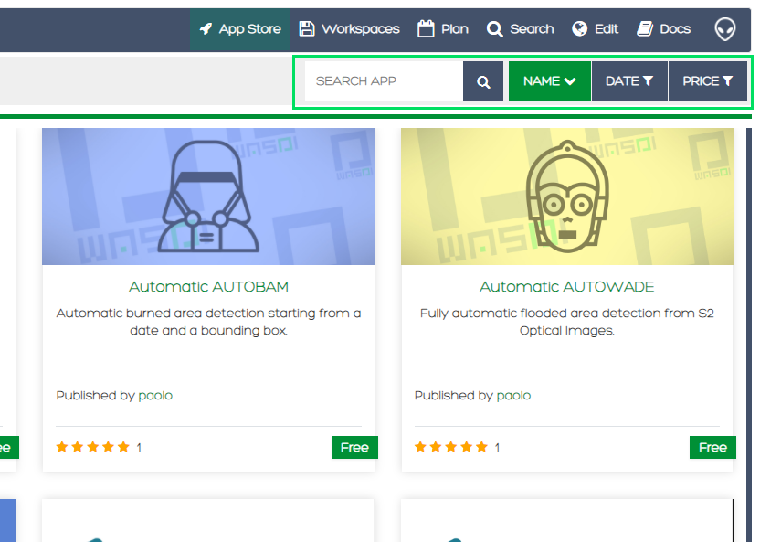

.. App store Tutorial

.. _AppStoreTutorial:

Wasdi App Store
==================

In this tutorial the WASDI app store will be introduced.
The document will cover and highlight the main feature of this WASDI sections and also,
 will present how a WASDI application can be launched.

The app store concept is pretty common for mobile devices and our efforts
was invested to develop the same user experience for the WASDI web service.
An user can upload, execute and share his own application directly on
a web browser, with a fast and consistent user experience.
Also, a dedicated graphical interface(UI) can be added to the application,
allowing to supply other users a well taylored experience. :-)

Intro
---------

The main app store view consist of some icons reporting the WASDI applications:

.. image:: _static/appstore_images/1.png

It is possible to search the applications by using the following search field

Also, an user can enable some filters related to categories, developer, ratings and price

.. image:: _static/appstore_images/3Zoom.png

Let's try an application, in particular, search for *e-DRIFT flood event V 2.0*.
This application can be used to identify flooded areas, using Sentinel-1 and Sentinel-2 products.

The application, at the lowest level of parameters specification, requires the date of the
flood events and the area where the study must be done.
WASDI, will then connect to dedicated servers (DIAS) to gather images and elaborates them to
obtain the final product map.

Click on the edrif_flood_event2 icon

.. image:: _static/appstore_images/4.png

and then on *Open Application*

.. image:: _static/appstore_images/5.png

The application UI it is now shown. Several tabs are available to the user, allowing to customize the elaboration:

* **Advanced** allows to select the number of days before events to be evaluated, plus the selection of the Data Provider
* **SAR** give the possibility of a fine tuning of SAR(Syntethic Aperture Radar) parameters
* **Optical** tab deals with cloud coverage, setting a maximum percentage
* **GIS** allows to set parameters for the customization of final products
* **Help** reports a handle guide to this particular application
* **History** allow user to see previous run of the application
* **JSON** Show to the user the final JSON, which is a structured text format, that contains all parameters that will be used
for the current app run.

For the sake of clarity only **Basic** tab will be used in this tutorial. More info on all the other parameters and a brief
explanation of the app capabilities can be found in descriptions and in **Help tab**.
This tutorial will analyze the outcome of a flood occured on 11 May 2021 in Tajikistan and Afghanistan. In particular our
analysis will consider imagery from the Khatlon Region of Tajikistan (`References <http://floodlist.com/asia/tajikistan-afghanistan-flash-floods-may-2021>`_)
From the first available field please select the date of the event. In this case
event.

Launch an application
------------------------

Add a new application
-------------------------

