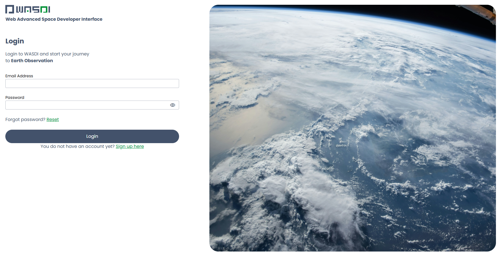
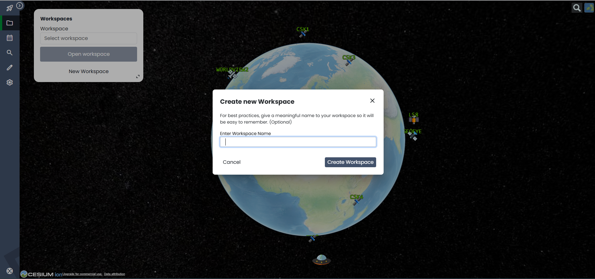
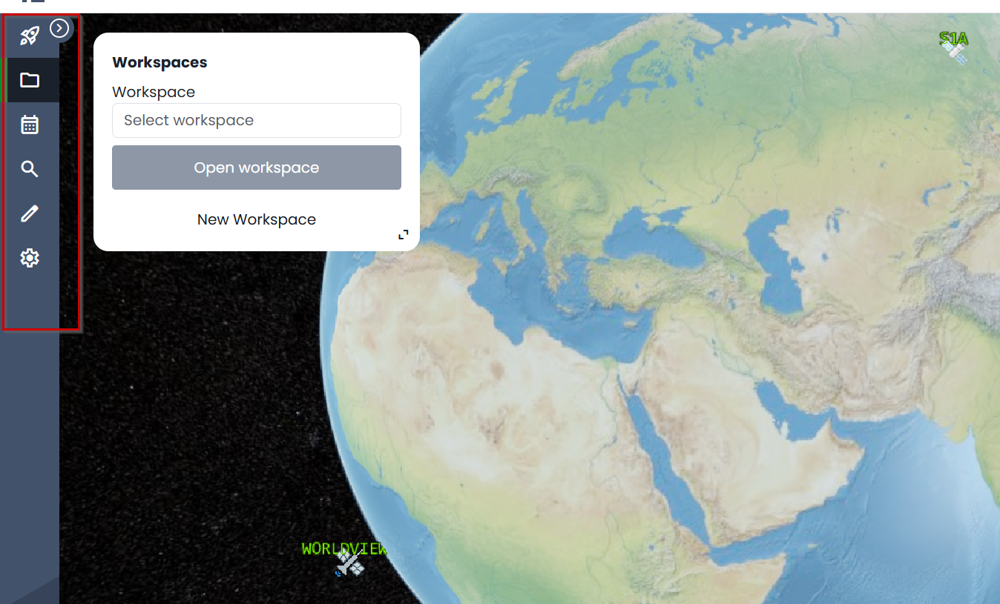
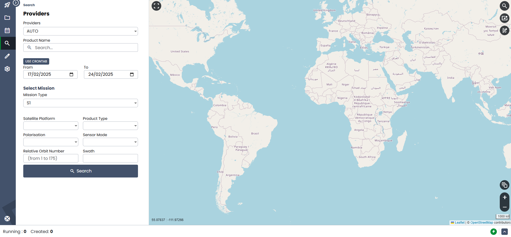
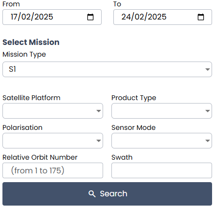
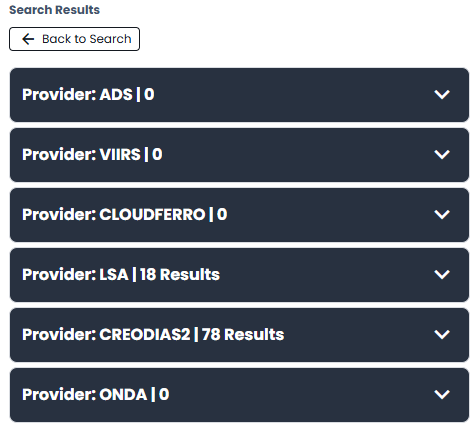
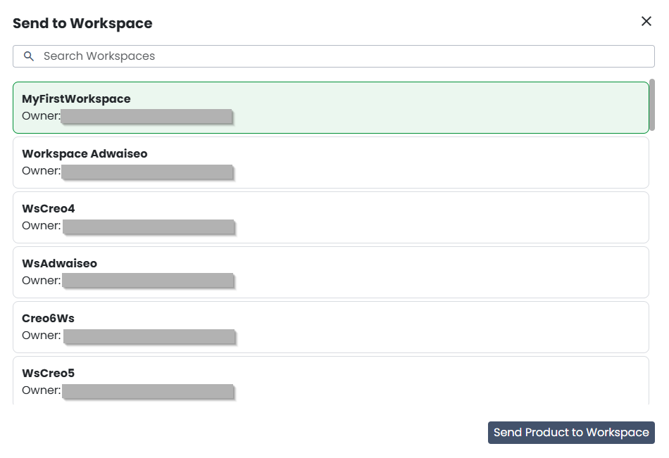
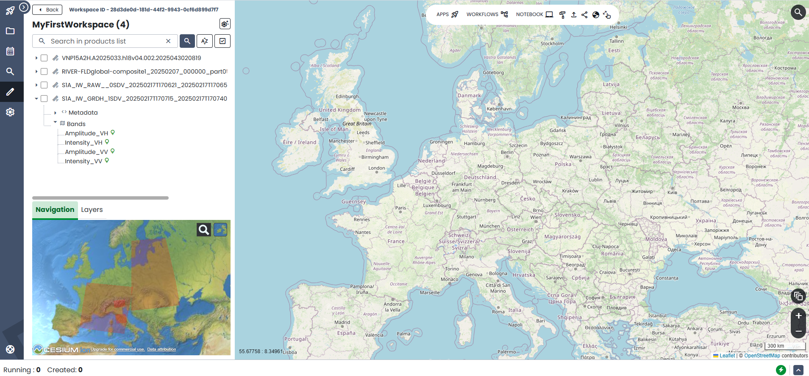
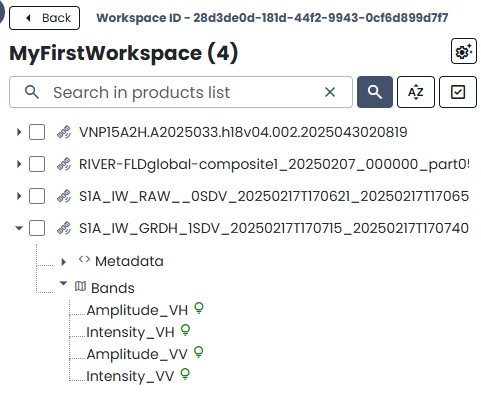
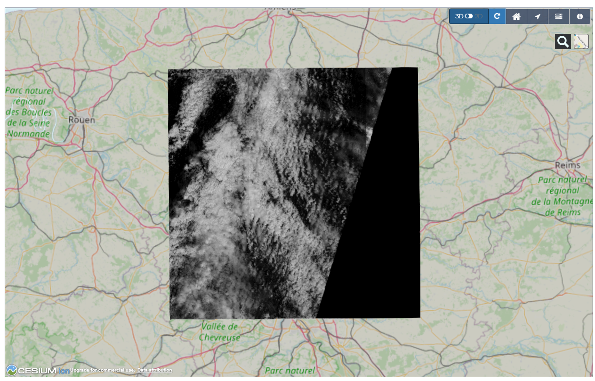

.. TestReadTheDocs documentation master file, created by
   sphinx-quickstart on Mon Apr 19 16:00:28 2021.
   You can adapt this file completely to your liking, but it should at least
   contain the root `toctree` directive.
.. _WasdiTutorial:

Wasdi Web Platform access and basic usage
=========================================
The Home page of WASDI is reachable at the address:

https://www.wasdi.net/

.. ../_static/wasdi_tutorial_images/Devmanimage11.png

WASDI Login
------------------------------------------
To create a WASDI account, just click on the **New User? Register here!** link

To register the user has to input:

* A valid eMail Address (that will be used as UserId)

* A password

* A Name and Surname

The user will receive a confirmation e-mail and then, after the confirmation, will be enabled to use WASDI.

Workspace Management
--------------------
Each user in WASDI can work in one or more Workspaces. A Workspace is a set of files (original EO data or elaborated by some processor) that are grouped in the same “project”.

The workspace concept is the same of several other development tools or languages: the same concept can be either be named workspace or project and any other name designed to identify to a specific set of files.

Once logged for the first time, the user is asked to create a new workspace.

To work with the Editor a Workspace is needed: just click on the text suggestion or on the New Workspace Button on the top right of the screen.

Wasdi Sections
--------------
The WASDI Sections are listed in the blue bar on the left side of your screen:

* **App Store**: Space Marketplace: explore and run available applications;

* **Workspaces**: workspace management: create, open or delete your workspaces;

* **Plan**: explore new acquisition plan for different Satellite platforms;

* **Search**: search for Satellite Images from all the supported Data Providers;

* **Edit**: edit data in a workspace;

* **User**: link to the documentation;

* **User**: user info and properties

App Store, Plan, and User are out of the scope of this Tutorial.

Search
^^^^^^
The search section has many features; in this guide we will make a basic introduction just to let the user start working with EO Images.

The user can set the filters:

To enable one mission specific filter, first select the mission type from the dropdown menu.

WASDI has a Multi Provider search system: this means that the same query is sent to many data providers. 
The results are shown in different tabs for different providers and the user can switch providers on and off:

The SERCO ONDA DIAS is the **priority one** Provider because data is stored in the Cloud where WASDI is installed so this is, usually, the fastest provider available.

.. .. image:: ../_static/wasdi_tutorial_images/Devmanimage9.png

.. .. image:: ../_static/wasdi_tutorial_images/Devmanimage25.png
   
To add a image to WASDI, click on the “+” icon near to the name of the image. The system will ask for the workspace where the image should be added, then will start the import of the image.

The image will appear in the workspace once the import is completed.

Editor
^^^^^^
Editor is where the user can interact with the EO Images.

On the left the tree of the products in the workspace is shown. Each product has its own metadata and band subfolder.

The user can browse the bands of the image. Just click on the icon close to the band's name to see the band image.

.. .. image:: ../_static/wasdi_tutorial_images/Devmanimage13.png

WASDI will publish on the fly in OGC-WMS standard the selected bands.

Once published the band will be shown on the map:

From the editor is possible to run SNAP Workflows and all the available user-supplied processors.

