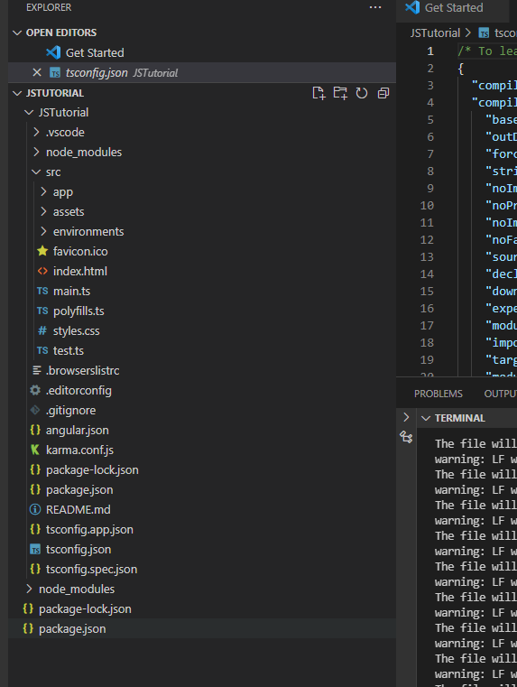
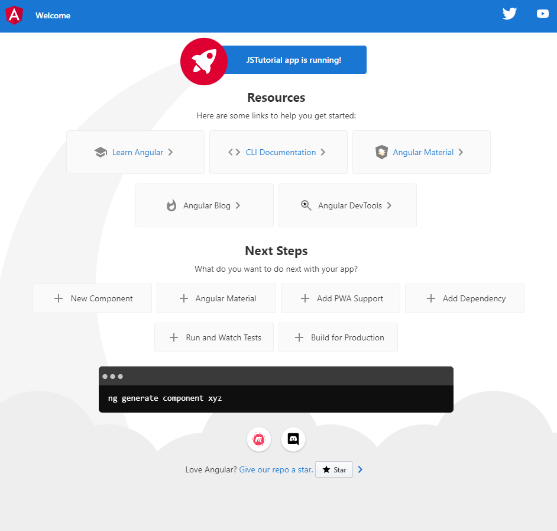
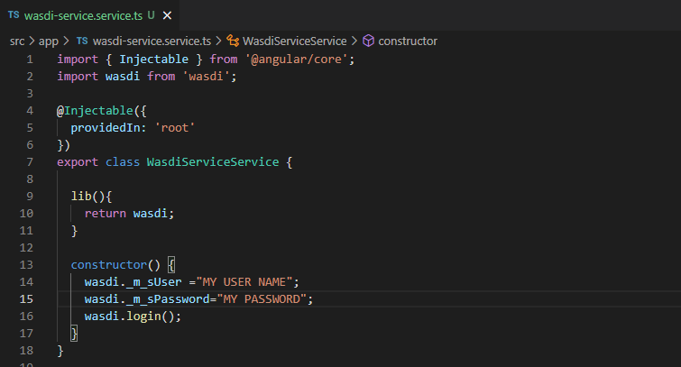
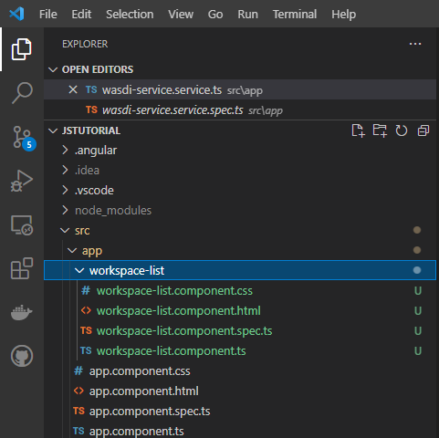
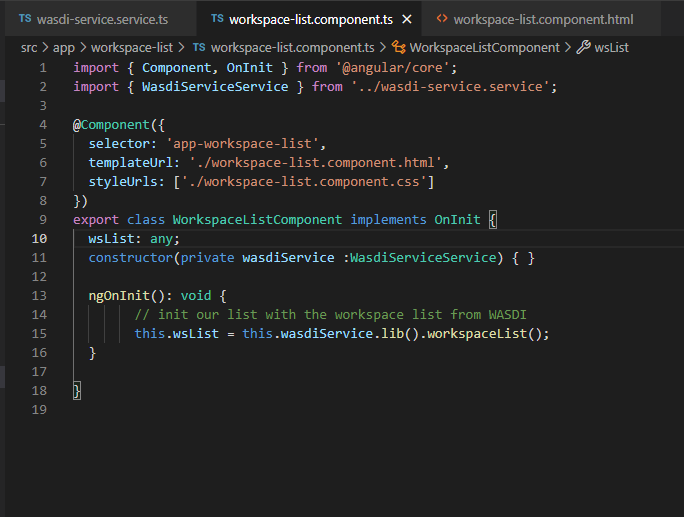
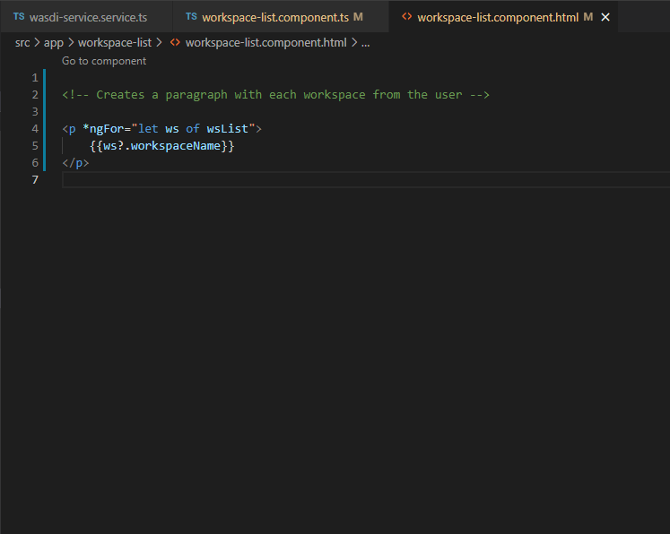

.. TestReadTheDocs documentation master file, created by
   sphinx-quickstart on Mon Apr 19 16:00:28 2021.
   You can adapt this file completely to your liking, but it should at least
   contain the root `toctree` directive.
.. _PythonTutorial:

Javascript Angular Tutorial
===========================

.. note::
	To make the most of this tutorial, prior experience with the WASDI platform is required.

	For new users, it is highly recommended to follow the `Wasdi Web Platform access and basic usage <https://wasdi.readthedocs.io/en/latest/WasdiTutorial.html>`_ tutorial before continuing.

    Also, to complete the tutorial, a validated account on WASDI is required.

In this tutorial we will introduce WASDI javascript library.
To showcase the usage of the library and how it connect to WASDI services,
an easy application will be created using Angular, a popular framework from Google.

Setup
---------------------------

The requirements for this tutorial are :

    * Microsoft Visual Studio Code (or any TS/JS compatible IDE)
    * npm, node package manager installed on the dev machine
    * Angular Cli, which will help in creating the project and adding components

Open VSCode, select open folder and select the parent directory for the project.
The project folder will be created in the following steps.

.. image:: _static/javascript_tutorial_image/VSCnewproject.png

Assuming you have already installed npm globally in the system, open a terminal and install Angular Cli
with the following command :

.. code-block:: python

    npm i @angular/cli

The Angular Cli will add the ng command that we use to generate a new project on the current folder

.. code-block:: python

    ng new JSTutorial

This command will take some time but, at the end, you'll end up with a new and complete Angular application, ready to go!

For the sake of this tutorial we will not showcase all the framework functionalities.
The objective of the tutorial is to make a brief introduction to WASDI library.
For further details about Angular, please check project documentation.
Just to check that everything is up and running raise the following command :

 .. code-block:: python

     ng serve

Open then a browser and navigate to http:localhost:4200, starter application will show up.

This is only a filler provided by Angular team, we can remove it.
Open src/app/app.component.html and delete its content.

The application will be now empty, don't worry that's exactly what we want.

Importing the library
---------------------------

Now we need to add the dependency to WASDI lib: the library is hosted on npm repository so,
to install it, we can use this command on terminal:

 .. code-block:: python

     npm i wasdi

Now that Wasdi lib is installed we need to add to angular its capabilities.
To have an injectable service, we canuse the following command:

.. code-block:: python

     ng generate service WasdiService

This will add to our Angular application a new service called WasdiService.
We will use this service to access library capabilities.
We need a little bit of setup, now: please open wasdi-service.service.ts file.
Add
* Import of the wasdi library
* A method to access the wasdi instance
* Set username and password to the library
* Login use wasdi.login() to obtain a session

Great ! now we have a service that can connect to WASDI and use functionalities exposed.

Using the library
---------------------------
Next step is to add an angular component that will show the list of workspaces of the current user.
First create the component with :

.. code-block:: python

     ng generate component WorkspaceList

this will create a workspacelist folder, with all the files and a starter implementation of the component:

Try to open again app.component.html and add the following line :

.. code-block:: html

    <app-workspace-list></app-workspace-list>

If you serve again the app and open localhost:4200 you will see the following:

.. image:: _static/javascript_tutorial_image/starter.png

Now the objective is to briefly show the workspace coming from WASDI server: to do this open the
ts file of our workspacelist component and add the following

* Inject our WasdiService in the constructor of the component
* Create the variable wsList which will hold the workspace list
* Initialize the variable by using the lib, as follows

Open now the html file and add the following code, which loop over element in wsList to render them as paragraph :

.. image:: _static/javascript_tutorial_image/htmlcode.png

Open now the webpage and you will se alist of the workspaces coming from your WASDI account!

The tutorial ends here. We have briefly showed how can a JS/TS application can interact with
WASDI. Please refer to the official documentation of the library for a complete
cover of alla the functionalities.

