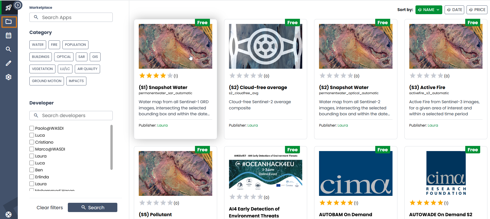
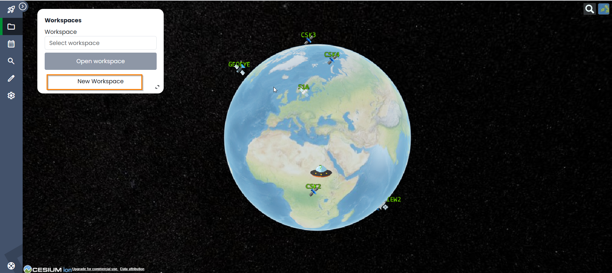
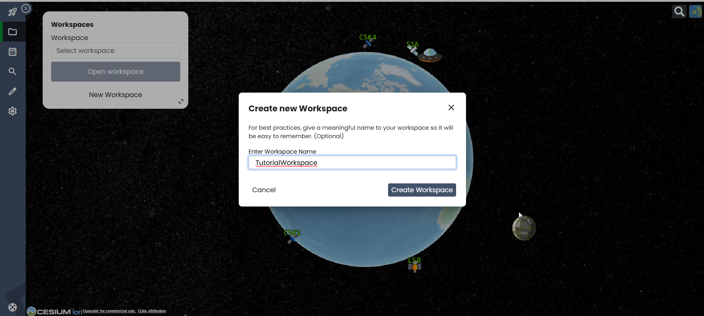
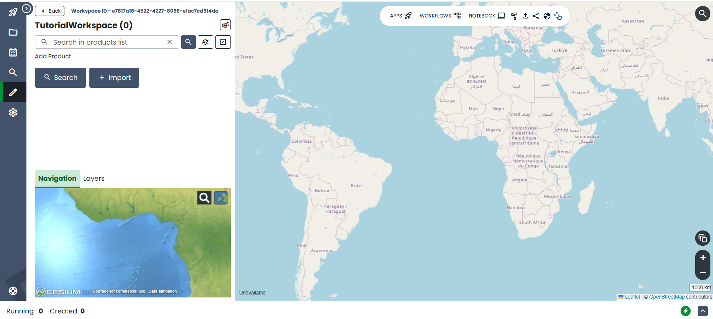

.. TestReadTheDocs documentation master file, created by
   sphinx-quickstart on Mon Apr 19 16:00:28 2021.
   You can adapt this file completely to your liking, but it should at least
   contain the root `toctree` directive.
.. _C#Tutorial:

C# Tutorial
===========================

Prerequisites
---------------------------

.. note::
	To make the most of this tutorial, prior experience with the WASDI platform is required.

	For new users, it is highly recommended to follow the `Wasdi Web Platform access and basic usage <https://wasdi.readthedocs.io/en/latest/WasdiTutorial.html>`_ tutorial before continuing.

Setup
---------------------------

Setup on Wasdi web-app side
+++++++++++++++++++++++++++

Open the Wasdi web-application in a browser by typing https://www.wasdi.net/.

|

On the main page, the marketplace is shown.
Go to the Workspaces page by pressing the **Workspaces** button.

|

Create a new workspace by pressing the **New Workspace** button.

|

On the pop-up window, specify the name of the new workspace and press **Create workspace**. For this tutorial, I will choose **TutorialWorkspace**.

.. note::
	Although it is not mandatory, it is strongly recommended to use the indicated name. This would allow the code to be copy/pasted without adjustments.

|

The newly created workspace is shown on the main page.

|

Setup on Microsoft's Visual Studio side
+++++++++++++++++++++++++++++++++++++++

Open Microsoft's Visual Studio

.. image:: ../_static/c#_tutorial_images/11_open_visual_studio.PNG
   :scale: 50%
   :align: center
   :alt: open MS Visual Studio

|

Create a new project (Console App).

.. image:: ../_static/c#_tutorial_images/12_create_new_project.PNG
   :scale: 50%
   :align: center
   :alt: create a new project

|

For this tutorial, choose **TutorialSeeSharpApp**.

.. note::
	Although it is not mandatory, it is strongly recommended to use the indicated name. This would allow the code to be copy/pasted without adjustments.

.. image:: ../_static/c#_tutorial_images/13_configure_new_project.PNG
   :scale: 50%
   :align: center
   :alt: configure the new project

|

Choose the desired framework. I will accepted the default option (.NET 6.0).

.. image:: ../_static/c#_tutorial_images/14_additional_information.PNG
   :scale: 50%
   :align: center
   :alt: additional information

|

Pressing the **Create** button, as the setup is complete, the MS Visual Studio will open the project.

.. image:: ../_static/c#_tutorial_images/15_open_the_new_project.PNG
   :scale: 36%
   :align: center
   :alt: open the new project in MS Visual Studio

|

Create a full-fledged main class. Use the URL provided to obtain the code. Copy and paste it to replace the generated stub.

.. image:: ../_static/c#_tutorial_images/16_full_fledged_main_class.PNG
   :scale: 36%
   :align: center
   :alt: copy the code of a full-fledged main class from the Microsoft site

|

Change the name name of the namespace to match the name of the project (**TutorialSeeSharpApp**).

.. code-block::

	namespace TutorialSeeSharpApp
	{
		internal class Program
		{
			static void Main(string[] args)
			{
				Console.WriteLine("Hello World!");
			}
		}
	}

Run the program to verify that everything is fine.

.. image:: ../_static/c#_tutorial_images/17_run_application_console_window.PNG
   :scale: 50%
   :align: center
   :alt: run the application and see a console window

|

Work with WASDI
------------------------------------------------------

Add the WasdiLib dependency to your application
+++++++++++++++++++++++++++++++++++++++++++++++

|

.. note::
	The code showed in this section can also be found on the dedicated public GitHub repository: https://github.com/wasdi-cloud/TutorialSeeSharpApp.

|

Find the WasdiLib on NuGet.
Open a page in a browser and navigate to https://www.nuget.org/packages/WasdiLib.

.. image:: ../_static/c#_tutorial_images/21_find_wasdilib_on_nuget.PNG
   :scale: 36%
   :align: center
   :alt: find WasdiLib on NuGet

|

Copy the installation commad for the latest version (by pressing the orange button):

.. code-block::

	Install-Package WasdiLib -Version 0.0.3.5

Open the NuGet Package Manager console (Tools > NuGet Package Manager) and paste in the command just copied.

.. image:: ../_static/c#_tutorial_images/22_open_nuget_package_manager_console.PNG
   :scale: 36%
   :align: center
   :alt: open NuGet Package Manager console

|

Install the WasdiLib as a dependency of your console application.

.. image:: ../_static/c#_tutorial_images/23_install_wasdilib_console.PNG
   :scale: 36%
   :align: center
   :alt: install WasdiLib

|

Alternatively, the WasdiLib can be installed through NuGet Package Manager (Tools > Manage NuGet Packages for Solution).

.. image:: ../_static/c#_tutorial_images/24_install_wasdilib_manager.PNG
   :scale: 36%
   :align: center
   :alt: install WasdiLib

|

Create configuration files
+++++++++++++++++++++++++++

Create appsettings.json
///////////////////////////

To add a file to the application, right click on the **TutorialSeeSharpApp**.

.. image:: ../_static/c#_tutorial_images/51_create_new_file.PNG
   :scale: 40%
   :align: center
   :alt: create new file

|

Select **Add** and then **New Item**.

.. image:: ../_static/c#_tutorial_images/52_create_new_file.PNG
   :scale: 50%
   :align: center
   :alt: create new file

|

Select the type of file and input the name.

.. image:: ../_static/c#_tutorial_images/53_create_new_file.PNG
   :scale: 60%
   :align: center
   :alt: create new file

|

The **appsettings.json** file contains the information required to connect to the Wasdi server.
In absence of such information, the library cannot connect to the server, in development mode.
Once the application is deployed on the Wasdi server, it will obtain the required information from the user session.
Therefore, for development use, please do not forget to input your credentials on the **appsettings.json** file.

.. code-block::

	{
	  "USER": "your_username",
	  "PASSWORD": "your_password",
	  "BASEPATH=": "C:/temp/wasdi/",
	  "BASEURL": "https://www.wasdi.net/wasdiwebserver/rest",
	  "WORKSPACE": "TutorialWorkspace",
	  "PARAMETERSFILEPATH": "./parameters.json"
	}

Create parameters.json
///////////////////////////

The **parameters.json** file contains the information related to the operation conducted on the Wasdi server.

.. code-block::

	{
	  "DATEFROM": "2020-01-01",
	  "DATETO": "2020-01-31",
	  "BBOX": "46.0,7.0,44.0,12.0",
	  "WORKFLOW": "LISTSinglePreproc2"
	}

.. note::
	The properties of both these configuration files should be changed to trigger their copy each time the project is built.
	
	Repeat this procedure for both files (appsettings.json and parameters.json):
	On the right side-bar, click on **Solution Explorer**. Select the file, right-click on it, Select the last option, **Properties**.

	.. image:: ../_static/c#_tutorial_images/25_config_file_properties.PNG
		:scale: 36%
		:align: center
		:alt: config file properties

|

	On the **Advanced** section, change the value of the property **Copy to output directory** to **Copy always**.

	.. image:: ../_static/c#_tutorial_images/26_copy_to_output_directory.PNG
		:scale: 36%
		:align: center
		:alt: copy to output directory

|

Verify the setup 
+++++++++++++++++++++++++++

Call the **/hello** endpoint
////////////////////////////

The application can run locally as a stand-alone application (with a Main method). However, in order for the application to run on the Wasdi platform, the class must meet two conditions:

- implement the **IWasdiRunnable** interface and override its **Run** method;

- have a no-arg constructor (if the class does not have an explicit constructor, the compiler will add a default no-arg constructor at compile time);

.. note::
	It is strongly recommended for the application to have the structure shown below.

To connect to the Wasdi server through the WasdiLib, an object of type Wasdi must be created and initialized in the **Main** method and passed as an argument to the **Run** method.
The verbosity of the logging mechanism could be increased, in order to see on the console the result.

The actual call to the Wasdi object should be done either form inside the **Run** method or from any other method called by **Run**.

.. code-block::

	using WasdiLib;

	namespace TutorialSeeSharpApp
	{
		internal class Program : IWasdiRunnable
		{
			static void Main(string[] args)
			{
				Wasdi wasdi = new();
				wasdi.Init();
				wasdi.SetVerbose(true);

				Program program = new Program();
				program.Run(wasdi);
			}

			public void Run(Wasdi wasdi)
			{
				wasdi.WasdiLog(wasdi.Hello());
			}
		}
	}

The outcome of running the program locally is a console window showing the Wasdi greeting.

.. image:: ../_static/c#_tutorial_images/27_hello_wasdi.PNG
   :scale: 36%
   :align: center
   :alt: hello wasdi

|

.. note::
	The procedure to deploy the application on the WASDI platform is described later in this tutorial.

Running the same program on the Wasdi platform produces the following outcome.

.. image:: ../_static/c#_tutorial_images/29_hello_wasdi_platform.PNG
   :scale: 36%
   :align: center
   :alt: hello wasdi on Wasdi

|

Get the user's workspaces' names
////////////////////////////////

The following program retrieves the names of the workspaces that the user has access to.
An user can access a workspace either if the workspace was created by the user or if the workspace was shared by another user.

.. code-block::

	using WasdiLib;

	namespace TutorialSeeSharpApp
	{
		internal class Program : IWasdiRunnable
		{
			static void Main(string[] args)
			{
				Wasdi wasdi = new();
				wasdi.Init();
				wasdi.SetVerbose(true);

				Program program = new Program();
				program.Run(wasdi);
			}

			public void Run(Wasdi wasdi)
			{
				GetWorkspacesNames(wasdi);
			}

			private static void GetWorkspacesNames(Wasdi wasdi)
			{
				wasdi.WasdiLog("GetWorkspacesNames():");

				List<string> workspacesNames = wasdi.GetWorkspacesNames();

				foreach (string workspaceName in workspacesNames)
				{
					wasdi.WasdiLog(workspaceName);
				}
			}
		}
	}

Runnig the program locally should show in the console the list of workspaces' names.
At least **TutorialWorkspace** should be present.

.. image:: ../_static/c#_tutorial_images/28_get_workspaces_names.PNG
   :scale: 36%
   :align: center
   :alt: get workspaces names

|

.. note::
	The procedure to deploy the application on the WASDI platform is described later in this tutorial.

Running the same program on the Wasdi platform produces the following outcome.

.. image:: ../_static/c#_tutorial_images/30_get_workspaces_names.PNG
   :scale: 36%
   :align: center
   :alt: get workspaces names on Wasdi

|

Running the new C# application on Wasdi platform
++++++++++++++++++++++++++++++++++++++++++++++++

It's great to have the application running locally but the end-goal is to have the application running on Wasdi server.

Writing the application
////////////////////////////////

In order to see the application producing some effects, two operations are triggerred: the execution of an workflow and the execution of a processor.

.. code-block::

	using WasdiLib;
	using WasdiLib.Models;

	namespace TutorialSeeSharpApp
	{
		internal class Program : IWasdiRunnable
		{
			static void Main(string[] args)
			{
				Wasdi wasdi = new();
				wasdi.Init();
				wasdi.SetVerbose(true);

				Program program = new Program();
				program.Run(wasdi);

				UpdateStatus(wasdi);
			}

			public void Run(Wasdi wasdi)
			{
				RunExecuteWorkflow(wasdi);

				RunExecuteProcessor(wasdi);
			}

			private static void RunExecuteWorkflow(Wasdi wasdi)
			{
				string sStartDate = wasdi.GetParam("DATEFROM");
				string sEndDate = wasdi.GetParam("DATETO");
				string sBbox = wasdi.GetParam("BBOX");
				string sWorkflow = wasdi.GetParam("WORKFLOW");

				double dLatN = 44.0;
				double dLonW = 35.0;
				double dLatS = 45.0;
				double dLonE = 36.0;

				if (sBbox != null)
				{
					String[] asLatLons = sBbox.Split(',');
					dLatN = Double.Parse(asLatLons[0]);
					dLonW = Double.Parse(asLatLons[1]);
					dLatS = Double.Parse(asLatLons[2]);
					dLonE = Double.Parse(asLatLons[3]);
				}

				wasdi.WasdiLog("Start searching images");
				List<QueryResult> aoResults = wasdi.SearchEOImages("S1", sStartDate, sEndDate, dLatN, dLonW, dLatS, dLonE, "GRD", null, null, null);
				wasdi.WasdiLog("Found " + aoResults.Count + " Images");

				if (aoResults.Count > 0)
				{
					wasdi.ImportProduct(aoResults[0]);

					List<string> asInputs = new List<string>();
					asInputs.Add(aoResults[0].Title + ".zip");

					List<string> asOutputs = new List<string>();
					asOutputs.Add("preprocessed.tif");

					wasdi.ExecuteWorkflow(asInputs, asOutputs, sWorkflow);
				}
				wasdi.WasdiLog("FINISHED");
			}

			private static void RunExecuteProcessor(Wasdi wasdi)
			{

				// call another app: HelloWasdiWorld
				Dictionary<string, object> dictionary = new Dictionary<string, object>()
							{ { "name", wasdi.GetUser() } };

				wasdi.ExecuteProcessor("HelloWasdiWorld", dictionary);
			}

			private static void UpdateStatus(Wasdi wasdi)
			{
				wasdi.WasdiLog("UpdateStatus:");
				string sStatus = "DONE";
				int iPerc = 100;
				wasdi.UpdateStatus(sStatus, iPerc);
			}
		}
	}

.. note::
	For applications that require heavy processing, it is recommended not to run locally but exclusively on the WASDI platform.

Packaging the application
////////////////////////////////

To export the application, zip the content of the **\\bin\\Debug\\net6.0** directory, except for the configuration files (appsettings.json and parameters.json) and the **ref** directory.
The zip archive should share the name of the application, in my case **TutorialSeeSharpApp.zip**.

.. image:: ../_static/c#_tutorial_images/31_create_zip_archive.PNG
   :scale: 50%
   :align: center
   :alt: create a zip archive with the content of the \bin\Debug\net6.0 directory

|

Deploying the application
////////////////////////////////

Back on the Wasdi web-application, create a new application by pressing the **New App** button.

.. image:: ../_static/c#_tutorial_images/32_new_app_button.PNG
   :scale: 50%
   :align: center
   :alt: the New App button

|

On the page that opens, fill in the details of the application, as shown in the image below.

.. image:: ../_static/c#_tutorial_images/33_create_new_app_page.PNG
   :scale: 36%
   :align: center
   :alt: the New App page

|

Until the application is ready to be exposed to the public, the **Make Application Public** checkbox could be unchecked. To find this checkbox, scroll down to the bottom of the page.

.. image:: ../_static/c#_tutorial_images/61_select_private_app.PNG
   :scale: 40%
   :align: center
   :alt: create a zip archive with the content of the \bin\Debug\net6.0 directory

|

A message will be shown to inform the user that the application (processor) will be deployed shortly.

.. image:: ../_static/c#_tutorial_images/34_new_app_created.PNG
   :scale: 36%
   :align: center
   :alt: New App created

|

Viewing the application
////////////////////////////////

Navigate to the applications page by pressing the **Apps** button.
Search the newly created application by filtering the list.

.. image:: ../_static/c#_tutorial_images/35_apps_button.PNG
   :scale: 50%
   :align: center
   :alt: the Apps button

|

Type **Tutorial** and click on the application's card.

.. image:: ../_static/c#_tutorial_images/36_view_app_details_page.PNG
   :scale: 36%
   :align: center
   :alt: view the application details page

|

Running the application
////////////////////////////////

Adjust the parameters of the application as needed and press the **Run** button. 

.. image:: ../_static/c#_tutorial_images/37_run_button.PNG
   :scale: 50%
   :align: center
   :alt: the Run button

|

Depending on the load on the server, the deployed application starts executing in second or in minutes.

.. image:: ../_static/c#_tutorial_images/38_application_running.PNG
   :scale: 36%
   :align: center
   :alt: the Running the application.

|

Also, the duration of the execution may vary. The bar and the percentage show to the user the progress.

.. image:: ../_static/c#_tutorial_images/40_application_running.PNG
   :scale: 36%
   :align: center
   :alt: the Running the application.

|

As soon as the execution is completed, a message is shown to the user.

.. image:: ../_static/c#_tutorial_images/41_application_completed.PNG
   :scale: 36%
   :align: center
   :alt: application completed running.

|

Minimizing the logging panel, the downloaded products become visible on the workspace.

.. image:: ../_static/c#_tutorial_images/42_workspace_with_products.PNG
   :scale: 36%
   :align: center
   :alt: workspace with products.

|

The GitHub repository
////////////////////////////////

The code showed in this tutorial can also be found on the dedicated public GitHub repository: https://github.com/wasdi-cloud/TutorialSeeSharpApp.

.. image:: ../_static/c#_tutorial_images/71_github_repo.PNG
   :scale: 36%
   :align: center
   :alt: the GitHub repository

|

You can clone the project or download the code as a ZIP archive. The `commits page <https://github.com/wasdi-cloud/TutorialSeeSharpApp/commits/main>`_ highlights the steps of this tutorial.

|

The end
////////////////////////////////

This is the end of the tutorial. Please try to use the WasdiLib to build interesting and powerful applications.

More information about the available operations can be found on the `library reference page <https://wasdi.readthedocs.io/en/latest/c%23/WasdiLib.html>`_.