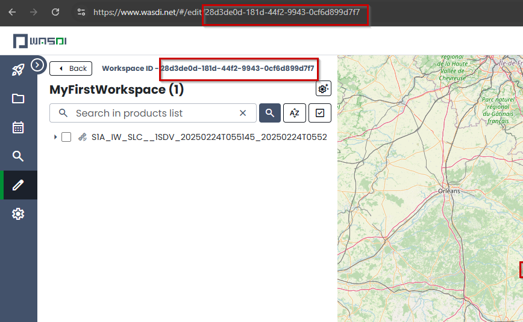

Configuration tutorial
========================================================================================================

Introduction
------------------------------------------------------------------------------------------------------------
The present Tutorial showcase all the feature available in the *WASDI configuration file*.
The config file is required to connect the running instance of your code with WASDI services.

.. note::
   This page reports all the features with complete description, if you just need a quick reference or a starting point 
   please refer to :doc:`config quickstart <../PythonCookbook/createConfig>`

This tutorial showcase all the available features with working example, explaining all the available fields
and their usage.
As a reference library, waspy python library is used but the same concepts applies for all wasdi libraries.

.. note::
    The configuration file contains your credentials and some additional information to get WASDI started: never share it with others! 
    It is required only for developing on your PC, so do not upload it to WASDI when deploying or updating an application

Login parameters
------------------------------------------------------------------------------------------------------------
WASDI allows a simple transition from local execution on your machine to the execution in the cloud, leveraging 
powerful dedicated cloud resources and faster interactions with data.

In order to start a new session with WASDI web services users can login to WASDI web services by invoking the **login** method.
If no parameters are passed the library will ask for credentials on the console where the code is executed.

Another possibility is to rely on the `config.json` file. This file can be read by using the **init** method. 
Upon initialization, the library search for credentials inside the configuration passed and proceed to create a new session for the user.

.. code-block:: json
   {
      "USER": "[]",,
      "PASSWORD": "[]",,
   }
   
.. note::
   Please remember that the config file follows the *JSON* syntax specification. Please check the syntax to adhere such specification. 

Workspace initialization
------------------------------------------------------------------------------------------------------------
After login, config.json file can be used to open a specific workspace and start on working there.
The reference can be done by using the workspace name OR the workspace Id.

Here's an example of the field included in a config file:

.. code-block:: json
   
   {
      "WORKSPACE" : "workspace Name",

      "WORKSPACEID" : "workspaceId"
   }
   
The workspace id can be found in WASDI application both on navigation bar or above the workspace's name.

.. note::
   In case both parameters, name and id, are specified only **workspace name** is taken in consideration.

Parameters dictionary 
------------------------------------------------------------------------------------------------------------
In order to make your WASDI application completely configurable, it is possible to embed a **custom dictionary** for 
the execution. This can be very flexible and useful, by instance, to parametrize some part of your algorithms and checks the results
on different setup. 

The dictionary use itself the JSON syntax and can contains any number of custom field. Such parameters can be stored on
a separated JSON file and in order to be loaded, can be specified the path to the particular file. 

To load a parameter dictionary the config file can specify the **PARAMETERSFILEPATH** field

.. code-block:: json

   {

   "PARAMETERSFILEPATH" : "./params.json"

   }

In this example we are using file named **params.json** in the same folder of the python script with the following content:

.. code-block:: json

   {
      "First_Param" : "First_Value",

      "Second_Param" : 42

   }

In the following of your code such values can be used by invoking, for example the **getParameter()** method:

.. code-block:: python
   
   print(wasdi.getParameter("First_Param"))

   print(wasdi.getParameter("Second_Param"))

The execution of the above code will simply print on the command line the values specified from the params.json 
file.

Download/Upload activation 
------------------------------------------------------------------------------------------------------------
In local environment it is possible to enable or disable both the upload and download of resources.
To control this aspect please check the following field of the config file:

.. code-block:: json

   {
   "DOWNLOADACTIVE" : true

   "UPLOADACTIVE" : false
   }

Both parameters are boolean so please check the syntax for JSON format.

Logs verbosity
------------------------------------------------------------------------------------------------------------
Upon execution of the code it is possible to control the verbosity.

Ideally during debugging of your scripts it is useful 
to have more details about the status of the running instance.
Instead, when the code is effectively deployed, the logs can be disabled 
by setting this field to false.

.. code-block:: json

   {
   "VERBOSE" : false
   }

 Ideally during debugging of your scripts it is useful 
to have more details about the status of the running instance.
Instead, when the code is effectively deployed, the logs can be disabled 
by setting this field to false.

Base path
------------------------------------------------------------------------------------------------------------
This parameter control where the running instance of your application stores the workspaces and their relative assets downloaded 
from WASDI. 

If no path is specified this defaults to 

* Linux: /home/[your user]/.wasdi
* Windows: C:\\Users\\[your user]\\.wasdi

.. code-block:: json

   {
   "BASEPATH" : "[Custom Directory]"
   }

Advanced settings 
------------------------------------------------------------------------------------------------------------
The following parameters represents functionalities for an advanced usage of WASDI. 
Each parameters is hereby described.

.. code-block:: json

   {   
   "BASEURL" : "baseUrl",

   "REQUESTSTIMEOUT" : "requestsTimeout",

   "SESSIONID" : "sessionId",

   "MYPROCID" : "myProcId",

   "ENABLECHECKSUM" : "enableChecksum"
   }

**BASEURL** Controls the base address used to contact the WASDI services. In brief WASDI is multicloud and can be executed in several different cloud enviroments:
this parameter allows the developer contact various instances of WASDI deployed on several different URLs.

**REQUESTSTIMEOUT** Allows the developer to setup the time, *in seconds*, before the call to WASDI api must respond before the connection is dropped.

**SESSSIONID** This field allows to connect directly to WASDI services skipping the login process and supplying directly a session id

**MYPROCID** Allows to force the Process ID within the workspace. All processes have a dedicated ID. In general this id is a GUID generated at each launch. This field of the settings 
gives the possibility to the developer to force a custom value.

**ENABLECHECKSUM** When dealing with EO product and in particular with their transfer between environments, it can be useful to relies the checksum to check data integrity.
When enabling this field the MD5 check sum is requested to the WASDI instance and verified against the downloaded files.

Complete config.json reference
------------------------------------------------------------------------------------------------------------
In the following a complete config.json file example is reported, showcasing all the 
possible parameters readable by the libraries.

.. code-block:: json

   {
      "USER" : "user",
         
      "PASSWORD" : "password",

      "WORKSPACE" : "workspace",
            
      "WORKSPACEID" : "workspaceId",
      
      "BASEPATH" : "basePath",

      "PARAMETERSFILEPATH" : "parametersFilePath",
            
      "DOWNLOADACTIVE" : true,
            
      "UPLOADACTIVE" : true,
            
      "VERBOSE" : true,
            
      "BASEURL" : "baseUrl",
            
      "REQUESTSTIMEOUT" : "requestsTimeout",
            
      "SESSIONID" : "sessionId",
            
      "MYPROCID" : "myProcId",
            
      "ENABLECHECKSUM" : true
   }