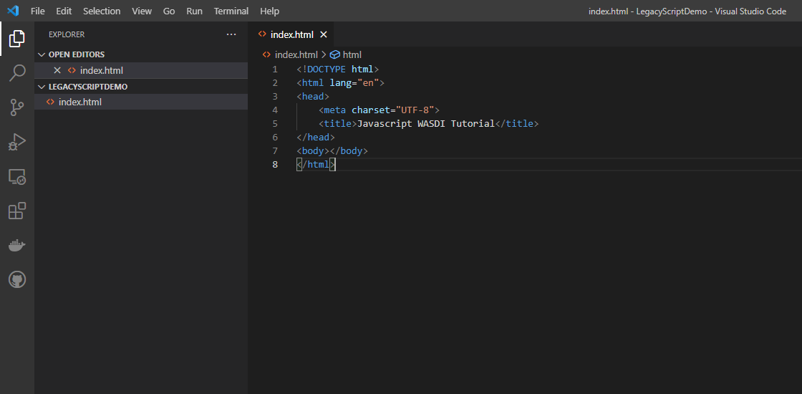
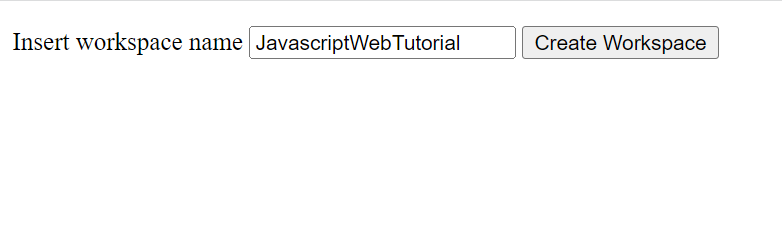
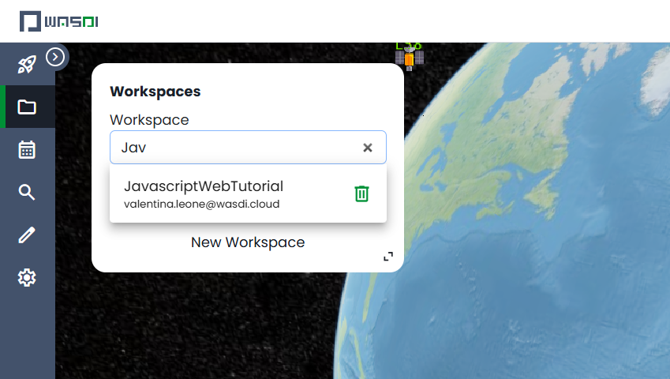
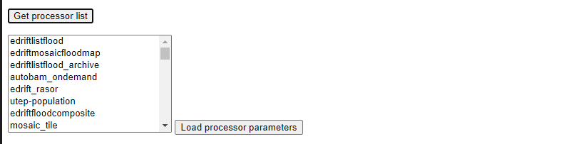
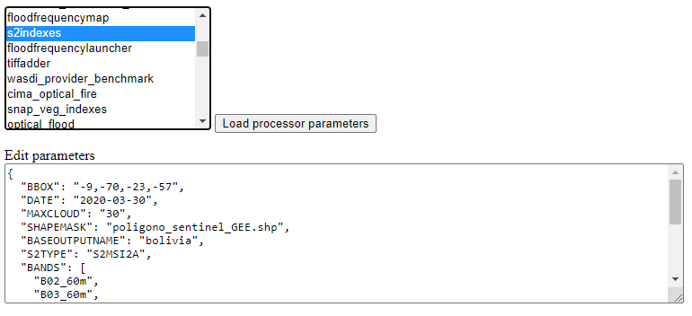
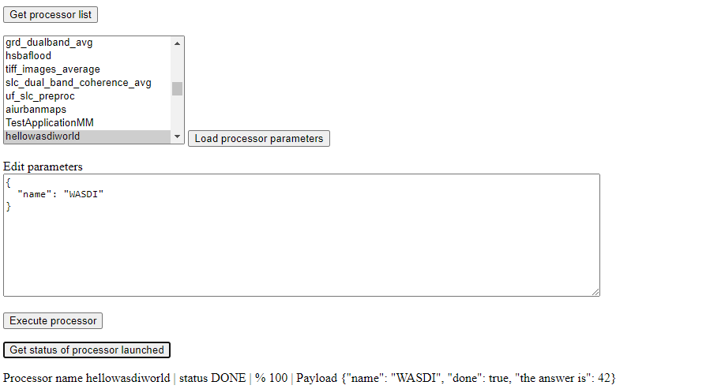
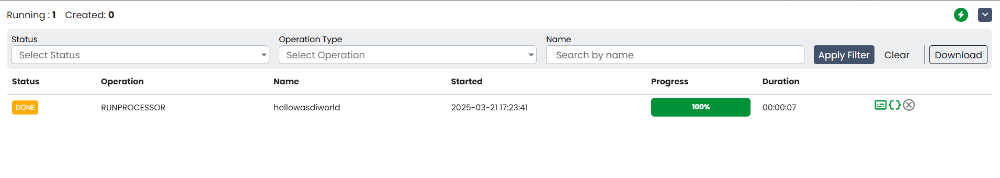

.. TestReadTheDocs documentation master file, created by
   sphinx-quickstart on Mon Apr 19 16:00:28 2021.
   You can adapt this file completely to your liking, but it should at least
   contain the root `toctree` directive.
.. _JavaScriptTutorial:

Javascript Web Tutorial
===========================

.. note::
	To make the most of this tutorial, prior experience with the WASDI platform is required.

	For new users, it is highly recommended to follow the `Wasdi Web Platform access and basic usage <https://wasdi.readthedocs.io/en/latest/WasdiTutorial.html>`_ tutorial before continuing.

    Also, to complete the tutorial, a validated account on WASDI is required.

In this tutorial we will show you how you can start using to use the Javascript library
for WASDI. In this tutorial we will create a web page that show data gathered through
the library just by using one **

    </head>
    <body></body>
    </html>

Now,to start using the functionalities exposed by the library, create a new file next to index.html
and name it **main.js**.

Include the file in index.html as a new 
    <!-- This script contains your custom code -->
    

    </head>
    <body></body>
    </html>

Login
---------------------------

WASDI is a web application that allow users to download, process and obtain results from satellite imagery.

To continue with this tutorial you will need a valid account on the platform: 
please, proceed to register to WASDI services and keep note of your credentials.

The first step to start interacting with `WASDI <https://www.wasdi.net>`_ services is to login by using the library facilities.

To achieve this you must add 2 files next the index.html file :

- config.json
- parameters.json

The second file will be introduced later on in the tutorial, when we will start using processors.

Add the following content to config.json, changing **[YOUR_USERNAME]** and **[YOUR_PASSWORD]** with your WASDI credentials

.. code-block:: json

    {
      "USER": "[YOUR_USERNAME]",
      "PASSWORD": "[YOUR_PASSWORD]"
    }

Note that this file name, config.json, is **the default value**, if no filename is passed to the method. Please check library documentation for more details about the
**loadconfig()** function.

WASDI libraries share the structure of the configuration files. 
The two fields used in the JSON above represent a sub-set of the available configuration fields.

Check `configuration chapter in Library Concepts <https://wasdi.readthedocs.io/en/latest/LibsConcepts.html#configuration>`_ section for more details.

For **parameters.json** file, for the moment, please just add the following content:

.. code-block:: json

    {}

The "{}" parenthesis represents an empty JSON object, a quick starting point for the tutorial. In the following we will edit this file adding the actual parameters.

Please open main.js and start editing the file.
Wasdi library is exposed as a global singleton, a common practice for Javascript libraries.

The variable to be used to access library methods is "**wasdi**"
Add the following lines:

.. code-block:: javascript

    // load the configuration from config.json file  
    wasdi.loadConfig();
    // login to Wasdi
    wasdi.login();

After the successful login call, the wasdi global object will keep its state, 
allowing to make further requests to the system.

Create Workspaces
-----------------------

A **Workspace** is a basic concept of WASDI: think of it as a folder.

One of the main objective of the platform is to connect
to various satellite imagery portals and download files from such services. 
The workspace is composed by a collection of images downloaded, called **products**. 

Data retrieval doesn't require local storage because it "happens" in the cloud.
Also, a workspace holds the information about the elaborations on such data, done by the **processors**.
Users can create their own workspaces, and they can also share them with other users.

In the following steps we will add some controls to HTML and some code to our main.js
file to create a Workspace on WASDI.

In this step of the tutorial we will use this library call :

.. code-block:: javascript
    
    wasdi.createWorkspace(wsName);

The function call can be used to create a workspace in WASDI. 

For more information, the library method documentation can be found `here <https://wasdi.readthedocs.io/en/latest/typescript/wasdi.html#createworkspace>`_

Wasdi uses a conventional object, the **PrimitiveResult**, as response for, among other, creation calls.
This object has the following structure :

.. code-block:: json

    {
        "IntValue" : 42,
        "StringValue" : "some_string",
        "DoubleValue" : 3.14159265359,
        "BoolValue" : true
    }

In this case the response will contain a primitive result with only the StringValue setted. 
The value of the response represents the **workspaceID** an univoque identifier of the workspace.

For more information, the library method documentation can be found `here <https://wasdi.readthedocs.io/en/latest/typescript/wasdi.html#createworkspace>`_

Going back to the webpage, please edit the index.html file by adding the following lines, inside the body tags :

.. code-block:: html

        

        Insert workspace name <input type="text" id="wsname">
        <input type="button" onclick="createWorkspace()" value="Create Workspace">
        

Then open our javascript file *main.js* and define the function createWorkspace() :

.. code-block:: javascript

    // Local function to create a workspace
    createWorkspace = function() {
    let wsName = document.getElementById("wsname").value;
    // this is the actual call to WASDI services 
    wasdi.createWorkspace(wsName);
    }

The function defined will be invoked when the user clicks on the "Create workspace" button.
Open the index.html page on you browser and you will have a simple form like this: 

When you click, the system will create a new workspace on WASDI.
You can check it in the wasdi web application in the workspaces page:

There it is !

For the following part of the tutorial, we will use this workspace as the default one.
This way, for the following features, it will not be necessary to create each time a 
new workspace.

To open it every time we reload the page, add this statement after the login call, at the beginning of the file
*main.js*: 

.. code-block:: javascript

    wasdi.loadConfig();
    wasdi.login();
    // From now on this tutorial uses JavascriptWebTutorial workspace as default
    wasdi.openWorkspace("JavascriptWebTutorial");

For more information, the library method documentation can be found `here <https://wasdi.readthedocs.io/en/latest/typescript/wasdi.html#openworkspace>`_

List the available Processors
---------------------------------

Another key concept of the WASDI web application is the **Processor**: it represents
a tool to gather and elaborate satellite imagery. Processors can be either public or private in WASDI, depending on your subscription.
Any user can upload his own code in several languages to create a new Processor.
Each processor has a defined set of parameters encoded in a specific JSON and, when we load a processor, a default
template is served.

Wasdi has a dedicated section to allow users to parametrize and launch processor. In fact, the UI available in the system just
alows to edit the JSON of the parameters before the execution.

In this step of the tutorial we will list the available processors, show them on a selection list
and load the parameters of the selected one.

In the following we're gonna use this library call : 

.. code-block:: javascript

    wasdi.getDeployed();

For more information, the library method documentation can be found `here <https://wasdi.readthedocs.io/en/latest/typescript/wasdi.html#getdeployed>`_

The library ask for a list of available processors (or apps). The response is an array with each element structured as follow :

.. code-block:: JSON 

    	{
		"imgLink": null,
		"isPublic": 0,
		"minuteTimeout": 180,
		"paramsSample": "%7B%0A%20%20%22name%22:%20%22WASDI%22%0A%7D",
		"processorDescription": "Hello WASDI world for testing purposes",
		"processorId": "22c37982-34f1-4b92-9983-93afb921a8f6",
		"processorName": "hellowasdiworld",
		"processorVersion": "1",
		"publisher": "c.nattero@fadeout.it",
		"sharedWithMe": true,
		"type": "ubuntu_python37_snap"
	}

The fields above represents a reference to application for WASDI. 

One note about **paramsSample**: the value, as you probably noted, is URL-encoded. In this context, in which 
we are using Javascript, to view and modify the parameters we can use the 2 functions :

- decodeURI() -> To convert sample in a plain string
- encodeURI() -> To re-convert it as URL compatible string

These functions are available natively on any modern Browser/Javascript engine and will be used in the following steps.

Add the following line to the index.hml file, containing

- the button to load the deployed processor.
- a selection list that will be populated with the available ones.
- a button to load the parameters of the selected ones.
- a textarea to show the JSON of the parameters.

.. code-block:: html

    

        <input type="button" onclick="getDeployed()" value="Get processor list">
        

    

    

        <select id="ProcessorSelect" size="8"></select>
        <input type="button" onclick="loadProcessorParameters()" value="Load processor parameters">
    

    
    

        Edit parameters  
        <textarea rows="10" cols="100" id="parameters">  </textarea>
    

Then, open the main.js file and add the definition to actual load the data for the controller defined:

.. code-block:: javascript

    getDeployed = function() {
    //Obtain a list of availble processors from WASDI
    var deployed = wasdi.getDeployed();
    let selectionList = document.getElementById("ProcessorSelect");

    deployed.forEach(element => {        
        let option = document.createElement("option");
        option.text=element.processorName;
        selectionList.add(option);
    });

    }

    loadProcessorParameters = function(){
    let list = document.getElementById("ProcessorSelect");
    let selectedProcessor = list.options[list.selectedIndex].text;

    wasdi.getDeployed().forEach(element => {        
        if (element.processorName == selectedProcessor){
            // Here is required the devode URI call 
            document.getElementById("parameters").value =decodeURI(element.paramsSample);
        }    
    });
    }

Opening again the index.html and clicking on the first button the list will be populated:

And, after selecting a processor, clicking on the second button the parameters are then showed:

Execute a processor
------------------------

In this step we will use the data gathered on the prevoius task of the tutorial to launch an actual application on WASDI.
The first approach will be by using a simple test application, which implements a pretty common feature for programming newbie.
After that we will introduce the request to obtain the status of the launched processors.
This data will be showed by adding a string to the html DOM.

In this step of the tutorial this library call will be used : 

.. code-block:: javascript

    wasdi.executeProcessor(processorName, parametersJSON);

For more information, the library method documentation can be found `here <https://wasdi.readthedocs.io/en/latest/typescript/wasdi.html#executeprocessor>`_

The methods has two parameters:

- **processorName** the name of the processor that we want to be launched
- **parametersJSON** a JSON string containing the parameters for the processor. As stating point use the template available through getDeployed() library call.

The response to this method has the following structure:

.. code-block:: json 

    {
	"jsonEncodedResult": "",
	"name": "hellowasdiworld",
	"processingIdentifier": "8f09edca-2f7b-4745-aada-bff50cdc6383",
	"processorId": "22c37982-34f1-4b92-9983-93afb921a8f6",
	"status": "CREATED"
    }
    

The most important parameter is the **processingIdentifier**: using this will allows us to follow the status of the processing task.
In this example, for the sake of clarity, the update will be triggered by the pressing of a button. In any case the call can be integrated 
in more sophisticated front-end frameworks.

To retrieve the status of the process launched we will use the following library method: 

.. code-block:: javascript

    wasdi.getProcessStatus(processId);

For more information, the library method documentation can be found `here <https://wasdi.readthedocs.io/en/latest/typescript/wasdi.html#getprocessstatus>`_

The response of this method has the following parameters:

.. code-block:: json 

    {
	"fileSize": "",
        "lastChangeDate": "2022-03-16 17:56:44 Z",
	"operationDate": "2022-03-16 17:56:42 Z",
	"operationEndDate": "2022-03-16 17:56:48 Z",
	"operationStartDate": "2022-03-16 17:56:44 Z",
        "operationSubType": "",
	"pid": 3860834,
        "payload": "{\"name\": \"WASDI\", \"done\": true, \"the answer is\": 42}",
	"processObjId": "8f09edca-2f7b-4745-aada-bff50cdc6383",
	"productName": "hellowasdiworld",
	"progressPerc": 100,
	"status": "DONE",
	"userId": "m.menapace@fadeout.it"
    }

Across the several fields of the response, the ones used in this tutorial are :

- **productName** which identifies the processor name, "hellowasdiworld" in this example.
- **status** represents the possible state of the processor among: {WAITING | RUNNING | DONE | ERROR}.
- **progressPerc** is a number indicating the percentage of the progress fot the current processing work.
- **payload** is a JSON which contains information about the outcome of the elaboration.

You can check their usage in the **getProcessorString** function definition in the following javascript snippets.

Open index.html and add the following components inside the *<body>* tags:

.. code-block:: html

    

        <input type="button" onclick="executeProcessor()" value="Execute processor">
    

    

        <input type="button" onclick="getStatus()" value="Get status of processor launched">
    
 

    

First, in order to have a support variable keeping the launched process from this webpage, add this line at the top of the *main.js* file

.. code-block:: javascript 

    var launchedProcessorID=[];

Then add the following methods to *main.js*:

.. code-block:: javascript 

    executeProcessor = function() {
    let list = document.getElementById("ProcessorSelect");
    let selectedProcessor = list.options[list.selectedIndex].text;
    let parameters = document.getElementById("parameters").value;
    let response = wasdi.executeProcessor(selectedProcessor,encodeURI(parameters));
    console.log(response.processingIdentifier);
    launchedProcessorID.push(response.processingIdentifier);

    }

    // Util function to render a formatteed string from the process status reponse 
    getProcessorString = function(status) {
    let response = "";
    response = response.concat("Processor name " + status.productName + " | " + "status " + status.status + " | % " + status.progressPerc +  " | Payload " + status.payload  );
    return response;
    }

    getStatus = function() {  
    document.getElementById("processorStatus").innerHTML = "";
    launchedProcessorID.forEach(element => {
        let status = wasdi.getProcessStatus(element);
        document.getElementById("processorStatus").innerHTML = document.getElementById("processorStatus").innerHTML.concat(
            getProcessorString(status) + " "
        );
    }); 
    }

The first function *executeProcessor* invoke the wasdi library method to run a processor (remember, on the workspace "JavascriptWebTutorial" ).

The second function *getProcessorString* it's an util method to shown the process status of the processes started from the current page.

The last function use the wasdi library to gather the data of the launched processors and push the formatted result on a dedicated div.

We can then test the page by launching the application **hellowasdiworld**: after clicking on both buttons, *excecute processor* and 
*Get status of processor launched* a string with the status will showed :

If you open WASDI on wasdi.net, login with your user credentials and open the workspace, you will see that the processor was executed:

