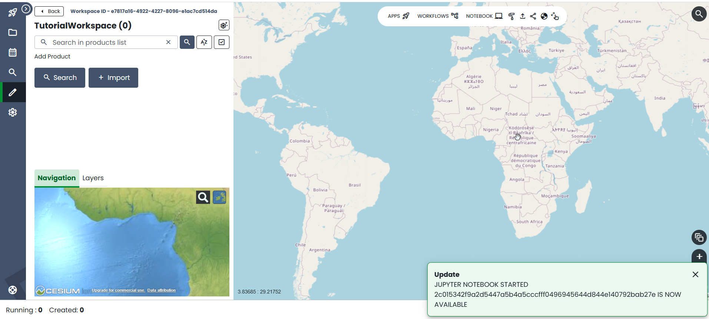

Jupyter Notebook Tutorial
===========================

This tutorial will guide you through the creation and usage of `Python Jupyter Notebooks in WASDI <https://wasdi.readthedocs.io/en/latest/UserManual/UsingYourWorkspace.html#open-jupyter>`_.

The (toy) problem we are addressing is retrieving and visualizing data. We will use Sentinel-5p products because they are small and quick to import, open and visualize, but the procedure works with any type of product supported by WASDI.

The tutoriaL follows the structure of a webinar we did for ESA:

.. youtube:: eNkWPD7nehY

Prerequisites
---------------------------

You will need:

- a valid WASDI user
- a workspace

You don't have them? Then `go get them <../GettingStarted/WasdiTutorial.rst>`_!

Create and Open Jupyter Lab
---------------------------

Open the workspace and once you are in the editor, click on the "Notebook" button:

An alert will invite you to wait for it to be ready.

.. image:: ../_static/JupyterNotebookTutorial/01.Patience.png

When the notebook is ready, a notification will tell you. 

Jupyter won't open automatically. You will need to click again on Notebook button. At that point, Jupyter Lab will open in another tab of the browser

Get started coding
---------------------

Let's create a jupyter: click on the icon to create a new Python 3 (ipykernel) notebook:

We will use `matplotlib` to generate visualization, so let's install it. In the first cell type:

.. code-block:: console

    !pip install matplotlib

You can execute it.

Next, create a new cell. Let's import some packages: type the following, and run it

.. code-block:: python3

    from datetime import datetime
    from datetime import timedelta
    import numpy
    from osgeo import gdal
    import matplotlib.pyplot as plt
    import wasdi

We can now start the WASDI Python library:

.. code-block:: python3

    wasdi.init()

Run the cell. Pay attention to the output and enter your username and password when requested. The library will the proceed to open the current workspace and confirm that the session is valid.

.. note::

    If you don't get a valid session, you probably inserted the wrong username and password. No problem: re-execute the cell and try again. Can't insert the new credentials? No panic: Kernel -> Restart Kernel. Try again ;)

Let's now see how to log to WASDI, create a new cell, type the following code and run it:

.. code-block:: python3

    # this is how we log a line in WASDI
    wasdi.wasdiLog("Welcome to tutorial on Jupyter Notebooks")

Next, we will set up a parameter dictionary. Normally, you wouldn't do this in a WASDI application, but rather read the parameters from input. However, to learn how the library works, let's do this preparatory step. Create a cell and type the following (read the comments to understand what's going on):

.. code-block:: python3

    # define input parameters (just for this exercise: normally parameters are fed from the user)

    # In any geospatial query in WASDI, we will need:
    # 1. an AoI in the form of a bounding box
    # 2. a time interval, in the form of a start and an end date
    # 3. collection-specific parameters

    # begin with a bounding box
    oInputParameters = {
        "BBOX": {
            "northEast": {
                "lat": 51.0,
                "lng": 7.7
            },
            "southWest": {
                "lat": 50.0,
                "lng": 6.5
            }
        }
    }

    # Define a time interval
    oEndDay = datetime.today()
    oStartDay = oEndDay - timedelta(days=2)

    # stringify the dates
    oInputParameters['endDate'] = oEndDay.strftime("%Y-%m-%d")
    oInputParameters['startDate'] = oStartDay.strftime("%Y-%m-%d")

    # print the params so far
    print(oInputParameters)

    # now let's define search parameters specific for this collection:
    # it's Sentinel-5p, so let's look for a pollutant: NO2
    searchParams = {
        'producttype': 'L2__NO2___'
    }

    # save parameters in the WASDI session
    # (normally we would not do this, WASDI would give us the parameters provided by the user)
    wasdi.setParametersDict(oInputParameters)

Now let's see how we can read parameters from within a WASDI application

.. note::

    From within the code of a WASDI application, we don't know **how** the parameters were fed to the application. Several ways are possible: if your code is running locally, then you may have loaded a JSON file, if it's running in the cloud, then the parameters might have been passed through the web UI, or maybe they have been passed programmatically by the calling code.
    However, we can read the parameter dictionary items with `getParameter`, or the entire parameter dictionary using `getParametersDict`

Create a new cell, input this code, and run it:

.. code-block:: python3

    # Let's see how we read parameters from WASDI

    # Read Bounding Box(LATN, LONW, LATS, LONE)
    # the second string is the (optional) default value
    sBbox = '51.0,6.5,50.0,7.7'
    oBbox = wasdi.getParameter('BBOX', sBbox)

    # did you notice we specified the default value as a string?
    # If your python-sense tickled you here, good, you paid attention!
    # In the previous cell, we specified the BBOX as a dictionary, and here
    # it's a string, so? No problem! WASDI supports both formats in queries

    # Let's log it
    wasdi.wasdiLog(f'Bounding box: {oBbox}')

    # Read time interval
    sStartDate = wasdi.getParameter('startDate')
    sEndDate = wasdi.getParameter('endDate')
    print(f'Interval: {sStartDate} - {sEndDate}')

    # let's log one line
    wasdi.wasdiLog(f'Searching Sentinel-5p product for time period: {sStartDate} - {sEndDate}')

Let's do the search now. Create a new cell, type the following code, run it:

.. code-block:: python3

    wasdi.wasdiLog('Search for available Sentinel-5 products')

    aoSearchResults = wasdi.searchEOImages('S5P', sStartDate, sEndDate, oBoundingBox=oBbox, aoParams=searchParams)

    wasdi.wasdiLog(f'Found {str(len(aoSearchResults))}')

The results are stored in a list, and the last instruction will print just the number of results. Now let's explore the first one in a new cell:

.. code-block:: python3

    # let's explore the results of the search
    # pick the first one:
    if len(aoSearchResults) > 0:
        print(aoSearchResults[0])

Run the cell: you will see that each result is a dictionary with some items, including the conventional name, the footprint, and a link for importing it from the data provider. Let's import it, and don't worry, WASDI will handle it. Create a new cell and paste this code in:

.. code-block:: python3

    # import one product

    if len(aoSearchResults) > 1:
        # as an example, import only the first one
        wasdi.importProduct(aoSearchResults[0])

    print('Product imported')

Run the code to import the product. As an exercise, you can import them all. One way would be to loop through all the results. A more efficient way, is to use the `importProductList method <https://wasdi.readthedocs.io/en/latest/Libraries/python/waspy.html#importproductlist>`_

Now create another cell, and let's discover how to run a WASDI processors programmatically. Put this code in a new cell, and run it:

.. code-block:: python3

    wasdi.wasdiLog('Convert S5 product to GeoTIFF')

    # pick just the first product returned from the search
    oFoundProduct = aoSearchResults[0]

    # we will call a processor named s5_2_tiff
    # which is already deployed in WASDI

    # Prepare the inputs for the processor
    aoInputs = {}
    aoInputs["S5Image"] = oFoundProduct["fileName"]
    aoInputs["Band"] = "nitrogendioxide_tropospheric_column"

    # call the processor...
    wasdi.wasdiLog('starting the processor')
    sProcessId = wasdi.executeProcessor("s5_2_tiff", aoInputs)
    wasdi.wasdiLog(f'waiting for process {sProcessId} to complete')
    # and wait for it to complete
    sStatus=wasdi.waitProcess(sProcessId)
    wasdi.wasdiLog(f'Process {sProcessId} completed in status {sStatus}')

Processors, in WASDI, have a payload, which is way of saving textual data. It's a JSON object. Let's see what `s5_2_tiff` saved in its payload: create a new cell, past this code in it and run it:

.. code-block:: python3

    # read the payload
    oPayload = wasdi.getProcessorPayload(sProcessId, True)

    if oPayload is not None:
        print(f'Payload saved for the process:\n{oPayload}')
        sTiffFile = oPayload["output"]

As an exercise, try to convert all imported files to tiff. Check the payloads of the processors you execute. Finally, remove imported files (.zip) from workspace and keep just the tiffs you extracted with `s5_2_tiff`

Finally, let's have a look at the band. Create a final cell, copy this code there, run it:

.. code-block:: python3

    # let's see the band

    if oPayload is not None:
        sPath = wasdi.getPath(sTiffFile)

        dataset = gdal.Open(sPath)
        band1 = dataset.GetRasterBand(1)
        b1 = band1.ReadAsArray()
        b1[numpy.where(b1 > 1)] = numpy.nan  #no data is 9.96921e+36

        f = plt.figure()
        plt.imshow(b1)
        plt.savefig('Tiff.png')
        plt.show()

What happened here? `wasdi.getPath(sTiffFile)` returns the path to the GeoTIFF file we just created. In general, it returns the path to the product you pass as argument.

.. note::

    If your code is running locally on your PC, the library realises if the product is missing and in that case downloads it from WASDI to a folder on your hard disk. That means that the first time you will incur a significant delay, but from the second run on it will be faster.

Then the following code opens the band with GDAL as a dataset, turns it into a numpy array, and then replaces invalid values with `NaN`. Finally, the last 3 lines plot the data with `matplotlib`