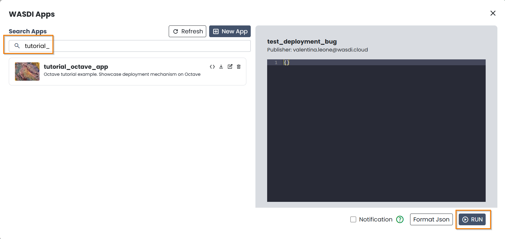
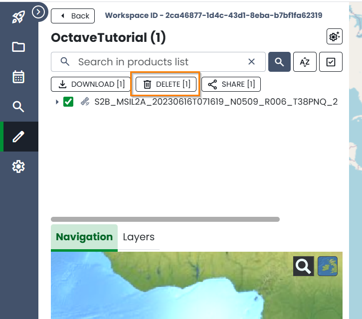
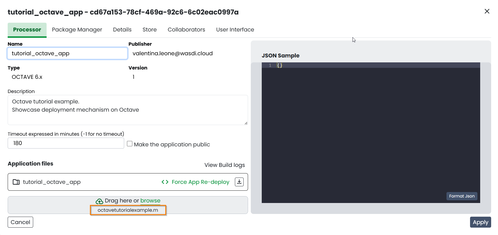

.. TestReadTheDocs documentation master file, created by
   sphinx-quickstart on Mon Apr 19 16:00:28 2021.
   You can adapt this file completely to your liking, but it should at least
   contain the root `toctree` directive.
.. _OctaveTutorial:

Octave Tutorial
===========================

This tutorial showcase the capabilities of WASDI Octave library.
For more information about Octave and Matlab compatibility, please check the following  `URL <https://octave.org/#:~:text=The%20Octave%20syntax%20is%20largely,operations%20on%20vectors%20and%20matrices.>`_

The tutorial is divided upon two main parts : 

- Local setup
- WASDI deployment and execution 

During the first part of this tutorial the execution of the code will be done on a local environment. 
For the sake of simplicity few operations will be included keeping the actual operational code as small as possible.
Next a brief introduction to the Octave package management in WASDI is presented.

The last phase will be to adapt the code to be deployed in a new WASDI application, to be executed in the cloud.

Local Setup
---------------------------
This first chapter covers the preparation of the folder in order to execute the code as it will be executed by WASDI as an application.

Remember the WASDI motto **"Develop at home, deploy to the cloud"** ? 
That's pretty much the spirit and little setup is required.
The preparation of this environment is required to align with the effective execution setup when the application will be deployed in WASDI.

Download the following `zip archive <https://raw.githubusercontent.com/fadeoutsoftware/WASDI/master/libraries/matlabwasdilib/matlabwasdilib.zip>`_. 

The archive contains the following assets:
- Matlab/Octave library functions (a set of various .m files)
- Java library to interact with WASDI itself

Create a new folder with the application name, in this case we will use **OctaveTutorialExample**: extract the content of the archive just downloaded inside the folder.

.. image:: ../_static/octave_tutorial_images/octave_tutorial_1.png

Add configuration 
^^^^^^^^^^^^^^^^^
Wasdi application requires an initialization in order to connect to the service.
This initialization is done by leveraging a JSON file named **config.json**.

Please proceed to create a file with the following content, replacing fields value with your data: 

.. code-block:: JSON

 {
    "USER": "The e-mail used to register in WASDI",
    "PASSWORD": "Your password",
    "PARAMETERSFILEPATH": "./parameters.json"
 }

Create application entry point 
^^^^^^^^^^^^^^^^^^^^^^^^^^^^^^^
We can now create the main entry point for the application: by convention **the entrypoint must have the same name as the application !**.
So, if we call our application **octavetutorialexample**, we need to add a file called **octavetutorialexample.m**.
NOTE: In order to avoid problems related to encoding all Octave applications names are converted to lowercase: please follow this convention also in the naming of the main 
entrypoint file.

Create a new file name it **"octavetutorialexample.m"**.
Add to the file the following content: 

.. code-block:: Matlab

   function octavetutorialexample(Wasdi)
      
      wLog(Wasdi,"Hello from Octave Tutorial example !");

   end

This will represent the main entry point of the application. Off course there is still the possibility to manage separated files in the same folder 
defining separated functions.
Adding custom path/folders must be done relative to the folder in which resides the entry point.

Zip the "octavetutorialexample.m" file, open wasdi and add a new application. 
Fill the form fields and upload the zip file. 

.. image:: ../_static/octave_tutorial_images/octave_tutorial_2.png

Proceed with the execution of the application: open the app, and click on "Run".
Looking at the logs we'll see our log from the application.

Local execution 
^^^^^^^^^^^^^^^^^^^^^^^^^^^^^^^

Re-open the application and download the application archive using the dedicated button:

Unzip the archive and you will notice one new file **myProcessor.m**: this is a standard wrapper used by wasdi application 
to execute the code of your application. 

Copy myProcessor.m to your local folder where the environment was prepared. 
Open the file and search for the following lines:

.. code-block:: Matlab

	addpath("/home/appwasdi/application/");
	Wasdi = startWasdi("/home/appwasdi/application/config.properties")

These paths represent the effective folder used in WASDI. To execute locally our algorithm we'll need to swap them 
with the complete directory where these files are now stored.

Edit the file config.properties adding your personal credentials int the relative fields

.. code-block:: Matlab
   
   USER=[Username on WASDI]
   PASSWORD=[Password]

Open **Octave** gui load myProcessor.m and execute it.
The command windows will show some details about WASDI initialization: 

 WASDI MATLAB LIB INITIALIZED it's a confirmation that our local environment is connected to WASDI. Nice ! 

Now, to showcase the local execution of functions from WASDI octave library, a search and download will be performed.
Open and edit **octavetutorialexample.m** adding a call to the method to :ref:`mat_SearchEOImages`.

Just as an example we'll search for Sentinel-2 images form the area around Milan (Italy) in the period 
between the 12th and 19th of June 2023.

Please re-open the file octavetutorialexample.m and substitute the entire code with the following:

.. code-block:: Matlab

   function octavetutorialexample(Wasdi)

   
      wLog(Wasdi,"Hello from Octave Tutorial example !");
      [asProductNames, asProductLinks, asProductFootprints] = wSearchEOImages(Wasdi,
      #sPlatform
      "S2",
      #sDateFrom, sDateTo,
      "2023-06-12",
      "2023-06-19",
      #dULLat, dULLon, dLRLat, dLRLon,
      8.995056152343752,45.39652136952787,9.478454589843752,45.6678052,
      #sProductType,
      "S2MSI2A",
      #sSensorOperationalMode,
      "",
      #iOrbitNumber,
      "",
      #sCloudCoverage
      ""
      )

      wLog(Wasdi,strcat(num2str(length(asProductNames))," Products found ! "));

   end

Save and re-launch myProcessor.m and the output will be:

Mid tutorial recap of the steps done:
- Created a new application in WASDI
- Downloaded the code to create the same environment between the cloud instance and the local execution
- Used the library to query Sentinel-2 catalog for images in the Milan area

The next step is about to create a Workspace in wasdi and connect to it from the local code environment. 
In this step we will highlight a peculiar behavior of WASDI which allows to create a parallel environment on 
you local PC. The ratio behind this feature is to allows smaller validation test on local machine. 

Upon reaching a certain degree of maturity of the algorithm the effective heavy weight computation can 
be transferred on WASDI powerful computational resources.

Open your web browser and navigate to `wasdi.net <https://www.wasdi.net>`_. 
Enter you credentials and proceed to Workspace section.

Select new workspace. Open it and rename it **"OctaveTutorial"**.

Open the file config.properties and add the following line:
.. code-block:: JSON

   WORKSPACE=OctaveTutorial

With this new parameters our script is now "pointing" to the workspace created.
Now proceed with the download of the first image of the two founded with the search call.

Edit **octavetutorialexample.m** and add the following lines:

.. code-block:: Matlab

   wLog(Wasdi,"Downloading the first product...");

  wImportProduct(Wasdi,asProductLinks{1},asProductNames{1},"")

The execution of the code will download the file searched in your workspace.
You can check the new file inside you workspace directly in WASDI :

WASDI deployment and execution 
--------------------------------------

Workspace setup
^^^^^^^^^^^^^^^^^^^^^^^^^^^^^^^
The next steps will showcase the execution of the same code but within the cloud environment.
First we need to delete the product downloaded from the workspace:

New codebase deployment
^^^^^^^^^^^^^^^^^^^^^^^^^^^^^^^

Open the application windows, search for "octavetutorialexample" and edit the application.
Drag and drop the main entry file **octavetutorialexample.m** to the drag and drop area. 

WASDI allows to re-write all the source code files by passing a zip file or to deploy single modifications 
to single files.

In these case we're using the single file approach. 
Click on apply and the application will be deployed with the new code base.

Open apps windows and launch the application:

The logs will show the new download operation:

At the end of the process the sentinel-2 image will be again present in our workspace ! 

This concludes the tutorial. This working example showcase the peculiar library management on 
Octave/Matlab. Actual processing scripts can be included in this workflow, leveraging the features available in Octave itself.

Explore our documentation for more information about the possibilities to create new applications using data and functionalities exposed by WASDI !