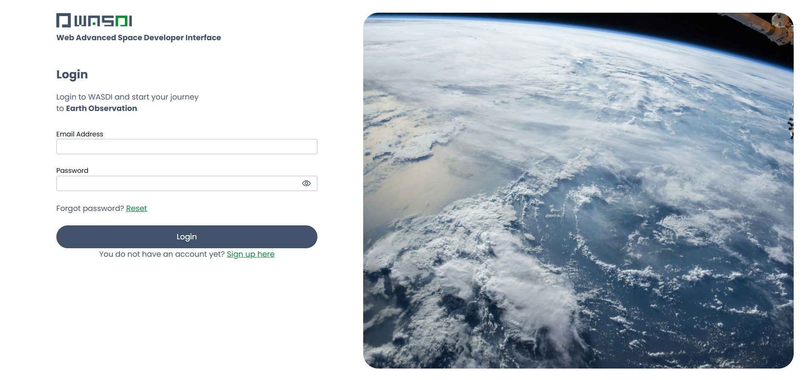
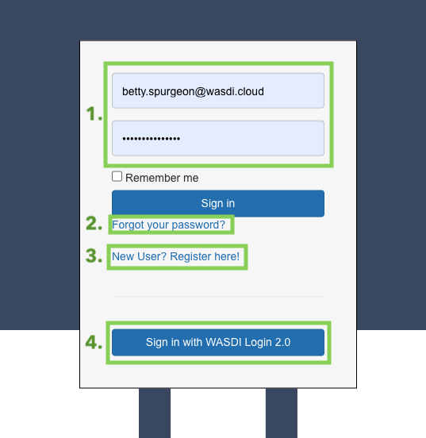

.. TestReadTheDocs documentation master file, created by
   sphinx-quickstart on Mon Apr 19 16:00:28 2021.
   You can adapt this file completely to your liking, but it should at least
   contain the root `toctree` directive.
.. _SiteMap:

Site Map
===========================

Login Page
---------------------------

To begin a session on WASDI, you must first log on to https://www.wasdi.net/. Here you will be welcomed with our homepage.

|

Logging In 
+++++++++++++++++++++++++++

|

This login card provides you with four options: 

1. Log into an existing account.

2. Reset a lost or forgotten password.

3. Register with WASDI and create a new account. 

To Login, simply enter your account credentials (email and password).

