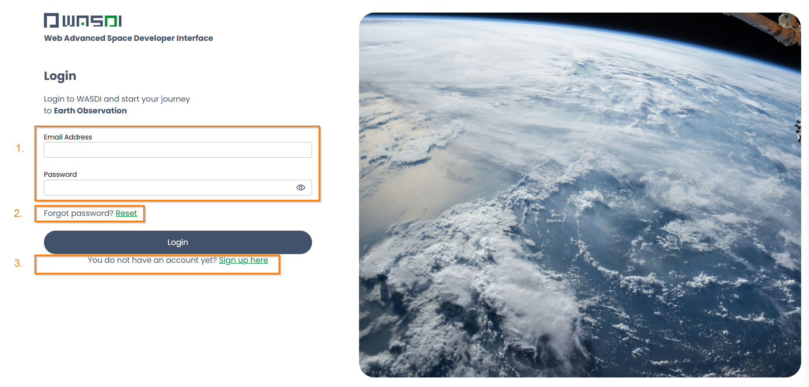

.. TestReadTheDocs documentation master file, created by
   sphinx-quickstart on Mon Apr 19 16:00:28 2021.
   You can adapt this file completely to your liking, but it should at least
   contain the root `toctree` directive.
.. _SiteMap:

Site Map
===========================

Login Page
---------------------------

To begin a session on WASDI, you must first log on to https://www.wasdi.net/. Here you will be welcomed with our homepage.

|

In the top right-hand corner there is a toolbar. 

|

This toolbar contains three options:

* The flag icon can be used to set the sit language. The options are: English, Italian, French, German, Vietnamese, Indonesian, and Romanian.

* The Info button will re-route you to https://www.wasdi.cloud/ by opening a new tab. This is WASDI’s informational site. Here you will find information about the company and platform, links to our social media pages, and other useful resources.

* The final button is a login button. When clicked it will open a login card in the middle of the page.

Logging In 
+++++++++++++++++++++++++++

|

This login card provides you with four options: 

1. Log into an existing account.

2. Reset a lost or forgotten password.

3. Register with WASDI and create a new account. 

4. Login with WASDI's new log in system. 

To Login, simply enter your account credentials (email and password) to the original login card or WASDI’s Login 2.0 which can be selected by clicking the bottom-most button from the homepage’s login card.

If you decide to use WASDI’s Login 2.0 system, you will be redirected to this page:

|

Here you will find most of the same options as WASDI’s original login page, but with the option to sign in with COIH, EduGAIN(GARR proxy), or EduGAIN as well.

You can use the same credentials (email and password) here as on the original login page.

