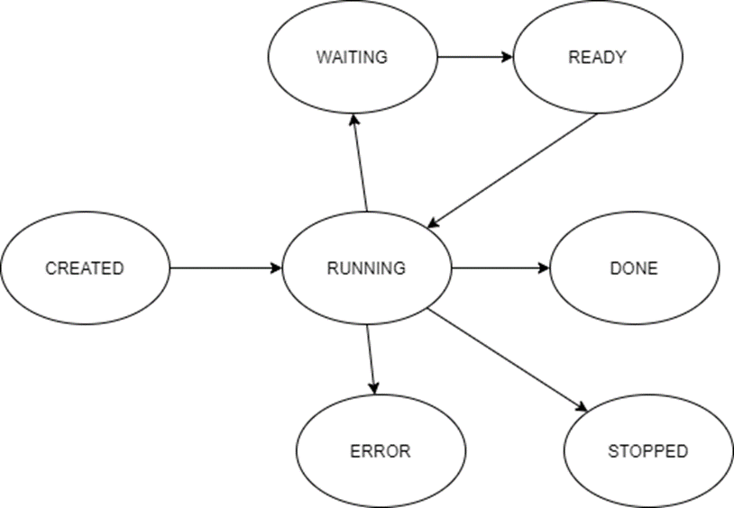
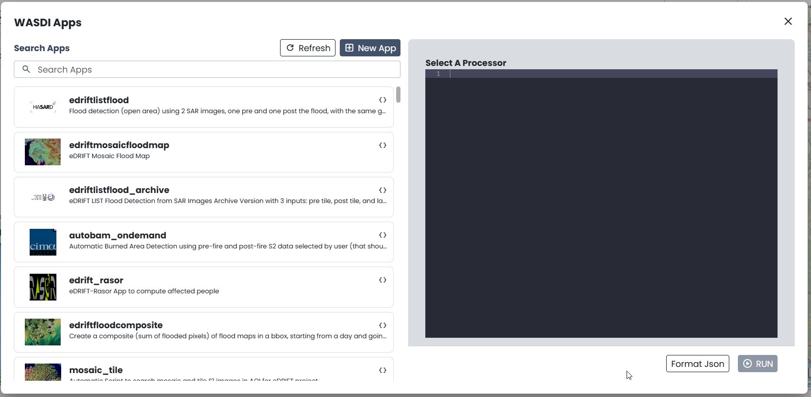
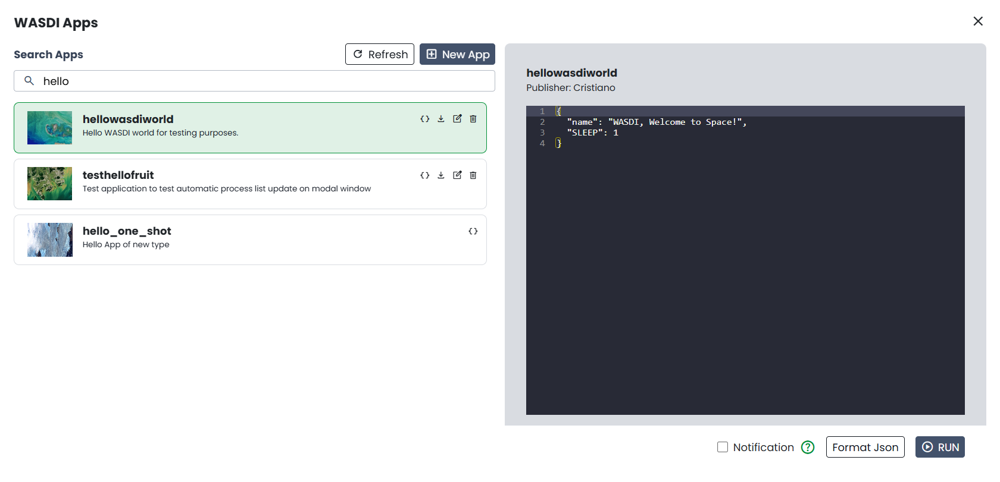

.. TestReadTheDocs documentation master file, created by
   sphinx-quickstart on Mon Apr 19 16:00:28 2021.
   You can adapt this file completely to your liking, but it should at least
   contain the root `toctree` directive.
.. _SynchAsynch:

Synchronous and Asynchronous WASDI programming
==================================================

Introduction
---------------------------
This tutorial is designed to explain in detail the Processes life cycle of WASDI, the meaning and difference between synch and asynch programming.

In this tutorial we use PyCharm as a free Python Development tool, but the code can be ran on every different Python environment.

It is out of scope of this Tutorial how to set up the environment and start programming with WASDI. For this you can refer to:

* :doc:`Wasdi Libraries Concepts </LibsConcepts>`
* :doc:`Python Tutorial </PythonTutorial>`

WASDI Processes
---------------------------
WASDI supports different operations. Each operation is called Process Workspace, since it is a process that is executed in a Workspace. 

Operations are a sort of Class, while Process Workspaces are Objects; the operations are what WASDI can do, a Process Workspace is an instance of one operation in a Workspace.

WASDI Operations are (the list is indicative):

* Download: more in general fetch of a Product (Image) in WASDI. The image can be really downloaded or accessed using the file system, depending by the Data Type and the cloud that hosts the computing node
* Ingest: this is the import of an image uploaded by the user or generated by an application
* Run Processor: with a sub type for each languange, is the operation that runs a user supplied application
* Graph: executes a SNAP graph on the cloud
* Mosaic: mosaic different products in a single new product
* Multisubset: subset one single image in one or more subsets (smaller parts of the original image)
* Sen2Core: executes the SNAP sen2core processor on the cloud

There are other operations that are more useful for the platform than for the developers and are out of the scope of this tutorial.

Each WASDI process has a state. The processes states are: 

* **CREATED**: each process workspace, when is triggered, goes in the CREATED state waiting for the scheduler to run it
* **RUNNING**: the process is up and running
* **WAITING**: the process is waiting for some other operation (process workspace) to finish
* **READY**: the process finshed to wait for other operation and now is waiting for the scheduler to restart it
* **DONE**: the process finished with success
* **STOPPED**: the process has been stopped by the user or by some timeout
* **ERROR**: the process ended in error

These states are handled like a String, in all the libraries. Some methods can return the status of an operation or set it; in both cases the state is a string.

We can divide these states in three categories:

* Pre Execution: CREATED is the only pre-execution state
* During Execution: RUNNING, WAITING and READY are the three states that means that the operation is executing
* Post Execution: DONE, STOPPED and ERROR are the three states that means that the operation is finished

Synchronous vs Asynchronous
---------------------------

Synchronous and Asynchronous are concepts that are valid in all the IT development world, not only in WASDI. 

With Synchronous, we mean that process A starts operation B and the execution of process A does not proceeed until operation B is finished. 

With Asynchronous, we mean that process A starts operation B and the execution of process A proceeeds immediatly without waiting that operation B is finished. 

These concepts are very important to optimize applications, specially in a cloud environment like WASDI where, **your application, if it is 'well written' in terms of synch or asynch operations, can scale up very quickly and use the full power of the cloud**.

In general, you need to use synch operations if the result of the operation you are running is needed to proceed and you can not do anything else in the meanwhile.

You are suggested to use asynch operations when you do not need immediatly the result of the operation to proceeed while in the meanwhile you can do something else.

In general, in WASDI, almost all the operations have two versions: Operation and asynchOperation. For example we can use:

.. code-block:: python 

	#Synch Version
	wasdi.importProduct(oProduct)
   
or

.. code-block:: python 

	#Asynch Version
	wasdi.asynchImportProduct(oProduct)

All the synch versions, returna a string (or an array of strings) with the output status of the requested operation.

All the asynch versions, return a string (or an array of strings) with ProcessWorkspaceId of the triggered operation.

Since each rule is done to be broken, All BUT ONE: executeProcessor, to run another wasdi app from your code, is ALWAYS an asynch call.

There are two methods in the library that can be used to re-syncronize the execution after the use of asynch operation:

.. code-block:: python 

	#Wait a single process: takes in input a string with the procId of the process to wait
	wasdi.waitProcess(sProcessId)

.. code-block:: python 

	#Wait a list processes: takes in input an array of strings with the procId of the processes to wait
	wasdi.waitProcess(arrayOfProcessIds)

Both functions returns the state of the processes in input: this will be one of the Post Execution States ("DONE", "ERROR" or "STOPPED").

Download Sample
---------------------------
Lets imagine that our application needs to import some images and apply some algorithm. We can imagine two situations to show the difference between synch and asynch operations.

Let start with the case where our application needs only one specific image in input: in this case, the image is needed... we need to import it and then we need to wait. Nothing to do. For this example, we make a search and then we use the first found image.

.. code-block:: python 

	#Search Images
	aoFound = wasdi.searchEOImages("S1", sDateFrom="2021-02-01", sDateTo="2021-02-02", sProductType="GRD", fULLat=44.5, fULLon=8.5, fLRLat=44.0, fLRLon=9.0)
	# Double check we have one
	if len(aoFound) > 0:
		wasdi.wasdiLog("Import Image 0")
		#Import the image
		sState = wasdi.importImage(aoFound[0])
		wasdi.wasdiLog("Import finished with status: " +sState)

If you run this snipped of code, you will see that execution breaks at the importImage line; you can check live on the wasdi user interface that in that workspace wasdi will start a download and, when is done, the control of the code will return to the log line.

Lets imagine instead that we need to retrive the full list of products. In this case, if we use the synch version, WASDI will trigger the execution of one download per time and will not use the ability of the cloud. Instead, if we use an asynch version, we can request all our list of images and then wait for all them to finish: in this case we push WASDI to download in parallel as many images as possibile:

.. code-block:: python 

	#Search Images
	aoFound = wasdi.searchEOImages("S1", sDateFrom="2021-02-01", sDateTo="2021-02-02", sProductType="GRD", fULLat=44.5, fULLon=8.5, fLRLat=44.0, fLRLon=9.0)
	
	# Here we will keep the list of process id that we started
	asOperationsIds = []
	
	# Double check we have one
	if len(aoFound) > 0:
		#For all our found images
		for oProduct in aoFound:
			wasdi.wasdiLog("Import Image " + oProduct["fileName"])
			# Start the import the image without waiting
			sOperationId = wasdi.asynchImportImage(oProduct)
			# Add the proc id to the list of the ones we need to wait
			asOperationsIds.append(sOperationId)
	
	# This line will be executed without waiting the images
	wasdi.wasdiLog("All import triggered, wait images")
	# Now, we stop and wait
	wasdi.waitProcesses(asOperationsIds)
	# This line will be executed when all are imported
	wasdi.wasdiLog("All images imported")
			
This code snippet is for didacting reason only: this functionality is already implemented in WASDI in a single function of the lib.

.. code-block:: python 

	#Search Images
	aoFound = wasdi.searchEOImages("S1", sDateFrom="2021-02-01", sDateTo="2021-02-02", sProductType="GRD", fULLat=44.5, fULLon=8.5, fLRLat=44.0, fLRLon=9.0)
	
	# Import all the images using the max power of the cloud
	wasdi.importProductList(aoFound)
	
	# This line will be executed when all are imported
	wasdi.wasdiLog("All images imported")

Start Other Applications
---------------------------
One of the most powerful feature of WASDI is the ability from one application to call another one. First of all, this means that in WASDI we have a full language interoperability: it does not matter in which language you are devoloping, you can call apps made in IDL, Java, Python or Matlab with the same syntax and same results.

As for your application the input is represented by your params.json, the same is for the others.

So to call another application in WASDI, you have to prepare a Dictionary that has a key for each parameter of the application you want to call, and assign the relative desired value.

Applications has two view in WASDI:

* App Store: is the Space Market of WASDI, desinged for end users
* Advanced App view: from the Edit section (just open a workspace), you can access the Apps view

From the apps view usually, each developer declares the sample json input required:

In the image, the hellowasdiworld app shows that takes a NAME parameter as input.

Usually, developers also add an help file to their applications where they declare the different parameters.

These are the info you need to call another app. 

As it has been stated before, to execute another application is always an asynch operation.

.. code-block:: python 

	#Prepare Params
	helloParams = {}
	helloParams["NAME"]="Synch Asynch Tutorial"
	
	#Call the hellowasdiworld application
	sProcessId = wasdi.executeProcessor("hellowasdiworld", helloParams)
	
	#Here you can do anything else!
	
	#Wait for the application to finish
	wasdi.waitProcess(sProcessId)
	
	wasdi.wasdiLog("Hello WASDI World finshed")

This snippet of code is the core for the optimization of your application.

Suggested WASDI App Organization
--------------------------------------
In our experience the best way to develop your wasdi application is an old advise: "Dividi et Impera".

Usually WASDI applications are developed to manipulate satellite data to obtain a value added product in output.

To obtain the value added product, your algorithm may need to take in input on single image, or a pair, or a list of images. In any case, usually, you can individuate the base brick of your algorithm that takes in input only the images needed and produces one or more output.

The suggestion is to start writing this first base processor: it can be developed and tested manually, using WASDI web interface to search, upload, import, preprocess or whatever is needed to prepare the input for you. The params.json should declares the images needed in input and any other specific param of your algorithm. 

Once this processor is ready, an automation processor can be build upon it: usually, the automation processor, takes in input date an bounding box and not the exact image to use: in this wrapper-processor you can search EO Images, filter results, apply workflows, mosaic, subsets, conversions, whatever is needed to run your base processor. 

When the data is ready, you can start in parallel as many instances as possibile of your base processor and then wait for all the different instances to finish and, maybe, if needed, mosaic or summarize the results that you will find in the workspace.

Using this technique usually let you take the best advantage from the execution of your code in the cloud. Also, it ensure you to have your code more portable: the base application takes in input only file names and can be quickly adapted to other systems or platforms, and you can isolate your dependency by WASDI only in the automation code.

Welcome to Space, Have fun!

