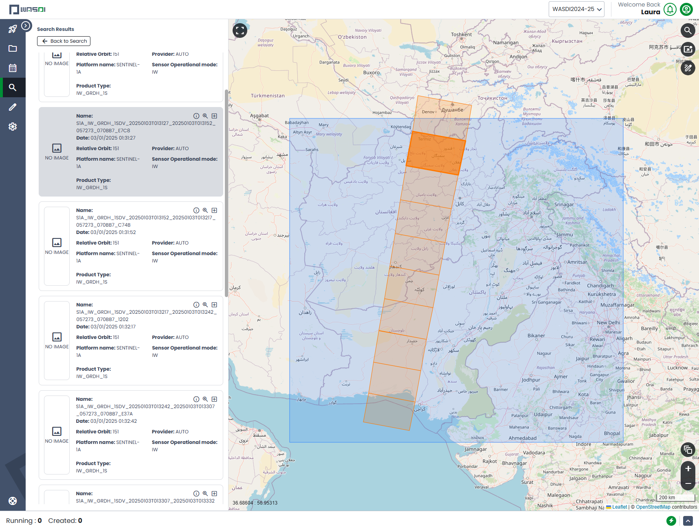
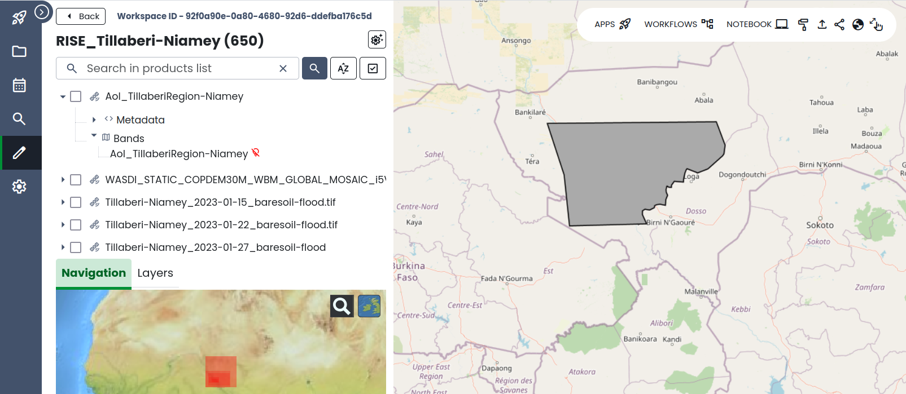

.. _how_to_use_shapefiles:

#########################################
How to Use and Import Shapefiles in WASDI
#########################################

Shapefiles are used in WASDI to define Areas of Interest (AOI), mask regions, and customize geospatial processing workflows. This guide provides an overview of shapefile usage and instructions on how to upload them in WASDI.

Prerequisites
===========================

To import a shapefile you need:
 - a valid WASDI Account
 - a workspace
 - a shapefile

You can use QGIS for instance to prepare your (polygon) shapefile. If you need guidance, refer to the YouTube tutorial `here <https://www.youtube.com/watch?v=knD2S89FV04>`_.

Uses of Shapefiles in WASDI
===========================
Shapefiles play an important role in geospatial processing within WASDI. Some of their main applications include:

- **Defining Areas of Interest (AOI):** Users can upload shapefiles to specify a geographic region for satellite image processing, reducing unnecessary computations outside the area of interest.
- **Masking and Filtering Data:** Shapefiles allow masking of certain areas, such as water bodies or urban areas, to focus processing on relevant regions.
- **Customizing Processing Workflows:** Many processing workflows, such as flood detection, can use shapefiles to refine results.
- Here is an example of a Shapefile being used in the workflow of the **SAR Archive Generator**:
    - The Shapefile Mask parameter (JSON: "SHAPEFILEMASK") allows uploading a shapefile (containing only one polygon) to exclude Sentinel-1 images outside the shapefile boundary.
    - The Area of Interest (AOI) must be rectangular, and the mask will exclude images outside the polygon.
    - This helps reduce unnecessary image processing while keeping relevant images for analysis.

Example of image (in dark orange) within a rectangular AoI (blue shade) but outside the borders of the country of interest (Pakistan in this specific example).

Recipe
=============================
To add a shapefile in WASDI, follow these steps:

1. **Prepare the Shapefile:**
   - A shapefile consists of multiple files, including:
     - ``.shp`` (feature geometry)
     - ``.shx`` (index of feature geometry)
     - ``.dbf`` (attribute information)
     - ``.prj`` (coordinate system and projection information in well-known text, or WKT, format)
     - (Optional) ``.cpg`` (character encoding information)
   - Ensure all required files are present in a single directory.

2. **Compress the Shapefile into a .zip File:**
   - Select all necessary files (.shp, .shx, .dbf, .prj, and optionally .cpg).
   - Right-click and choose **"Send to" > "Compressed (zipped) folder"** (on Windows) or use a similar method on other operating systems.
   - The **name of the .zip file** should match the shapefile name (e.g., if your files are named ``Valencia_AOI.shp``, ``Valencia_AOI.shx``, ``Valencia_AOI.dbf``, and ``Valencia_AOI.prj``, the zip file must be ``Valencia_AOI.zip``).
   - **Do not place the files inside a folder** before zipping; the files should be directly in the .zip archive.

3. **Upload the Shapefile to a Workspace in WASDI:**
   - Navigate to your required **Workspace** in WASDI.
   - Click on the **Import** button from the tools section.
   - Select and upload the shapefile .zip archive from your local directory.

4. **Visualizing the Shapefile:**
   - Expand the uploaded shapefile from the workspace.
   - Expand the **Bands** of the shapefile.
   - Publish the band to overlay it on the satellite imagery in the workspace.

Example of a shapefile (in dark grey) published in WASDI, highlighting a region in Niger.

Conclusion
==========
Shapefiles are a very useful tool in WASDI. By following the steps above, users can efficiently upload and utilize shapefiles to improve the accuracy and relevance of their workflows.

