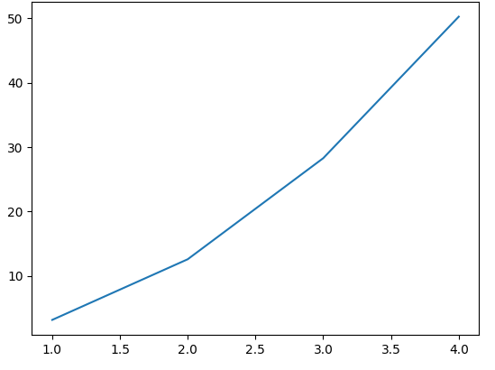

How to use matplotlib and plotly in WASDI
=========================================
`Matplotlib <https://matplotlib.org/>`_ and `plotly <https://plotly.com/python/>`_ are two commonly used python packages for plotting. If you wish to use them in WASDI notebooks, then this page is for you.

Prerequisites
------------------------------------------

To run this code you need:
 - a valid WASDI Account
 - a workspace
 - a Jupyter Notebook running in that workspace
 
If this is not clear, you probably need to take a look to the `Jupyter Notebook Tutorial <../ProgrammingTutorials/JupyterNotebookTutorial.html>`_ before.

matplotlib recipe
------------------------------------------

`Install the library <InstallCustomPackagesInNotebook.html>`_

.. code-block::

    pip install matplotlib -U

And test it:

.. code-block:: python

   import matplotlib.pyplot as plt

   radius = [1.0, 2.0, 3.0, 4.0]
   area = [3.14159, 12.56636, 28.27431, 50.26544]

   plt.plot(radius, area)
   plt.show()

You should be able to see a simple graph like this one:

If you can see the images, then good, you don't need to re-execute the pip install block in the future. Otherwise reach out for help on the `support forum <https://discord.com/channels/937730046335017002/1176058818770255872>`_ on our `discord server <https://discord.gg/FkRu2GypSg>`_.

plotly recipe
------------------------------------------

`Install the library <InstallCustomPackagesInNotebook.html>`_

.. code-block::

   pip install plotly -U

And then test it:

.. code-block:: python

   # we'll use this package to make plotly work with Jupyter notebooks in WASDI
   import plotly.io as pio
   import plotly.graph_objs as go

   # Set the default renderer to 'iframe'
   pio.renderers.default = 'iframe'

   fig = go.Figure(
       data=[go.Bar(y=[2, 1, 3])],
       layout_title_text="A Figure Displayed with fig.show()"
   )
   fig.show()

You should be able to see a bar plot like this one:

If you can see the images, then good, you don't need to re-execute the pip install block in the future. Otherwise reach out for help on the `support forum <https://discord.com/channels/937730046335017002/1176058818770255872>`_ on our `discord server <https://discord.gg/FkRu2GypSg>`_.

**What it does:**

In both cases, we first installed the required package and then we plotted a test graph to check it worked properly.
