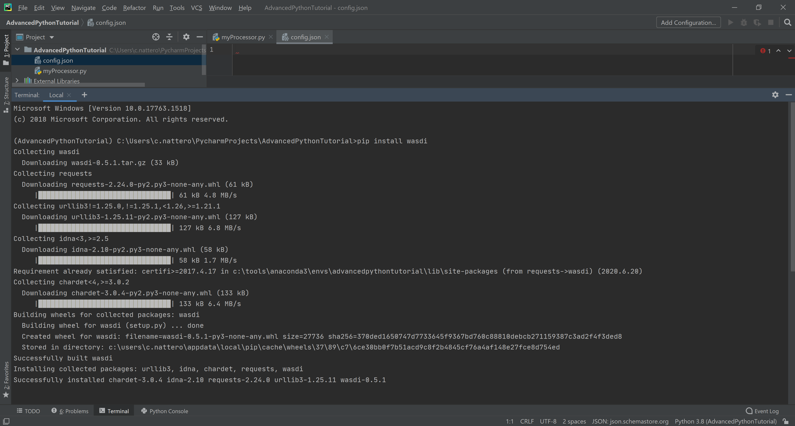
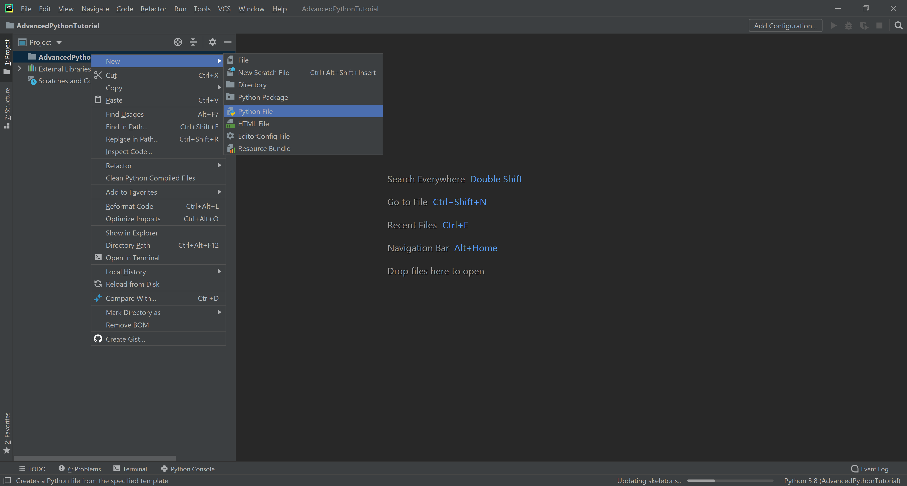
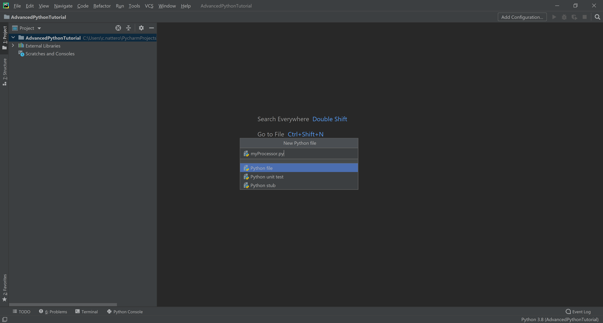
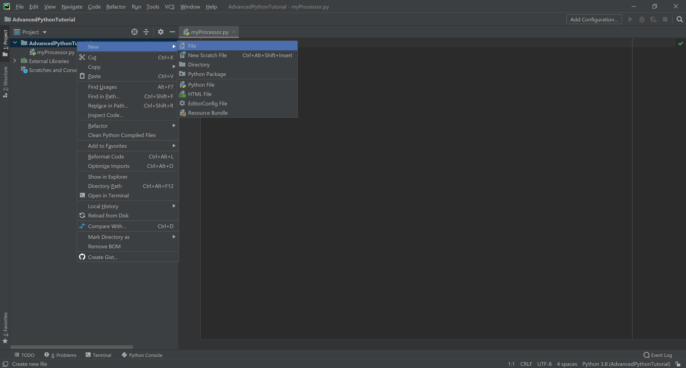
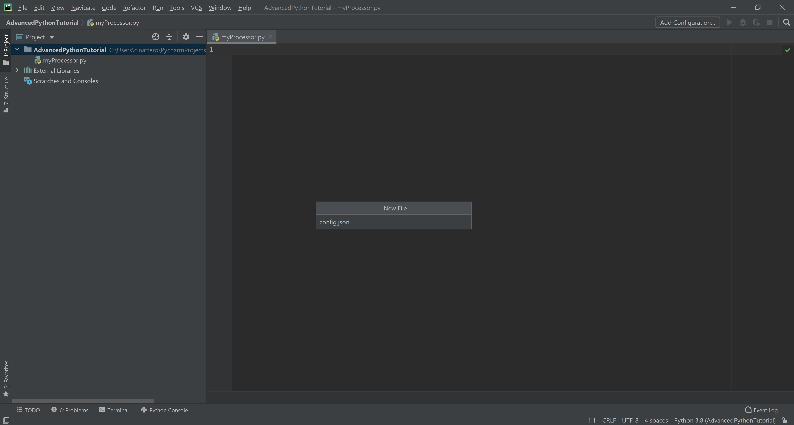
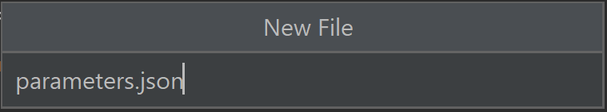
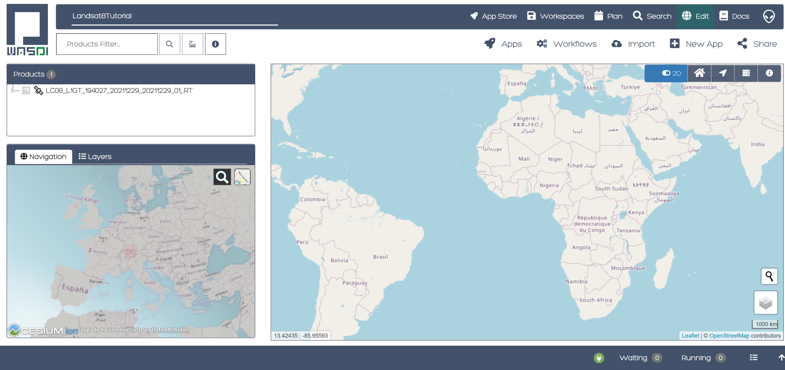
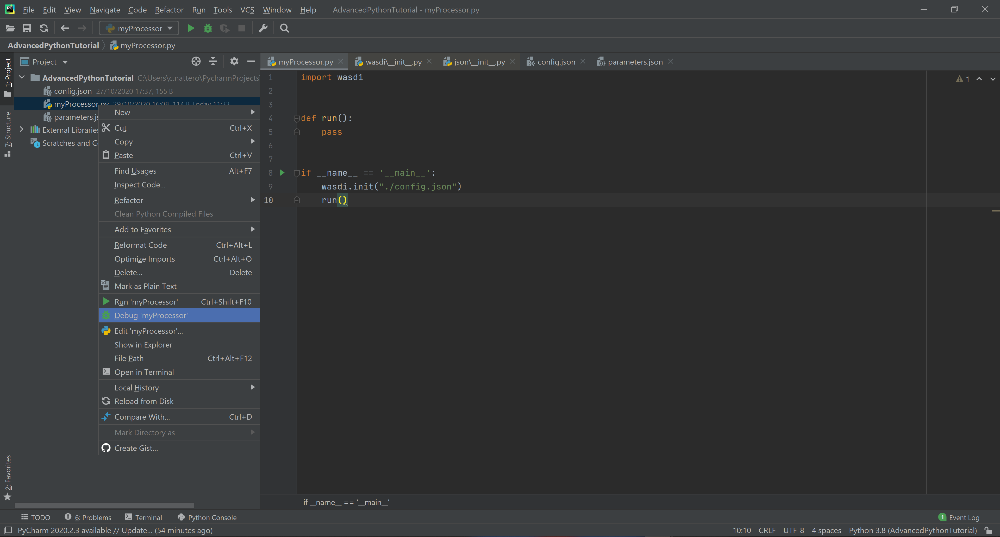

.. TestReadTheDocs documentation master file, created by
   sphinx-quickstart on Mon Apr 19 16:00:28 2021.
   You can adapt this file completely to your liking, but it should at least
   contain the root `toctree` directive.
.. _PythonLandsatTutorial:

Python Landsat Tutorial
===========================

Requirements
---------------------------
This tutorial is designed to show how to work with Landsat 8 files in WASDI. 
Details of the Landsat 8 mission and/or guidelines on how to configure your own environment are out of the scope of this tutorial
In this tutorial we use PyCharm as a free Python Development tool, but the code can be executed on every different Python environment.

.. note::
	This tutorial requires gdal working in your python env: we know this can be tricky.

	For Windows 10, we suggest following this tutorial:

	https://opensourceoptions.com/blog/how-to-install-gdal-for-python-with-pip-on-windows/

	The key is that here:

	https://www.lfd.uci.edu/~gohlke/pythonlibs/#gdal

	you can find different pre-build GDAL "images" that can be installed directly asking pip to use the file.

Overview
---------------------------
In this tutorial, we will learn how to work with Landsat 8 Images in WASDI. The tutorial will implement a processor that takes as input:

* Name of a Landsat 8 file
* List of Bands to extract, by default B5 and B4
* Resolution to use

The processor will open the Landsat image, create a tiff with only the selected bands, reprojected to the desired resolution, and then it will calculate NDVI, assuming that the first extracted band is NIR and the second is RED.

The equation to compute NDVI is: [NIR-RED]/[NIR+RED].

.. note::
	It is mandatory that at least 1 Landsat image is imported in the workspace (using the WASDI web interface, i.e. Search) BEFORE running this processor.
	Check `Wasdi Web Platform access and basic usage <https://wasdi.readthedocs.io/en/latest/WasdiTutorial.html>`_ for more general info on this.

Setup
---------------------------

Open PyCharm and start a new project.

.. image:: _static/python_tutorial_images/openPyCharmAndStartANewProject.png

Name it “Landsat8Tutorial” (or however you wish, just remember to be coherent). You may wish to create a new virtual environment or use an existing one. Uncheck the option for creating a “main.py” welcome script (or, at least, remember to delete it later on).

Let's install the library we need. In the terminal write:

.. code-block:: python 
  
   pip install wasdi
   
and hit enter

.. note::
	Remember you need also to have gdal installed.
	If you previously installed wasdi, you may wish to update it by adding the --upgrade flag, i.e.:

.. code-block:: python
  
   pip install --upgrade wasdi
   
Create first files
-------------------
Now we need to create these three fundamental files (right click on the Projec Icon, new -> ...):

* myProcessor.py: create a python file, then call it myProcessor.py
* config.json: create a file, then call it config.json (PyCharm will recognize automatically it is a JSON file)
* params.json: create a file, then call it params.json (PyCharm will recognize automatically it is a JSON file)

Create python file

Call it myProcessor.py

Create a json file

Call it config.json

Create a json file

Call it params.json

Next, point your browser to wasdi.net, log in, go in the Workspaces Section and create a new workspace. Call it "Landsat8Tutorial".

Go to the search section and select L8 data type and a bounding box in Europe

.. image:: _static/python_l8_tutorial_images/searchL8Image.jpg

Select one image and click on the + button to add the image to the Landsat8Tutorial Wokspace

.. image:: _static/python_l8_tutorial_images/addToWS.jpg

Come back to the edit section, and check that WASDI has been able to fetch the image.

Take note of the file you imported, we will need it later. For this tutorial we assume:

LC08_L1GT_196029_20211227_20211227_01_RT

but this can be changed with any image you imported.

Leave the browser open on that page, we will need it later on.

First lines
----------------------
Let's begin by editing the **config.json** file. It is a JSON file, containing the user credentials and some fundamental parameters to get you started (see :doc:`Wasdi Libraries Concepts </LibsConcepts>`):

.. code-block::

    {
      "USER": "your user name here",
      "PASSWORD": "your password here",
      "PARAMETERSFILEPATH": "./params.json"
      "WORKSPACE": "AdvancedTutorialTest"
    }
 
.. note::
	please, keep this file for yourself. You should never give this file to anyone else, and you do not need to upload to WASDI, as we'll see later on. You just need this file in your project for working with the WASDI python library.
	Use this file to change the workspace where you want to work.

Let’s then edit **params.json** file. It is a JSON file that represents the inputs needed by our processor. The WASDI Developer can decide what parameters are needed; each parameter has a unique name within the processor. Each parameter can be of different types (i.e. Strings, Integers, Float, Arrays, Complex Objects…). 
params.json is where you declare and valorize your inputs. The same inputs will be avaiable in the WASDI Web Interface when publishing the processor.

.. code-block::

    {
      "BANDS": ["B5", "B4"],
       "RESOLUTION": "30",
       "L8FILE": "LC08_L1GT_196029_20211227_20211227_01_RT.zip"
    }

Now, open **myProcessor.py**, create a main and a method called run. The latter is required for WASDI to work (more on that later on).

.. note::
	These are two requirements necessary to use WASDI:
		* have a python file called myProcessor.py
		* have a function called run() (no params) within myProcessor.py

After that, you can include as many python files as you need, regardless their organization in directories. 
You just need to have a myProcessor.py with a method run() as entry point.																		  

The main method will initiate the WASDI library and call the run method:

.. code-block:: python

   import wasdi
   
   
   def run():
       pass
   
   
   if __name__ == '__main__':
       wasdi.init("./config.json")
       run()
	   
As you can see, we call wasdi.init and pass the relative path of the config file to it.

.. image:: _static/python_tutorial_images/wasdi_init.png

Let's debug to see the effects of this. 

.. note::
	If a file main.py was created automatically for you, remember to define another debug configuration. The easiest way to do so is by right clicking on your code and select Debug ‘myProcessor.py’.

If the setup is correct so far, we should see the output from the wasdi library that shows the initialization has gone well. Something like this:

.. code-block:: python
    [INFO] _loadParams: wasdi could not load param file. That is fine, you can still load it later, don't worry
    [INFO] waspy.init: returned session is: 0d3f3ef1-f4c3-4202-9015-6ca17fc21cc7
    [INFO] waspy.init: WASPY successfully initiated :-)
    [INFO] waspy.printStatus: user: username@email.address
    [INFO] waspy.printStatus: password: ***********
    [INFO] waspy.printStatus: session id: 0d3f3ef1-f4c3-4202-9015-6ca17fc21cc7
    [INFO] waspy.printStatus: active workspace: 4f541d2c-4b29-445b-9869-9c8d185932ce
    [INFO] waspy.printStatus: workspace owner: username@email.address
    [INFO] waspy.printStatus: parameters file path: [...]/params.json
    [INFO] waspy.printStatus: base path: C:\Users\username\.wasdi\
    [INFO] waspy.printStatus: download active: True
    [INFO] waspy.printStatus: upload active: True
    [INFO] waspy.printStatus: verbose: True
    [INFO] waspy.printStatus: param dict: {'BANDS': ['B5', 'B4'], 'RESOLUTION': '30', 'L8FILE': 'LC08_L1GT_196029_20211227_20211227_01_RT.zip'}
    [INFO] waspy.printStatus: proc id:
    [INFO] waspy.printStatus: base url: http://www.wasdi.net/wasdiwebserver/rest
    [INFO] waspy.printStatus: is on server: False
    [INFO] waspy.printStatus: workspace base url: http://www.wasdi.net/wasdiwebserver/rest
    [INFO] waspy.printStatus: session is valid :-)

If you have the same situation, we are configured and ready to start!!

Extract Bands
-----------------
The first step of our processor will be to extract the bands from the L8 image. 
WASDI ingest L8 images as a .zip file.  Each .zip file contains different .tif images, one for each band, and some other files.
We want to implement a function that takes as input the name of the L8 zip file, a list of bands, a resolution 
and that then creates a new .tif file with only the extracted bands at the desired resolution. 
The L8 bands are:

* B1 - Coastal aerosol 30m
* B2 - Blue	30m
* B3 - Green	30m
* B4 - Red	30m
* B5 - Near Infrared (NIR) 30m
* B6 - SWIR 1 30m
* B7 - SWIR 2 30m
* B8 - Panchromatic 15m
* B9 - Cirrus 30m
* B10 - Thermal Infrared (TIRS) 1 100m
* B11 - Thermal Infrared (TIRS) 2 100m

Our function is implemented like this:

.. code-block:: python

 def extractBands(sFile, asBands, sResolution="30"):
    """
    Extracts some bands from the L8 zip file into a multiband tiff file at the specified resolution
     Bands are
     B1 - Coastal aerosol 30m
     B2 - Blue	30m
     B3 - Green	30m
     B4 - Red	30m
     B5 - Near Infrared (NIR) 30m
     B6 - SWIR 1 30m
     B7 - SWIR 2 30m
     B8 - Panchromatic 15m
     B9 - Cirrus 30m
     B10 - Thermal Infrared (TIRS) 1 100m
     B11 - Thermal Infrared (TIRS) 2 100m

     :param sFile: name of the Landsat 8 file
     :param asBands: array of string with the names of the bands to extract
     :param sResolution: resolution as a string is in meteres
     :return Returns the name of the new tiff file
    """

    # Output File Name that will be returned
    sOutputTiffFile = ""

    try:
        # Prepare the name a .vrt file that will be used to extract bands from the zip
        sOutputVrtFile = sFile.replace(".zip", ".vrt")
        # Prepare the name of the ouptut tif file
        sOutputTiffFile = sFile.replace(".zip", ".tif")

        # Get the Local Path of the input Landsat file
        sLocalFilePath = wasdi.getPath(sFile)

        # Get the path of the output files
        sOutputVrtPath = wasdi.getPath(sOutputVrtFile)
        sOutputTiffPath = wasdi.getPath(sOutputTiffFile)

        # Prepare an array of bands called BXX.TIF
        asBandsTiff = [b + '.TIF' for b in asBands]

        # Open the zip file
        with zipfile.ZipFile(sLocalFilePath, 'r') as zf:
            # Get all the files in the zip
            asZipNameList = zf.namelist()
            # Take from the files in the zip, the ones that match the BXX.TIF naming schema we are searching
            asBandsL8 = [name for name in asZipNameList for band in asBandsTiff if band in name]

            # Create the zip path of the files we want to extract
            asBandsZip = ['/vsizip/' + sLocalFilePath + '/' + band for band in asBandsL8]

            # Create an array that has the names of the files to extract in the order required by the asBands array in input
            asOrderedZipBands = []

            for sBand in asBands:
                for sZipBand in asBandsZip:
                    if sBand in sZipBand:
                        asOrderedZipBands.append(sZipBand)
                        break

            # Let gdal build a virtual file with our bands
            gdal.BuildVRT(sOutputVrtPath, asOrderedZipBands, separate=True)

            # Convert the vrt in tif with option  -tr sResolution sResolution to have all bands at the same res (ie -tr 30 30 to have at 30 meters)
            gdal.Translate(sOutputTiffPath, sOutputVrtPath, options="-tr " + sResolution + " " + sResolution)

            # we can remove the vrt file
            os.remove(sOutputVrtPath)
    except Exception as oEx:
        wasdi.wasdiLog("extractBands EXCEPTION")
        wasdi.wasdiLog(repr(oEx))
        wasdi.wasdiLog(traceback.format_exc())
    except:
        wasdi.wasdiLog("extractBands generic EXCEPTION")

    # Return the output file name
    return sOutputTiffFile

Compute NDVI
-----------------

The second step is to compute the NDVI starting for our extracted Tif file.
To compute NDVI we need to access the NIR and RED bands and compute the formula:
NDVI = NIR-RED/NIR+RED

.. code-block:: python

   def computeNDVI(sTiffFile, sNDVIOutputFile):
       """
       Compute ndvi assuming that in sTiffPath there is as band 1 NIR and band 2 RED
       :param sTiffFile: name of the input tiff file
       :param sNDVIOutputFile: name of the ouput file with ndvi
       :return: full path of sNDVIOutputFile
       """

       # Open the tiff file: we assume it has two bands
       oDataset = gdal.Open(wasdi.getPath(sTiffFile))

       if not oDataset:
           wasdi.wasdiLog("Impossible to get Dataset from " + sTiffFile)
           return ""

       # Get the dimension of the bands in input
       [iCols, iRows] = oDataset.GetRasterBand(1).ReadAsArray().shape
       # Create gdal GeoTiff driver
       oDriver = gdal.GetDriverByName("GTiff")
       # Create a new Ouput file, same dimension of the input, compressed and with type float32.
       oOutDataFile = oDriver.Create(wasdi.getPath(sNDVIOutputFile), iRows, iCols, 1, gdal.GDT_Float32, ['COMPRESS=LZW', 'BIGTIFF=YES'])

       # set to the output same geotransform as input
       oOutDataFile.SetGeoTransform(oDataset.GetGeoTransform())
       # set to the output same projection as input
       oOutDataFile.SetProjection(oDataset.GetProjection())

       # We assume NIR = band1, RED = band2
       oNIR = oDataset.GetRasterBand(1)
       oRED = oDataset.GetRasterBand(2)

       # Convert the band values in a numpy array
       adNIRBandArray = numpy.array(oNIR.ReadAsArray())
       adREDBandArray = numpy.array(oRED.ReadAsArray())
       # Force data to be float
       adNIRBandArray = adNIRBandArray.astype(float)
       adREDBandArray = adREDBandArray.astype(float)
       # Compute NDVI formula, where is not nan
       adNDVIBandArray = numpy.where((adNIRBandArray + adREDBandArray!=0), (adNIRBandArray-adREDBandArray)/(adNIRBandArray+adREDBandArray), 0)

       # Write the new calulated NDVI to ouput file band 1
       oOutDataFile.GetRasterBand(1).WriteArray(adNDVIBandArray)
       # We assume 0 as no data
       oOutDataFile.GetRasterBand(1).SetNoDataValue(0)

       # saves to disk!!
       oOutDataFile.FlushCache()
       wasdi.wasdiLog("Saved " + sNDVIOutputFile)

       # Clean memory
       oNIR = None
       oRED = None

       # Return the name of our NDVI create file
       return sNDVIOutputFile

This tutorial shows an NDVI as a sample, but is clear that with this technique you can manipulate L8 data to fit your needs.

Main Function
-----------------
Now the main operations are ready, we just need to put it all togheter.

.. code-block:: python

   def run():
       wasdi.wasdiLog("Landsat tutorial v.1.0")

       # Read from params the bands we want to extract and the resolution
       asBands = wasdi.getParameter("BANDS", ["B5", "B4"])
       sResolution = wasdi.getParameter("RESOLUTION", "30")
       sL8File = wasdi.getParameter("L8FILE", "LC08_L1GT_196029_20211227_20211227_01_RT.zip")

       # Call extract bands
       sTiffFile = extractBands(sL8File, asBands, sResolution)

       # Prepare the output NDVI name
       sNDVIFile = sTiffFile.replace(".tif", "_NDVI.tif")

       # Call compute NDVI
       computeNDVI(sTiffFile, sNDVIFile)

       # Add the file to the WASDI workspace
       wasdi.addFileToWASDI(sNDVIFile, "NDVI")

You can now test your processor.
Remember that, at the first time you will debug it locally, WASDI will take some time to download for you the L8 file you are using. All is done automatically and only once, when needed.

In the same way, when you add the file to WASDI, the lib will updload for your result to the cloud:

.. code-block:: python

   [INFO] waspy._internalAddFileToWASDI( LC08_L1GT_196029_20211227_20211227_01_RT_NDVI.tif, False )
   [INFO] waspy._internalAddFileToWASDI: remote file is missing, uploading
   upload LC08_L1GT_196029_20211227_20211227_01_RT_NDVI.tif
   uploadFile: uploading file to wasdi...
   uploadFile: upload complete :-)
   [INFO] waspy._internalAddFileToWASDI: file uploaded, keep on working!
   [INFO] Running Locally, will not update status on server

Now that the core of our processor is done, lets make it a little bit more WASDI-integrated.
We want to give some feedback to the user while the app is runnig and we do this using:

* wasdi.wasdiLog: locally just a print to console, when on the server, it sends the logs to the web user interface
* wasdi.updateProgressPerc: when on the server, updates the progress bar of the processor
* wasdi.setPayload: allows to save a user-defined object associated to the processor run

.. code-block:: python

   def run():
       wasdi.wasdiLog("Landsat tutorial v.1.0")

       # Read from params the bands we want to extract and the resolution
       asBands = wasdi.getParameter("BANDS", ["B5", "B4"])
       sResolution = wasdi.getParameter("RESOLUTION", "30")
       sL8File = wasdi.getParameter("L8FILE", "LC08_L1GT_196029_20211227_20211227_01_RT.zip")

       wasdi.wasdiLog("Calling extract bands")
       # Call extract bands
       sTiffFile = extractBands(sL8File, asBands, sResolution)

       wasdi.updateProgressPerc(30)
       wasdi.wasdiLog("Calculating NDVI")

       # Prepare the output NDVI name
       sNDVIFile = sTiffFile.replace(".tif", "_NDVI.tif")

       # Call compute NDVI
       computeNDVI(sTiffFile, sNDVIFile)
       wasdi.updateProgressPerc(80)

       wasdi.wasdiLog("Adding " + sNDVIFile + " to the workspace")
       # Add the file to the WASDI workspace
       wasdi.addFileToWASDI(sNDVIFile, "NDVI")

       # Create the payload object
       aoPayload = {}
       # Save the inputs that we received
       aoPayload["inputs"] = wasdi.getParametersDict()
       # Save the output we created
       aoPayload["output"] = sNDVIFile
       # Save the payload
       wasdi.setPayload(aoPayload)

       # Close the process setting the status to DONE
       wasdi.updateStatus("DONE", 100)

Welcome to Space, Have fun!

