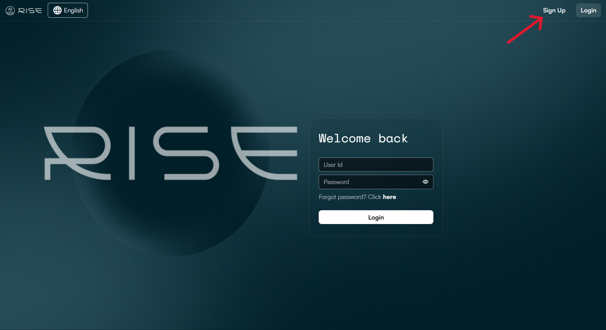

RISE User Guide - EN
===========================================

.. contents:: Table of Contents
   :depth: 3

1. Getting Started with RISE
~~~~~~~~~~~~~~~~~~~~~~~~~~~~~~~~~~~~~~~~~~~~~
To begin using RISE, one member must create the organization and will automatically assume the ADMIN role (see role details below). Follow these steps to complete the setup:

Step 1: Create a RISE Account
-------------------------------

IMAGE 1: landing page

* Go to: https://rise.wasdi.net/
* Click the **'Sign Up'** button in the top-right corner

IMAGE 2: Create an account

Enter your **personal account credentials** as follows:
* **User ID**: A unique login name (8+ characters).
* **Email Address**: Must not be linked to an existing RISE account.
* **Password**: Must include:
   * Minimum 8 characters
   * 1+ lowercase letter
   * 1+ capital letter
   * 1+ number
   * 1+ special character (@,$,!,%,*,#,?,&)

Check the boxes to accept the **Terms and Conditions** and **Privacy Policy**. You may click the links to review them before proceeding.

Step 2: Enter your Personal Information
-------------------------------

IMAGE 3: ID & PW

Provide your:
* First name
* Last name
* Phone number

Step 3: Enter your Organization's Information
-------------------------------

IMAGE 0.4: ID & PW

* Fill in your **organization’s details**.
* Then, click **'Register'** to complete the form.
* A confirmation email will be sent to the address you provided. If it doesn’t appear in your inbox, please check your **spam folder**.
* Click **'Confirm'** in the email to finalize your registration.

**Your are now all set up. Welcome to RISE!**

1. RISE Dashboard
~~~~~~~~~~~~~~~~~~~~~~~~~~~~~~~~~~~~~~~~~~~~~

IMAGE 5

The **Dashboard** serves as RISE’s home screen, providing quick access to **Areas of Operations (AoO)**, a summary of active hazard events, and user account management.

**Interactive Map (Center)**
The map displays AoOs as clickable markers (1). Each marker type indicates the zone’s access level:
* **Yellow markers:** Private AoOs, created by members of your organization.
* **Green markers:** Public AoOs, accessible to all RISE users.
* **Blue markers:** Shared AoOs, provided by users from other organizations.
To open an AoO, click on its marker on the map.

**Left Panel:**
The panel on the left (2) offers a live situation overview of the AoOs status, including:
* Ongoing hazard events
* Estimated affected population
* Critical alerts

**Top-Right Menu:**
Click the user icon (3) in the top-right corner to access:
* **Account:** Update personal details and account settings.
* **Organization:** View organization details and manage members (ADMIN/HQ roles only).
* **Subscriptions:** Handle billing and plans (ADMIN/HQ roles only).
* **Areas of Operations** Configure your AoOs (ADMIN/HQ roles only).
* **Language:** Switch the interface language.
* **Help:** Contact the RISE (WASDI) team for support.
* **Logout:** Securely exit your session.

**Map Tools:**
The following features are available on all RISE's pages including an interactive map:
* **Search bar** (4): Locate specific places.
* **Measurement tool** (5): Calculate distances/areas.
* **Base map controls** (6): Change the base map style (standard, topology, satellite, etc.) and zoom level.

**Navigation Tip**
From any RISE page, click the **RISE logo** (7) to return to the Dashboard instantly.

3. User Account
~~~~~~~~~~~~~~~~~~~~~~~~~~~~~~~~~~~~~~~~~~~~~
A. Overview
----------------------------------------------

IMAGE 6

From the user account page, you can access the following sections from the left panel:
* **User:** Update personal details and account settings.
* **Organization:** View organization details and manage list of members and their roles (ADMIN/HQ roles only).
* **Subscriptions:** Handle billing and plans (ADMIN/HQ roles only).
* **Areas of Operations** Configure your AoOs (ADMIN/HQ roles only).
See the sections below on how to invite collaborators to the organisation, add a new Subscription, and create a new Area of Operations.

B. Organization: Invite collaborators
----------------------------------------------

IMAGE 7

* From the **User Account** page, click on 'Organization' (1).
* Click on the 'Invite a collaborator to RISE' button (2).

IMAGE 8

* Enter the collaborator's email address in the first two fields (1).
* Assign a role to this future RISE user (2).
* After choosing the appropriate role for the collaborator, click on 'Invite a new user'

In RISE, user roles are defined as follows:
* **ADMIN:** Full system control, user & global settings management.
* **HQ:** Strategic oversight, multi-team reporting & coordination.
* **FIELD:** On-site operations, task execution, data collection.
* **SHARED:** Access to common features & shared resources across specific user groups.

The table below summarizes the permissions associated with each role in RISE:

.. list-table:: RISE Roles and Permissions
   :widths: 60 10 10 10 10
   :header-rows: 1

   * - **Actions**
     - **ADMIN**
     - **HQ**
     - **FIELD**
     - **SHARED**
   * - **RISE ORGANIZATION & USER ACCOUNT**
     -
     -
     -
     -
   * - Modify details and delete an organization
     - ✅
     - ❌
     - ❌
     - ❌
   * - Invite collaborators to an organization
     - ✅
     - ✅
     - ❌
     - ❌
   * - Purchase and modify a RISE subscription for an organization
     - ✅
     - ✅
     - ❌
     - ❌
   * - Modify personal user account details
     - ✅
     - ✅
     - ✅
     - ✅
   * - **OPERATION ZONE MANAGEMENT**
     -
     -
     -
     -
   * - Create, modify details and delete an operation zone
     - ✅
     - ✅
     - ❌
     - ❌
   * - Add collaborators (internal or external to the organization) to access an operation zone
     - ✅
     - ✅
     - ❌
     - ❌
   * - Make an operation zone public
     - ✅
     - ✅
     - ❌
     - ❌
   * - **OPERATION ZONE ACCESS**
     -
     -
     -
     -
   * - Access all operation zones of the organization
     - ✅
     - ✅
     - ❌
     - ❌
   * - Access an operation zone shared by an ADMIN or HQ collaborator
     - ✅
     - ✅
     - ✅
     - ✅
   * - Access all public operation zones
     - ✅
     - ✅
     - ✅
     - ✅
   * - Create, modify details and delete an event in an operation zone
     - ✅
     - ✅
     - ✅
     - ✅

C. Organization: Modify the list and roles of collaborators
----------------------------------------------

IMAGE 9

* To modify a user's role, click on the pencil icon (1).
* Click on the drop-down menu (2) and choose the desired role for the collaborator in question.
* Save by clicking on the floppy disk icon. (3)
* Cancel the ongoing role modification of a collaborator (4).
* Delete a collaborator from the organization (5).

D. Subscriptions: Add a new RISE subscription (AoO)
----------------------------------------------

IMAGE 10

* From the **User Account** page, navigate to the **Subscriptions** section in your user account (1).
* Click **'Buy New Subscription'** (2).
* Configure your subscription by specifying:
   * **Name and Description**: Give a name and identify the purpose of the subscription.
   * **Number of AoOs**: Select how many Areas of Operations (AoOs) you want to monitor.
   * **Plugins**: Choose the Earth-Observation (EO) data you want access to (e.g. flood, drought, buildings, etc.). More details on each plugins in the **'Area of Operations'** section below.
   * **Area Type**:
     * **Emergency Only Area**: Ideal for short-term, high-priority monitoring (e.g., natural disasters or ongoing incidents). Data is delivered rapidly but stored for only **3 months**.
     * **Long Term Area**: Suited for continuous or periodic monitoring (e.g., environmental studies or infrastructure tracking). Data delivery may be slower, but it is archived for long-term access.

E. Areas of Operations: Create a new AoO
----------------------------------------------

IMAGE 11

* **Prerequisite**: Ensure you have an **active subscription** (see section above for details).
* Go to the **'Area of Operations'** (1) section in your user account.
* Click **'Create New Area of Operations'** (2).

IMAGE 12

Configure your AoO with the following details:
* **AoO Name & Description (1)**: Provide a name and concise description for your AoO.
* **Public AoO (2):** Check this box to make the AoO visible to all RISE users.
* **Support Archive (3):** Enable this option to generate historical data archives for the selected plugins/layers.
* **Select Plugins (4):** Choose the plugins (or layers) you want to include in your AoO.

Next, use the tools on the left side of the map and listed below to define your AoO's location and area:
* **Search Bar (5):** Locate specific places on the map.
* **Import Shapefile (6):** Upload a pre-existing shapefile (geospatial vector data) to define your AoO.
* **Manual Bounding Box (7):** Define the AoO by entering coordinates manually or in JSON format.
* **Draw a Circle (8):** Click this button, then click on the map to create a predefined-size circular AoO.
* **Custom Draw Tool (9):** Use the drawing tools to create an AoO of any shape and size (within RISE’s acceptable limits).
You can use the **Base Map Controls** (10) to adjust the map style (e.g., standard, topography, satellite) and zoom level.

Once your AoO is defined, click **'Save'** (11) to finalize the creation. *Note: The first maps may take some time to process. You will receive an email notification when they are ready for review.*

1. Area of Operations
~~~~~~~~~~~~~~~~~~~~~~~~~~~~~~~~~~~~~~~~~~~~~~~~
A. Plugins (Layers)
---------------------------------------------------

IMAGE 13

* Click on any plugin located at the top (1) to display its latest available map. The map appears instantly on the screen. Note: several maps from different plugins can be displayed simultaneously.
* When a plugin is checked, its map details are automatically displayed in the left sidebar (2). 

For more information on plugins and their maps, see the table below:

.. list-table:: Flood Layers and Descriptions
   :widths: 25 45 20 15
   :header-rows: 1

   * - **Layer**
     - **Description**
     - **Map Frequency**
     - **Legend**
   * - High Resolution Flood
     - Flood detection outside urban areas (resolution: 10m)
     - 3 - 7 days
     - Light blue: Floods, Dark blue: Permanent water bodies
   * - Low Resolution Flood
     - Flood detection outside urban areas (resolution: 250m)
     - Daily
     - Light blue: Floods, Dark blue: Permanent water bodies
   * - Flood Frequency
     - Detection of more or less frequently flooded areas (resolution: 10m)
     - 1 map generated per operation zone
     - Scale from white (less flooded) to blue (more flooded)
   * - Urban Flood
     - Flood detection in urban areas (resolution: 10m)
     - If flooding is detected in an urban area
     - Light blue: Floods
   * - Composite Flood
     - Identifies all areas outside urban zones that have been flooded at least once in the last 3 years (resolution: 10m)
     - 1 map generated per operation zone
     - Light blue: Floods, Dark blue: Permanent water bodies
   * - Flood Depth
     - Measurement of flood depth in flooded areas
     - For each detected flood event
     - Depth scale: from purple (less deep, 0 m) to red (deeper, 5 m)
   * - Drought
     - Indication of drought risk
     - 10 days
     - Red: Hyperarid, Orange: Arid, Yellow: Semi-arid, Light green: Dry sub-humid, Green: Humid
   * - Buildings
     - Detection of urban areas (buildings)
     - Infrequent
     - White: Buildings
   * - Exposures
     - Delineation of critical infrastructure likely to be affected by flooding
     - If flooding affects critical infrastructure
     - White or red polygons: Potentially affected infrastructure
   * - Markers
     - Location of critical infrastructure likely to be affected by flooding
     - If flooding affects critical infrastructure
     - Red stars: Location of potentially affected infrastructure
   * - Roads
     - Location and delineation of road infrastructure likely to be affected by flooding
     - If flooding affects a road
     - Red lines: Potentially affected roads
   * - Crops
     - Detection of crop areas likely to be affected by flooding
     - If flooding affects crops
     - Red: Potentially affected crops
   * - Pop
     - Population density in urban areas likely to be affected by flooding
     - If flooding is detected in an urban area
     - Scale from white (less dense) to blue (more dense)
   * - Rain 24h, 12h, 3h
     - Precipitation over the last 24 hours, 12 hours, and 3 hours
     - Daily
     - Color scale: Green: 0 - 39 mm, Yellow: 40 - 100 mm, Orange: 101 - 200 mm, Red: > 200 mm
   * - Temperature
     - Land surface temperature (expressed in Kelvin)
     - 1-2 days
     - Scale from dark blue (243.15 K or -30 °C) to red (323.15 K or 50 °C)

B. Map details and features
-------------------------------------

IMAGE 14

* Date and time of the satellite image used to generate the map (timezone: CET) (1).
* Click the button with three dots (2) to access additional options:
    * Show or hide the legend (a).
    * Center the view on the selected layer (b).
    * Download the map (c).
    * Consult map details (source, resolution, etc.) and/or force layer update (d).
* Adjust map opacity to control its transparency (3).
* To temporarily hide a layer, uncheck the corresponding box. To show it again, check it (4).
* To remove a layer from the view, click the red trash can icon once the layer is active (5).

C. Analysis tools
--------------------------------------------

IMAGE 15

On the right side of the operation zone page, we have the following features:
* **User account (1):** Click here to return to dashboard, change language, etc.
* **Search bar (2):** Look for a specific location (e.g., city, country) to access it instantly.
* **Measurements (3):**Tool for calculating the area of a zone (polygon, square, circle, etc.) or the distance between two or more points.
* **Pixel info tool (4):** Get data on a specific map pixel, such as flood depth at a selected location.
* **Print Map View (5):** Export current view as PDF or PNG.
* **Layer analyzer (6):** Allows analysis of map data displayed in a defined area.
* **Base Map Controls (7):** Adjust the map style (e.g., standard, topography, satellite) and zoom level.

D. Historical data review
-------------------------------------------

IMAGE 16

By default, your view is positioned on today (or Live) and will displays the latest available maps for the plugins you activate.
* Click, hold, and drag the yellow bar on the timeline (1) to explore maps at different dates. 
* Your can also click directly on the calendar icon (2) to go to a specific date.
* The indicated date (3) corresponds to the day currently displayed. **Warning: The displayed date may not match the actual date of the maps due to varying update frequencies. For accuracy, always check the exact data capture date for each map in the left panel (4).**
* Use the buttons (5) to return to today and display the most recent maps
* Navigate day by day (back/forward) (6).
* Click on the flags (7) in the timeline to view hazard events, either manually saved by a member or automatically detected by RISE.

E. Impacts Evaluation

IMAGE 17

* In the event of flooding, click the "Impacts Evaluation" button (1) to generate a summary of the estimated impacts within your AoO.
* Select the area type (2) for the impact summary:
    * **Urban Flood Map:** Impacts on urban areas
    * **Bare Soil Flood Map:** Impacts on non-urban areas
    * **Merged Impacts:** Impacts on urban and non-urban areas combined
* The feature provides a summary of the following impacts affected by the flood:
    * **Population Affected:** Estimated number of people affected.
    * **Exposures Affected:** Estimated number of critical infrastructures (e.g. airports, hospitals, schools, etc.) impacted.
    * **Roads Affected:** Estimated number of roads affected.
    * **Crops:** Estimated total and affected crop area (in km²).
    * **Grasslands:** Estimated total and affected grassland area (in km²).
    * **Built Up:** Estimated total and affected building area (in km²).
Hover over the donut chart (3) to review the share (in %) of affected vs. non-affected area for Crops, Grasslands and Built Up areas.

F. Manage Events

IMAGE 18

In RISE, you can save a specific view as an event (e.g. during a flood) to allow you and your collaborators to revisit and review the corresponding maps at a later time. This ensures continued access to the maps from that date, even after the 3-month retention period, during which RISE automatically deletes older maps for monitoring-only Areas of Operations (AoO).
Once an event is saved, a flag (1) will appear on the timebar at the date of the saved view. Clicking the flag will load the event, displaying the corresponding maps. Additionally, the event’s start, peak, and end dates will be visible in the lower section of the left panel (2).

To create an event, follow these steps:
* Ensure to be currently at the date of the view you would like to save
* Click on **'Manage Events'** (3).

IMAGE 19

Click on **'Create new Event'**

IMAGE 20

Indicate the following event's details:
* **Name:** Assign a clear name to the event.
* **Public Event:** Choose whether to make the event visible to all RISE users. Note: The associated AoO must also be set as public.
* **Description:** Add a detailed description of the event.
* **Start Date:** Specify the date when the event began.
* **Peak Date:** Indicate the date when the event was at its peak.
* **End Date:** Enter the date when the event ended, or select **'Ongoing Event'** if it is still active.
* **Type:** Define the nature of the event.
Once you have filled in these details, click "Save".

IMAGE 21

After creating the event, you will find it listed along with its details on the **Manage Events** page.
If you wish to upload associated images and documents and link it to the event, click the **pen icon** (1) next to the event to edit it.

IMAGE 22

* Select the image or document by clicking **'Choose File'** (1), or simply drag and drop the files into the designated area.
* Click **'Upload'** (2) to add the image or document.
* Click **'Save'** (3) to confirm your changes.

The event, including its maps, details, images, and documents, is now saved and available for review whenever needed.
