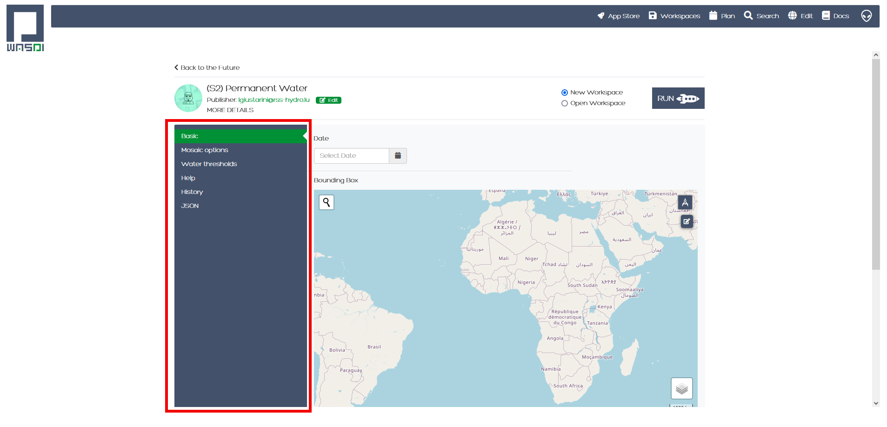
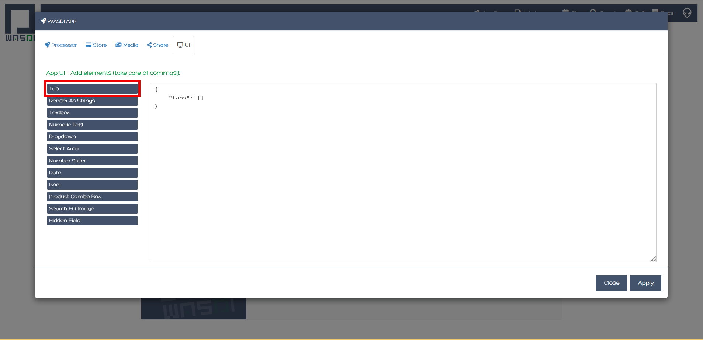

.. User interface tutorial

.. _UITutorial:

How to create a User Interface (UI)
==================

Here we introduce how to create a User Interface (UI) for an app that has already been deployed and made visible on the marketplace.
The UI represents a user-friendly way to enter the parameters that otherwise should be defined in the params.json file.
Indeed, the UI maps all parameters of the params.json file to an interface where the user can enter the parameter values,
using different pieces of the interface itself that describe what parameter is expected and guide the user in the selection.

The marketplace displays all visible apps:

.. image:: _static/ui_images/1.png

Selecting for example, the app named Automatic Permanent Water (S2):

.. image:: _static/ui_images/2.png

After clicking on it to select this app:

.. image:: _static/ui_images/3.png

And after opening the app itself, we are presented with the following:

Each of the elements listed to the left represent a tab. In this case there are 6 tabs: Basic, Mosaic Options, Water thresholds, Help, History and JSON. The last 3 tabs, i.e. Help, History and JSON are always created by default by WASDI, any time a developer creates a UI.
The figure above shows the controls of the tab named Basic (highlighted in green): in the figure we can see the first 2 controls of this tab, i.e. Date and Bounding Box. A control is a portion of UI to enter a certain parameter (as defined in the params.json file). In this case, the first parameter is a date and its corresponding control is a calendar, while the second parameter is a bounding box and its corresponding control is a map with options to define the bounding box itself.
After clicking on a different tab, for instance Mosaic options, the controls of this specific tab are displayed. In the figure below we can see the 4 controls of this tab, i.e. Minimum percentage covered in the composite, Maximum number of iterations to fill the mosaic, Option to make a mosaic of all water maps, Option to delete intermediate files. In this case, the parameter corresponding to the slider is a range of integers (for the first 2 controls in this tab), while the parameter corresponding to the on/off button is a Boolean variable (for the last 2 controls in this tab).

.. image:: _static/ui_images/5.png

In general, the following interfaces are available for different parameters:
*Text box to insert a text
*Calendar to insert a date
*Map to insert an area of interest
*Slider to insert an integer number
*Numeric field to insert a floating number
*Switch to insert a Boolean value
*Dropdown box to select a value from a pre-defined set of values
*Product Dropdown to let the user select an image in a workspace
For each control, the developer can set:
*The associated parameter
*The default value
*If it is mandatory or not
For each type of control, there may be additional options like a min and max value (for a slider), or the max or min area (for a bounding box).

To build the UI, WASDI needs a JSON file that describes the number of tabs, their names as they should appear in the UI, the order of the tabs, the controls to be included in each tab, the order of the controls in the tab and the type of control to be attributed to each parameter (as defined in the params.json file). To build the UI, the developer accesses the application edit window:

.. image:: _static/ui_images/6.png

and goes to the UI section:

.. image:: _static/ui_images/7.png

The UI editor is a text editor where the developer can type a JSON files describing the UI. The first time you open the UI text editor, it will look like this:

.. image:: _static/ui_images/8.png

“tabs” indicates that what will be added between the squared brackets is going to become one or more tabs. To add one tab, first set the cursor between the squared brackets and then click on Tab:

