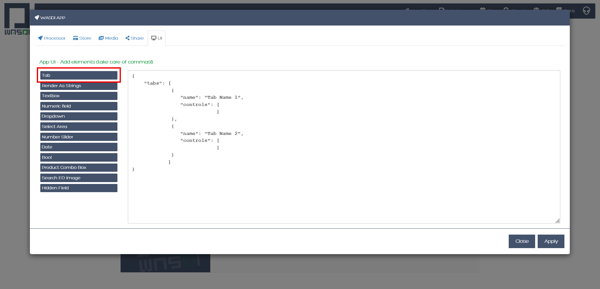
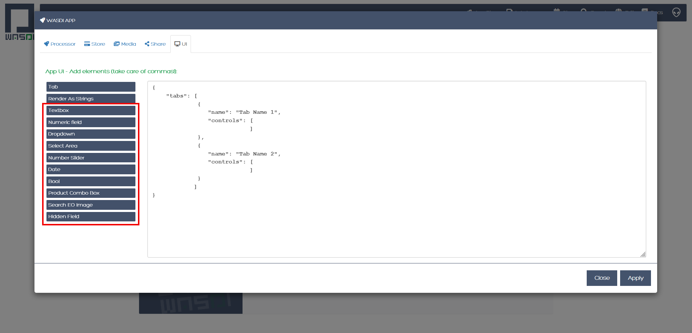
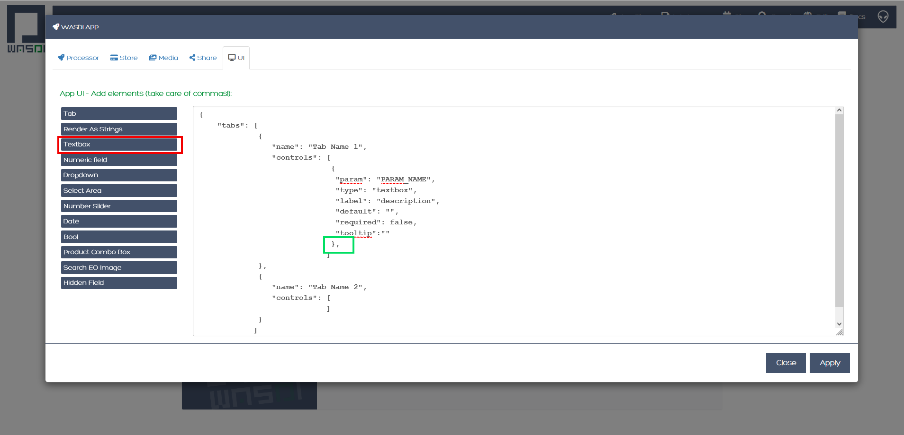
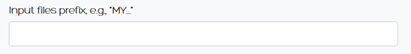

.. User interface tutorial

.. _UITutorial:

How to create a User Interface (UI)
=======================================

Introduction
------------------------------------------

Here we introduce how to create a User Interface (UI) for an app that has already been deployed and made visible on the marketplace.
The UI represents a user-friendly way to enter the parameters that otherwise should be defined in the params.json file.
Indeed, the UI maps all parameters of the params.json file to an interface where the user can enter the parameter values,
using different pieces of the interface itself that describe what parameter is expected and guide the user in the selection.

The marketplace displays all visible apps:

.. image:: _static/ui_images/1.png
    :scale: 50%

Selecting for example, the app named Automatic Permanent Water (S2):

.. image:: _static/ui_images/2.png
    :scale: 50%

After clicking on it to select this app:

.. image:: _static/ui_images/3.png
    :scale: 50%

And after opening the app itself, we are presented with the following:

.. image:: _static/ui_images/4.png
    :scale: 50%

Each of the elements listed to the left represent a tab. In this case there are 6 tabs: Basic, Mosaic Options, Water thresholds, Help, History and JSON. The last 3 tabs, i.e. Help, History and JSON are always created by default by WASDI, any time a developer creates a UI.
The figure above shows the controls of the tab named Basic (highlighted in green): in the figure we can see the first 2 controls of this tab, i.e. Date and Bounding Box. A control is a portion of UI to enter a certain parameter (as defined in the params.json file). In this case, the first parameter is a date and its corresponding control is a calendar, while the second parameter is a bounding box and its corresponding control is a map with options to define the bounding box itself.
After clicking on a different tab, for instance Mosaic options, the controls of this specific tab are displayed. In the figure below we can see the 4 controls of this tab, i.e. Minimum percentage covered in the composite, Maximum number of iterations to fill the mosaic, Option to make a mosaic of all water maps, Option to delete intermediate files. In this case, the parameter corresponding to the slider is a range of integers (for the first 2 controls in this tab), while the parameter corresponding to the on/off button is a Boolean variable (for the last 2 controls in this tab).

.. image:: _static/ui_images/5.png
    :scale: 50%

In general, the following interfaces are available for different parameters:
*Text box to insert a text
*Calendar to insert a date
*Map to insert an area of interest
*Slider to insert an integer number
*Numeric field to insert a floating number
*Switch to insert a Boolean value
*Dropdown box to select a value from a pre-defined set of values
*Product Dropdown to let the user select an image in a workspace
For each control, the developer can set:
*The associated parameter
*The default value
*If it is mandatory or not
For each type of control, there may be additional options like a min and max value (for a slider), or the max or min area (for a bounding box).

To build the UI, WASDI needs a JSON file that describes the number of tabs, their names as they should appear in the UI, the order of the tabs, the controls to be included in each tab, the order of the controls in the tab and the type of control to be attributed to each parameter (as defined in the params.json file). To build the UI, the developer accesses the application edit window:

.. image:: _static/ui_images/6.png
    :scale: 50%

and goes to the UI section:

.. image:: _static/ui_images/7.png
    :scale: 50%

The UI editor is a text editor where the developer can type a JSON files describing the UI. The first time you open the UI text editor, it will look like this:

.. image:: _static/ui_images/8.png
    :scale: 50%

“tabs” indicates that what will be added between the squared brackets is going to become one or more tabs. To add one tab, first set the cursor between the squared brackets and then click on Tab:

.. image:: _static/ui_images/9.png
    :scale: 50%

After clicking on Tab, this is what will appear on the right of the screen (the different brackets might be slightly differently indented):

This means that we are planning to create, in the UI, a single tab named, for the moment, “Tab Name”. This tab is going to have a certain number of controls that will need to be added between the squared brackets after “controls”:. In case you want to create a single tab, like in this example, make sure to remove the final comma.

Otherwise, if you like to make more than one tab in the UI, set the cursor after the comma and click again on Tab. Let’s assume we want to make 2 tabs in the UI, each of them with their controls. Then we will have something like this:

In this case we have one tab named “Tab Name 1”, comprised between curly brackets, and a second tab named “Tab Name 2”, comprised between curly brackets. A comma separates the pairs of curly brackets defining each tab. For the second tab, I took care of removing the comma that the system automatically adds any time one click on Tab, like you can see here below:

.. image:: _static/ui_images/12.png
    :scale: 50%

Now we see how to build a certain tab, i.e. the portion highlighted in the blue square in the figure below.

Here, "name" is the Tab Name. In the specific case “Tab Name 1” can be replaced by any strings, for example "Basic", "Advanced", "GIS", ...  This is the name that will be displayed in the UI. Careful: the order in which you put the tabs here is the same order in which they will be displayed in the UI.

Once the name of a tab has been chosen, we need to add its controls, between the squared brackets. Careful: the order in which you put the controls within the tab is the same order in which they will be displayed in the UI. The list of available controls is as follows:
•	Textbox: to display a parameter in the form of text
•	Numeric field: to display a parameter in the form of a float number
•	Dropdown: to display a parameter as a pre-defined set of values in a dropdown menu
•	Select Area: to display a parameter in the form of a an area of interest to be selected over a map
•	Number Slider: to display a parameter in the form of an integer number
•	Date: to display a parameter in the form of a date to be selected from a calendar
•	Bool: to display a parameter in the form of switch to insert a Boolean value
•	Product Combo Box: to select from an existing workflow where the required images have been previously loaded, the image(s) to be used
•	Search EO image: …
•	Hidden field: for parameters that the developer does not want to be exposed to the user
All these buttons are listed on the left of the screen.

To add controls to a given tab, first set the cursor between the square brackets after "controls": []. Then, clicking on the elements on the left of the screen, you can add one or more controls. The following paragraph walks you through each different control and shows how to set its properties and how it will eventually look like in the UI.
Each control is defined by one or more properties. All controls have at least 2 properties:
•	“param”
•	“type”
The property “param” is the one that links the parameter as displayed in the UI to the parameter defined in the params.json file .
The property “type” define the type of the interface block that will be added. In other words, it is one of the types listed above as available controls.
Other than these 2, other common properties are:
•	“label”
•	“default”
•	“required”
The property “label” is used to define the name the parameter in the UI.
The property "default" is used to set the default value of this parameter.
The property "required" is used to define is the parameter is mandatory or not.

Textbox
----------------
To add to “Tab Name 1” a control in the form of a text box, first set the cursor between the square brackets after “controls” and then click on the button Textbox (to the left of the screen).

Careful: in case you have only one control in this specific tab, make sure to remove the trailing  comma!
The property “param” is used to identify the parameter to be used here. "PARAM_NAME" has to be exactly the same as in the params.json file.
Do not modify the property "type": "textbox",.
The property "label" is used to define the name the parameter in the UI. In this case, it is prefilled with the text "description". Please change it to the name of your parameter as you would like to see it displayed in the UI.
The property "default" is used to set the default value of this parameter, in case the user does not know how to set it or does not want to change it.
The property "required" is used to define is the parameter is mandatory or not. It can be either true or false (careful: no "").
Again, careful with the trailing comma! If you add one more control to this specific tab, click after the final comma, otherwise take care of removing the final comma.

This is an example of how a Textbox control appears in the UI:

In this case, here is how the properties of this control were set:

.. code-block:: json

    {
    "label": "Input files prefix",
    "default": "",
    "required": true
    }

Numeric field
--------------------

To add to “Tab Name 1” a control in the form of a float number, first set the cursor between the square brackets after “controls” and then click on the button Numeric field (to the left of the screen).

.. image:: _static/ui_images/17.png
    :scale: 50%

Careful: in case you have only one control in this specific tab, make sure to remove the trailing  comma!
The property "param" is used to identify the parameter to be used here. "PARAM_NAME" has to be exactly the same as in the params.json file.
Do not modify the property "type": "numeric",.
The property "label" is used to define the name the parameter in the UI. In this case, it is prefilled with the text "description". Please change it to the name of your parameter as you would like to see it displayed in the UI.
The property "default" is used to set the default value of this parameter, in case the user does not know how to set it or does not want to change it. Set it to the numeric float value that you want as default.
The property "required" is used to define is the parameter is mandatory or not. It can be either true or false (careful: no "").
Again, careful with the trailing comma! If you add one more control to this specific tab, click after the final comma, otherwise take case of removing the final comma.

This is an example of how a Numeric field control appears in the UI:

.. image:: _static/ui_images/18.png
    :scale: 50%

In this case, here is how the properties of this control were set:

.. code-block:: json

    {
    "label": "Threshold to be applied to SWM (range of possible values: 1.4 - 1.6)",
    "default": 1.4,
    "required": true
    }

Dropdown
-----------------

To add to “Tab Name 1” a control in the form of a drop down menu with several options to choose from, first set the cursor between the square brackets after “controls” and then click on the button Dropdown (to the left of the screen).

.. image:: _static/ui_images/19.png
    :scale: 50%

Careful: in case you have only one control in this specific tab, make sure to remove the trailing  comma!
The property "param" is used to identify the parameter to be used here. "PARAM_NAME" has to be exactly the same as in the params.json file.
Do not modify the property "type": "dropdown",.
The property "label" is used to define the name the parameter in the UI. In this case, it is prefilled with the text "description". Please change it to the name of your parameter as you would like to see it displayed in the UI.
The property "default" is used to set the default value of this parameter, in case the user does not know how to set it or does not want to change it. Set it to the value that you want as default (one of those listed in "values" in the following line).
For the property "values", within the squared brakets [], add a list of strings, that represent the values to appear in the dropdown menu. For example, it could be: "values": ["ONDA", "EODC", "CREODIAS"]
Again, careful with the trailing comma! If you add one more control to this specific tab, click after the final comma, otherwise take case of removing the final comma.

This is an example of how a Dropdown menu control appears in the UI:

.. image:: _static/ui_images/20.png
    :scale: 50%

In this case, here is how the properties of this control were set:

.. code-block:: json

    {
    "label": "Data Provider:",
    "default": "ONDA",
    "values": ["ONDA",
               "EODC",
               "SOBLOO",
               "CREODIAS"]
    }

Select Area
-----------------

To add to “Tab Name 1” a control in the form of a bounding box, that the user can either draw on the displayed map or that can be inputted as the 4 values of North, South, East, West within a pop up window in the UI, first set the cursor between the square brackets after “controls” and then click on the button Select Area (to the left of the screen).

.. image:: _static/ui_images/21.png
    :scale: 50%

Careful: in case you have only one control in this specific tab, make sure to remove the trailing  comma!
The property "param" is used to identify the parameter to be used here. "PARAM_NAME" has to be exactly the same as in the params.json file.
Do not modify the property "type": "bbox",.
The property "label" is used to define the name the parameter in the UI. In this case, it is prefilled with the text "Bounding Box". If you want, please change it to the name of your parameter as you would like to see it displayed in the UI.
The property "required" is used to define is the parameter is mandatory or not. It can be either true or false (careful: no "").
Again, careful with the trailing comma! If you add one more control to this specific tab, click after the final comma, otherwise take case of removing the final comma.

This is an example of how a Select Area control appears in the UI:

.. image:: _static/ui_images/22.png
    :scale: 50%

In this case, here is how the properties of this control were set:

.. code-block:: json

    {
    "label": "Bounding Box",
    "required": true
    }

The option highlighted in the figure below is used to manually draw a rectangle:

.. image:: _static/ui_images/23.png
    :scale: 50%

The other option, highlighted in the figure below, allow the user to manually enter the values of the bounding box:

.. image:: _static/ui_images/24.png
    :scale: 50%

The control also allows to set some limits to the area selected. In case on or more of these constraints are
violated, the user will receive a specific feedback and the application cannot be launched.

The limitations can be imposed upon:

- Max area in square kilometre
- Max side in kilometre
- Maximum ratio between the sides of the selected area computed as the greater side over the smaller one. (e.g. a bounding box of 2 kilometre by 1 kilometer will have the ratio equals to 2)

The last constraint can be used to avoid that application users, by mistake, set a bounding box very thin but also very large: imagine for instance 1 meter per 1000 kilometers.
This setup will require the load of several tiles and will slow down the performances in general.

If maximum ratio is set to a reasonable value can guide users to avoid such errors.

.. code-block:: json

    {
    [...]
        "maxArea": 269837,
        "maxSide": 100000,
        "maxRatioSide": 2

    }

Number Slider
----------------------
To add to “Tab Name 1” a control in the form of an integer number within a range of values, first set the cursor between the square brackets after “controls” and then click on the button Number Slider (to the left of the screen).

.. image:: _static/ui_images/25.png
    :scale: 50%

Careful: in case you have only one control in this specific tab, make sure to remove the trailing  comma!
The property "param" is used to identify the parameter to be used here. "PARAM_NAME" has to be exactly the same as in the params.json file.
Do not modify the property "type": "slider",.
The property "label" is used to define the name the parameter in the UI. In this case, it is prefilled with the text "description". Please change it to the name of your parameter as you would like to see it displayed in the UI.
The property "default" is used to set the default value of this parameter, in case the user does not know how to set it or does not want to change it. Set it to the numeric integer value that you want as default.
The property "min" is used to set the minimum (integer) acceptable value of this parameter. Set it to the numeric integer value that you want as minimum.
The property "max" is used to set the maximum (integer) acceptable value of this parameter. Set it to the numeric integer value that you want as maximum.
The property "required" is used to define is the parameter is mandatory or not. It can be either true or false (careful: no "").
Again, careful with the trailing comma! If you add one more control to this specific tab, click after the final comma, otherwise take case of removing the final comma.

This is an example of how a Number Slider control appears in the UI:

.. image:: _static/ui_images/26.png
    :scale: 50%

In this case, here is how the properties of this control were set:

.. code-block:: json

    {
    "label": "Days to search in the past",
    "default": 10,
    "min": 5,
    "max": 20,
    "required": true
    }

Date
----------------
To add to “Tab Name 1” a control in the form of a date, first set the cursor between the square brackets after “controls” and then click on the button Date (to the left of the screen).

.. image:: _static/ui_images/27.png
    :scale: 50%

Careful: in case you have only one control in this specific tab, make sure to remove the trailing  comma!
The property "param" is used to identify the parameter to be used here. "PARAM_NAME" has to be exactly the same as in the params.json file. Please change it to the name of your parameter if you want to.
Do not modify the property "type": "date",.
The property "label" is used to define the name the parameter in the UI. In this case, it is prefilled with the text "Date". If you want, please change it to the name of your parameter as you would like to see it displayed in the UI.
The property "required" is used to define is the parameter is mandatory or not. It can be either true or false (careful: no "").
Again, careful with the trailing comma! If you add one more control to this specific tab, click after the final comma, otherwise take case of removing the final comma.

This is an example of how a Date control appears in the UI:

.. image:: _static/ui_images/28.png
    :scale: 50%

.. image:: _static/ui_images/29.png
    :scale: 50%

In this case, here is how the properties of this control were set:

.. code-block:: json

    {
    "label": "Date",
    "required": true
    }

Bool
-----------------

To add to “Tab Name 1” a control in the form of a Boolean variable, first set the cursor between the square brackets after “controls” and then click on the button Bool (to the left of the screen).

.. image:: _static/ui_images/30.png
    :scale: 100%

Careful: in case you have only one control in this specific tab, make sure to remove the trailing  comma!
The property "param" is used to identify the parameter to be used here. "PARAM_NAME" has to be exactly the same as in the params.json file. Please change it to the name of your parameter if you want to.
Do not modify the property "type": "boolean",.
The property "label" is used to define the name the parameter in the UI. In this case, it is prefilled with the text "description". Please change it to the name of your parameter as you would like to see it displayed in the UI.
The property "default" is used to set the default value of this parameter, in case the user does not know how to set it or does not want to change it. Set it to the value that you want as default: false or true.
The property "required" is used to define is the parameter is mandatory or not. It can be either true or false (careful: no "").
Again, careful with the trailing comma! If you add one more control to this specific tab, click after the final comma, otherwise take case of removing the final comma.

This is an example of how a Bool control appears in the UI:

.. image:: _static/ui_images/31.png
    :scale: 50%

In this case, here is how the properties of this control were set:

.. code-block:: json

    {
    "label": "Option to delete intermediate files",
    "default": true,
    "required": true
    }

Product Combo Box
---------------------------

To add to “Tab Name 1” a control in the form of Product Combo Box to allow selecting a product from an existing workspace, first set the cursor between the square brackets after “controls” and then click on the button Product Combo Box (to the left of the screen).

.. image:: _static/ui_images/32.png
    :scale: 50%

Careful: in case you have only one control in this specific tab, make sure to remove the trailing  comma!
The property "param" is used to identify the parameter to be used here. "PARAM_NAME" has to be exactly the same as in the params.json file. Please change it to the name of your parameter if you want to.
Do not modify the property "type": " productscombo ",.
The property "label" is used to define the name the parameter in the UI. In this case, it is prefilled with the text "Product". Please change it to the name of your parameter as you would like to see it displayed in the UI.
The property "required" is used to define is the parameter is mandatory or not. It can be either true or false (careful: no "").
The property " showExtension " is determine whether the extension of the output of the combo will be showed. It can be either false or true.
Again, careful with the trailing comma! If you add one more control to this specific tab, click after the final comma, otherwise take case of removing the final comma.

This is an example of how a Product Combo Box control appears in the UI:

.. image:: _static/ui_images/32.png
    :scale: 50%

.. image:: _static/ui_images/33.png
    :scale: 50%

In this case, here is how the properties of this control were set:

.. code-block:: json

    {
    "type": “productscombo”,
    "label": "Reference Image (.tif)",
    "required": true,
    "showExtension": false
    }

Search EO Image
----------------------

To add to “Tab Name 1” a control in the form of …, first set the cursor between the square brackets after “controls” and then click on the button Search EO Image (to the left of the screen).

.. image:: _static/ui_images/34.png
    :scale: 100%

Careful: in case you have only one control in this specific tab, make sure to remove the trailing  comma!
The property "param" is used to identify the parameter to be used here. "PARAM_NAME" has to be exactly the same as in the params.json file. Please change it to the name of your parameter if you want to.
Do not modify the property "type": " searcheoimage ",.
The property "label" is used to define the name the parameter in the UI. In this case, it is prefilled with the text " Description ". Please change it to the name of your parameter as you would like to see it displayed in the UI.
The property "required" is used to define is the parameter is mandatory or not. It can be either true or false (careful: no "").
Again, careful with the trailing comma! If you add one more control to this specific tab, click after the final comma, otherwise take case of removing the final comma.

Hidden Field
-----------------
To add to “Tab Name 1” a control in the form of an **Hidden filed**, first set the cursor between the square brackets after “controls” and then click on the button Hidden Field (to the left of the screen).

.. image:: _static/ui_images/35.png
    :scale: 100%

Careful: in case you have only one control in this specific tab, make sure to remove the trailing  comma!
The property "param" is used to identify the parameter to be used here. "PARAM_NAME" has to be exactly the same as in the params.json file. Please change it to the name of your parameter if you want to.
Do not modify the property "type": " hidden ",.
The property "default" allows to set the actual value for this UI control.
Again, careful with the trailing comma! If you add one more control to this specific tab, click after the final comma, otherwise take case of removing the final comma.

One additional option concerns the button “Render As Strings”. You can add this right after the very first curly brackets (i.e. before the section with the tabs).

.. image:: _static/ui_images/36.png
    :scale: 100%

The idea behind this button is that, without “Render As Strings” WASDI cannot generate primitive parameters. In other words, without “Render As Strings” a calendar will return a date, a map will return a bbox object, a slider will return a number. But with “Render As Strings”, WASDI will automatically convert all the parameters to strings.
“Render As Strings” is required with IDL and Matlab processors. In case of a Python processor, the developer has the choice between primitive types and strings.

Eventually, the user saves the UI that is then available in the marketplace.

Example - Create an actual UI
-------------------------------

The following is an example with 3 tabs: the first tab “Tab Name 1” has 3 controls, the second tab “Tab Name 2” has 1 control and the third tab “Tab Name 3” has 1 control. Please note the comma between “Tab Name 1” and “Tab Name 2” and between “Tab Name 2” and “Tab Name 3” (in orange) and the comma between the first and the second control and between the second and the third control in “Tab Name 1” (in purple). All trailing commas have been removed: please check the location of the red crosses.

.. image:: _static/ui_images/37.png
    :scale: 100%

Now, let's try to reproduce together an example. We use the app developed here:
https://wasdi.readthedocs.io/en/latest/PythonTutorial.html
The file params.json contains 5 parameters

.. image:: _static/ui_images/38.png
    :scale: 100%

Which means that the UI will contains 5 controls.

In this case we set 2 Tabs, one named “Input” and the other one named "Provider selection".

.. image:: _static/ui_images/39.png
    :scale: 100%

The first tab “Input” contains 4 controls (within the squared brakets []), the second tab “Provider selection” contains 1 control (within the squared brakets []). The order in which the tabs appear here is the same order in which they will appear in the UI, as you can see below.

.. image:: _static/ui_images/40.png
    :scale: 100%

The first tab “Input” is composed of a "date" control, a “slider” control, a "bbox" control and one more “slider” control. The “date” control refers to the parameter named DATE in the file params.json. The first “slider” control refers to the parameter named SEARCHDAYS in the file params.json. The “bbox” control refers to the parameter named BBOX in the file params.json. The second “slider” control refers to the parameter named BBOX in the file params.json. The order in which the controls appear here is the same order in which they will appear in the UI, within the “Input” tab, as you can see below.

.. image:: _static/ui_images/41.png
    :scale: 100%

The second tab is composed of 1 "dropdown" control. This “dropdown” control refers to the parameter named PROVIDER in the file params.json.

.. image:: _static/ui_images/42.png
    :scale: 100%

