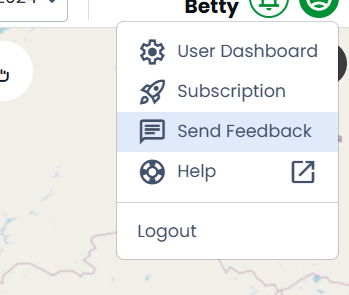
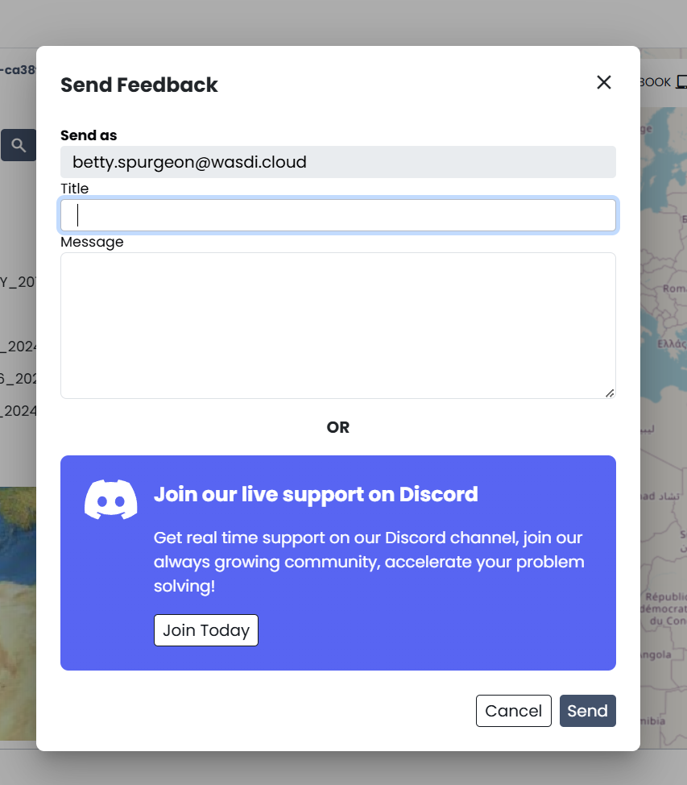
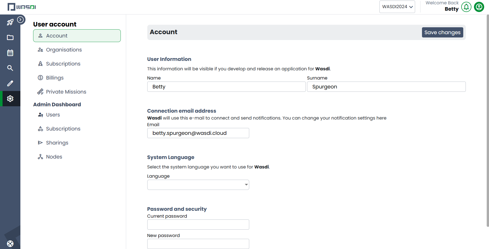

.. _OtherFunctions:

Other
===========================

Accessing Documentation
---------------------------

To access WASDI documentation directly from `www.WASDI.net <http://wasdi.net>` , select the documentation button in the navigation bar. Alternatively, you may also select the user profile dropdown (represented by the Alien head) and select “Docs” from the dropdown.

Both options will re-direct you to the WASDI documentation.

Sending Feedback
---------------------------

To send feedback or report bugs to the WASDI team, select the speech bubble icon in the navigation bar. This will open a dialog box where you will provide a title and message for the team.

Both input fields must be filled out in order to send the message. The message will be sent via email and the email address associated with you WASDI account will be included with the feedback.

If your issue requires immediate assistance, you can click “Houston, we have a problem!” and this will open an invitation to WASDI’s discord server, where we offer live support.

To learn more about Discord, `please look to their documentation <https://discord.com/terms>`.

To participate in WASDI’s Discord Server, you must have a valid Discord account.

Account Management
---------------------------

To update your account settings, you can open your account management dashboard by selecting the alien icon and then your user profile (User: Name). 

You can also manage your organizations from this dashboard. For more information about Subscriptions and Organizations, please see the section on “Managing Subscriptions and Organisations”
