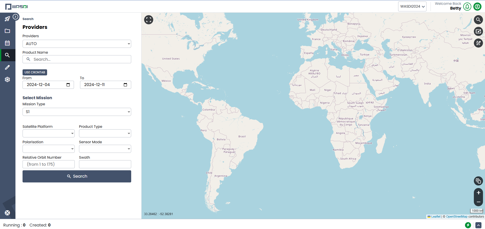

.. _ProductSearch:

Searching for Products
===========================

The search tab is used to search for images that have been recorded in the past. To execute a search:

* Select a date range for your search. You can either select a specific date range or you may use the CronTab to search more broadly for a season in a certain year (e.g., Spring 2022).

* You may enter a specific product name if you would prefer (e.g., IW_RAW__0S).

* To enable one mission specific filter, first select the tab and the Checkbox of the mission. If no checkbox is selected, the system will search all the available missions, otherwise, selected it will search only for the selected ones. (For example, with S1 - Sentinel-1, you can further narrow your search with Satellite Platform, Polarisation, Sensor Mode, Relative Orbit Number, and Swath - these inputs will likely change based on the mission you select).

WASDI has a Multi Provider search system: this means that the same query is sent to many data providers. The user can switch providers on/off:

The SERCO ONDA DIAS is the **priority one** Provider because data is stored in the Cloud where WASDI is installed so this is, usually, the fastest provider available.

To start a query click on the SEARCH button.

Finally, you must select a specific bounding box (geographic location) to search for images.

The results will then be returned:

To add a image to WASDI, click on the “+” icon near to the name of the image. You will be able to select all the workspaces you'd like to add the iamge to. Then click **Add to Workspace** and WASDI will get to work.

.. image:: ../_static/user_manual_images/search/send-to-workspace.png