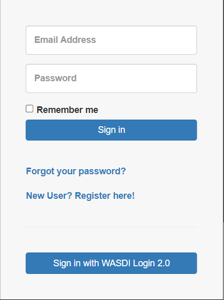
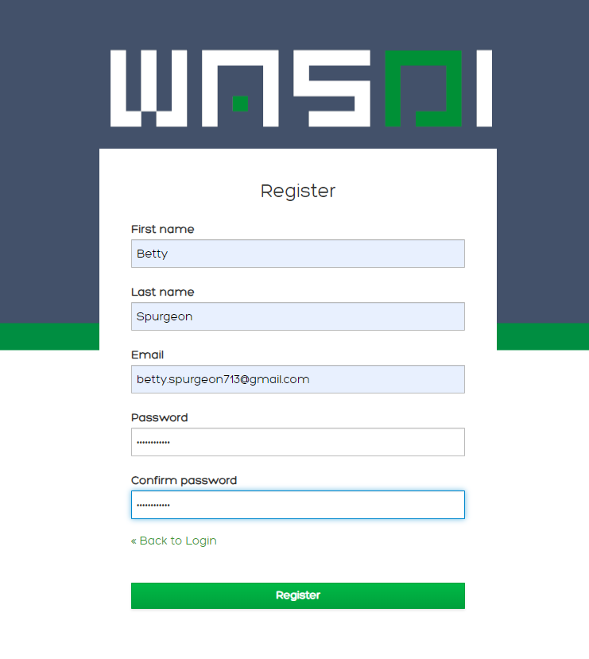

Signing Up and Signing In
===========================

To create an account on https://www.wasdi.net/ , navigate to the homepage and click “Sign Up”.

WASDI Login
------------------------------------------

To create a WASDI account, either click **New User? Register here!** link.

To register, the user must input: 

* A vaild email address (this will be your User Id in WASDI). 

* A password

* A first name and last name

Keycloak Login
------------------------------------------

You are also able to create a new account via WASDI's authentication parter Keycloak. To create an account with Keycloak, either click **Sign Up** in the top right-hand corner or click **Login**, then **Sign in with WASDI Login 2.0**, and finally click **New User? Register**.

After you've successfully created an account via either method, you will receive a confirmation email. Once you have followed any prompts in this email, you will be able to use WASDI!