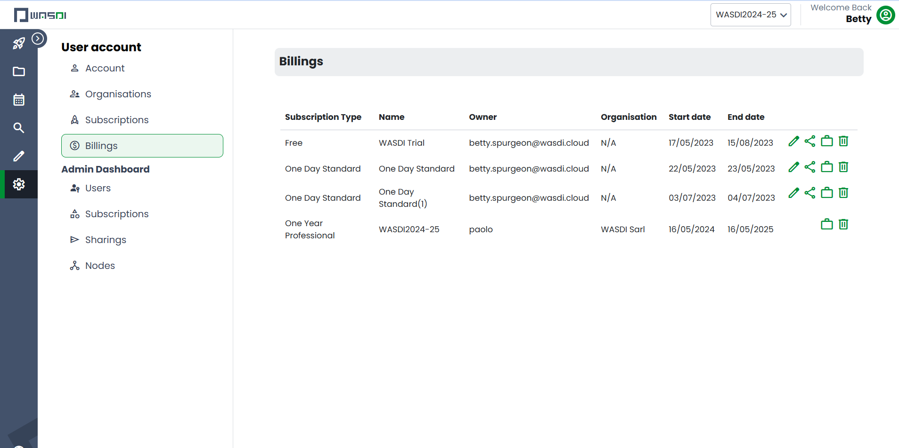
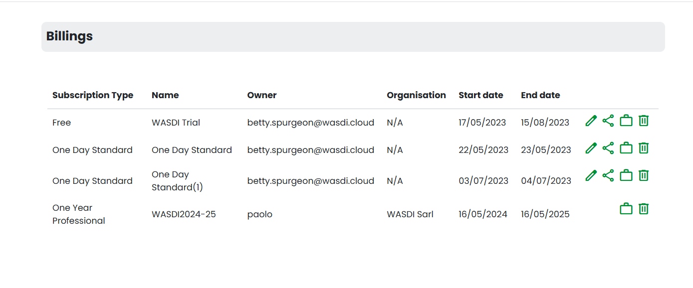
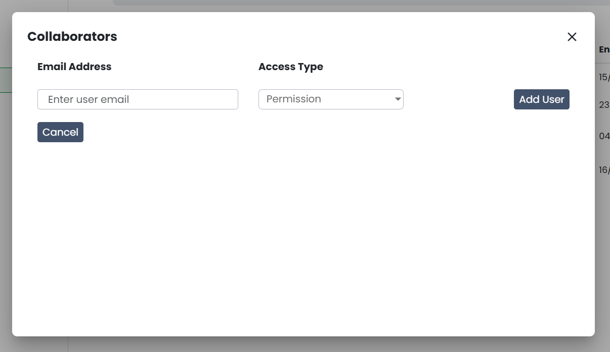
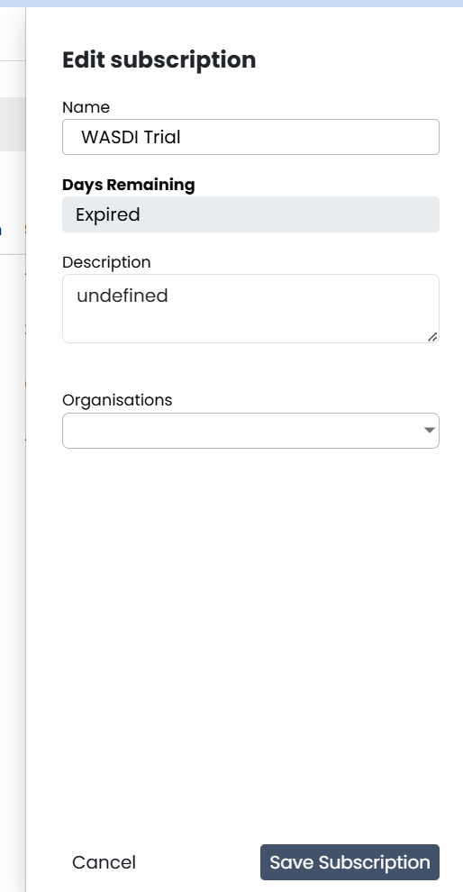
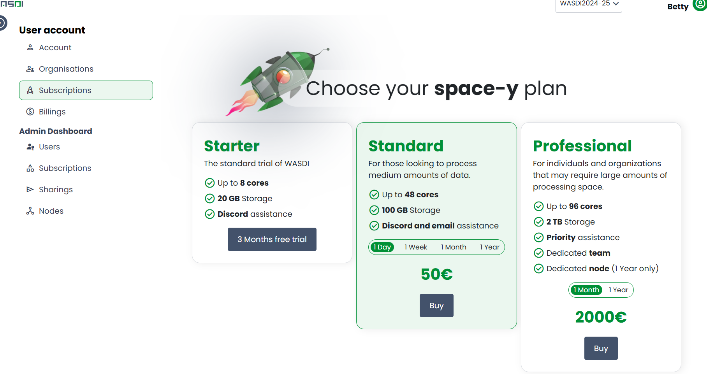
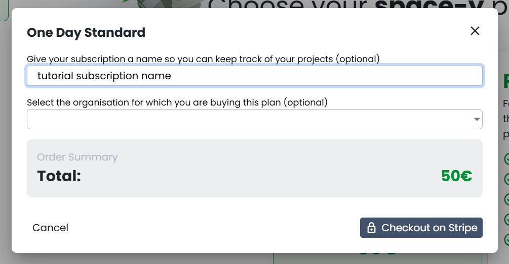

.. _SubscriptionsAndOrganizations:

Managing Subscriptions and Organizations
======================================================

WASDI has recently implemented a subscription based usage model. To execute various actions in WASDI, the user must have an a valid subscription and an active project.

Managing Subscriptions
---------------------------

To review your subscriptions, navigate to the subscription dashboard by clicking on the gear icon in the WASDI side bar and selecting 'billings'.

One this page you will find a list of all your subscriptions - current and expired.

In this dashboard you are able to:

View the users with whom the subscription is shared: by clicking the “Show Users” button, you will open a secondary dialog box that displays all the users who have access to this subscription. This sharing dialog behaves the same way that other sharing dialogs behave in WASDI.

To view the Projects associated with the subscription, click the “Show Projects” button represented by a briefcase. This opens a secondary dialog where you can manage (create, edit, or delete) projects.

To Edit a subscription’s information, click the “Edit Subscription” button. This opens a secondary dialog where you can view read-only information (the acquisition date, start date, end date, and days remaining) and edit the subscription’s name, description, and attach an organisation.

You can also remove subscriptions, but be aware: you CANNOT remove subscriptions that are attached to organizations or have active projects.

If you are not the owner of a subscription, by removing it, you are not deleting it - you are simply removing your permission to view it. Furthermore, if you are not the owner, information about the subscription is read-only and you can only edit or create projects for that subscription.

Purchasing Subscriptions
---------------------------

If you do not have a WASDI subscription and would like to purchase one - click the “Subscriptions” button in the account sidebar.

.. image:: ../_static/user_manual_images/subscriptions/purchase_sub_dropdown.png

On the purchasing page you will be able to see the distinction between the various tiers of WASDI Subscriptions:

For this example, we will purchase a 1 Day Standard Subscription for 50 euros. By clicking “Buy Now” we open a dialog box where we can enter a name for this subscription. If we do not enter a name, a standard one will be provided for us (in this case the standard name will be “One Day Standard”).

When we click “Checkout” we will be re-directed our WASDI’s payment partner, Stripe. All payments are executed through Stripe. If you do not complete the payment right away, the Subscription information will be saved to your account and will be available through the “Manage Subscriptions” dialog and will be shown as “Pending…”

To complete your Stripe Payment enter your information to the Stripe payment channel.

Once you have finalized your payment and it is confirmed by Stripe (this usually takes just a few moments) you will be re-directed to WASDI and if payment was successful, the “Payment Status” will read as “Paid”.

You are now set to use all features in WASDI!

Active Projects
---------------------------

To switch between projects in WASDI, use the projects tab in the navbar. When selected it will show a dropdown list of all the user’s projects.

.. image:: ../_static/user_manual_images/subscriptions/active-project-dropdown.png

To switch between projects, simply select the project you wish to work with. If your selection is successful, that project’s name will appear in your navbar and you will receive a notification that you selection was successful.
