.. User Workspace Tutorial (Edit Tab)

.. _UsingYourWorkspace:

Workspace Management and Use
=======================================

The Workspaces Tab
------------------------------------------
Each WASDI User can work in one or more Workspace. A Workspace ia set of files (original EO data or elaborated by some processor) that are grouped in the same "project". 

The Workspaces page is where all of your workspaces are displayed. On this page you are able to manage (e.g., create and delete) and view the properties of each workspace.

When you select a workspace, that workspace’s properties will be displayed and the globe will navigate to the associated geographic location.

Inside the “Properties” box, you’ll be able to view the products inside the workspace along with the option to copy the workspace's id. This can be helpful when discussing issues with WASDI Staff.

If you click “New Workspace”, you will be automatically re-directed to a new open workspace. You will be able to change the name of this new workspace once inside. When the user logs into for the first time, they will be asked to create a new workspace.

If you are not the owner of a workspace, but you wish to remove a workspace from your account, click the trashcan icon beside that workspace. This will remove your sharing permissions, not delete the workspace.

However, if you are the owner, then clicking the trashcan and confirming will permanently delete that workspace.

Just like when executing an application through the marketplace, if you click the “open” button beside a workspace name, you will be directed to that workspace.

If you decide to navigate away from the newly opened workspace, it will remain open in the Edit tab. As long as you keep WASDI open, this workspace will remain open until you open a different workspace.

Interacting With Products
------------------------------------------

Once you have loaded products into your workspace, the products will be housed in the Products Box. The number beside the title “Products” represents how many products there are in your workspace.

When you click on the arrow beside a product, you will open the Metadata and Bands nodes. The Bands node also have arrows and when clicked, the Bands will be shown (if there is any).

Publishing and Interacting with Bands
------------------------------------------

To publish a band, simply open the Bands node for the desired product and then click on the band you wish to publish. Depending on the band type, the amount of time it takes to publish the band will vary.

You will receive a notification in the bottom right corner that indicates that your band is being published.

Once the publishing is complete, you will see that the band is on the 2D or 3D Map in the style applied to that product - note the workspace opens with your map component in 2D by default.

* For more information about Styles, please view the section on styles.

Once a band is published, you can set the opacity of the band by using the slider displayed next to that band’s name in the “Layers” tab.

To view the legend for a band, click the “Legend” button to reveal the legend.

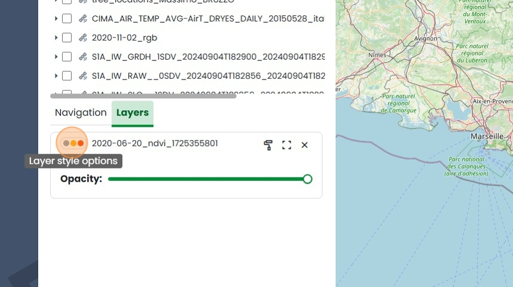
    
If you move away from a displayed band and wish to refocus on it quickly, click the “Navigate To” Button.
    

To remove the band from your map, click the “Remove layer from map” Button.

.. image:: ../_static/user_manual_images/workspaces/workspace11.png

Reading Metadata
------------------------------------------

To read the Metadate of a Product, simply click “Metadata” and WASDI will begin fetching the Metadata.

The Editor Toolbar 
------------------------------------------

In the top centre of the workspace map, you will find the workspace Toolbar. Here you can execute different actions in order to work with your workspace.

Apps
------------------------------------------

Clicking “Apps” will open a dialog box containing all WASDI applications. Applications will be displayed with different names, additionally, there may be apps here that are not in the marketplace.

On the right-hand side of the dialog box, the processor parameters of the first application are displayed by default. When you select an application this will be updated automatically.

* At first the default parameters provided by the developer are displayed, but you can update them by changing any of the values in the JSON file and then executing the processor with those parameters by clicking “RUN”.

If you are not the owner of an application or an application has not been shared with you, you are still able to use that application and create processor parameters for it by clicking the book icon.

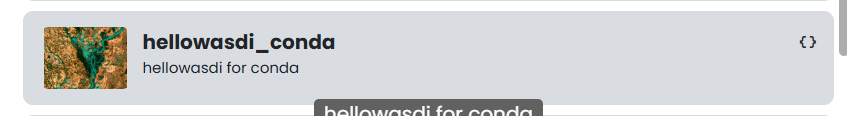

Processor Parameters are parameters you’ve created and saved to execute in that application.

.. image:: ../_static/user_manual_images/workspaces/params-library.png

You edit and share processor parameters as with any other WASDI elements.

Once you click “Apply” either on the processor Parameters card or in the information box, that parameters template will be automatically applied to the application so when you “Run” that application, the parameters you selected will execute.

If you are the owner or a processor has been shared with you, your toolbar inside the processor card will be different.

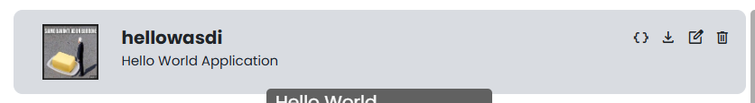

In regards to deleting a processor: A processor can only be deleted by the person that uploaded it. If the processor has been shared with you, by clicking the delete button, you are simply removing your permissions to access the processor - not the processor itself

* If you’ve removed your permissions by accident, contact the processor’s developer or another WASDI user with permission to share the processor to have them grant you access once again.

You are also able to download a processor.

If you are the owner of a particular application or it has been shared with you, you will be able to edit it by clicking the page with pen button in the processor card.

The editable elements are:

* The Processor Information: i.e., the Short Description, the Programming Language, the Timeout in minutes, and the JSON Sample. From here you can also access WASDI’s package manager for applications, which will be explained in depth in the PACKAGE MANAGER section.

* The Processor Store Information: i.e., how the processor appears in the app store (if at all) the Processor’s Friendly Name (the name it can be searched by in the app marketplace), the application’s information link if applicable), the developer’s or association’s email , the price of the application either as a description or on demand use price, a long description, and the categories.

* The Processor Media: i.e., the logo for the application or association, and any other associated imagery - up to seven (7) images.

* The Processor’s Sharing Settings: i.e., WASDI users with whom the processor has been shared.

* The Processor UI: i.e., the input fields required to run the processor. If the processor is accessed through the marketplace, these UI fields will show as form inputs. Users will be able to update them manually through the JSON file as well.

New App
------------------------------------------

To upload a new application to WASDI, you can click the “NEW APP” button inside the workspace. This will open a new dialog box that resembles the edit application button in the “EDIT PROCESSOR” section. The difference here being that you cannot update the Store Information, Media. or Sharing options.

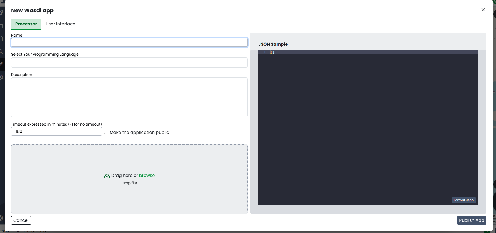

For more information on these options please see the section on Editable Elements in the APPS section.

Package Manager
------------------------------------------

Once you’ve opened the Package Manager, you will be able to view all the packages the selected application is dependent on.

To add a package:

* Add the package by name (e.g., affine) - ensure it is spelled correctly, or the package will not be added.

* This method will add the package in its most current version. (e.g., affine 2.40 will be added)

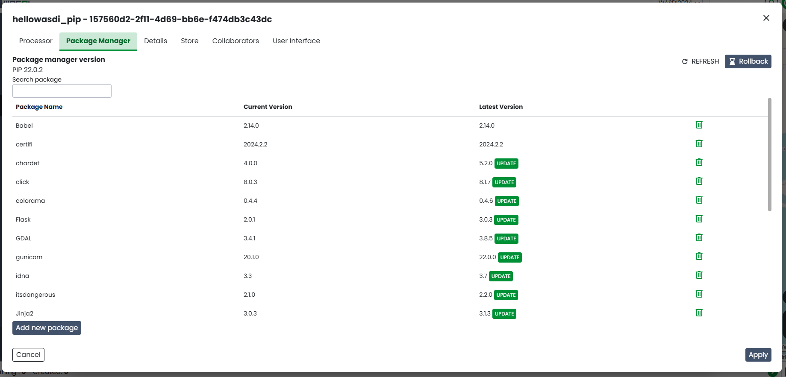

To add a specific version of the package use the following construction - affine == 2.39

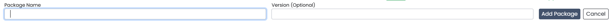

To remove a Package, simply click the remove package button (the Trashcan icon) and confirm.

* When updating the Package Manager in any way, it may take some time to communicate the changes to the WASDI servers. This is normal and if you close the package manager and re-open it before the action is complete, it may not be immediately reflected in your dashboard. To check if the action was completed, click “Refresh List”.

To automatically update a Package, click the Update Package button (the Upwards facing Arrow). This action updates the selected package to the most recent version.

You can search for packages by name in the ‘Search Packages’ input bar. The search is NOT case-sensitive.

Workflows
------------------------------------------

Import
------------------------------------------

If you have an image that you would like to use in an existing workspace, you can use the import dialog. You can drag and drop the file into the box or click the box to search for a file on your machine.

You may also select a Style to apply to this product from the Style dropdown menu.

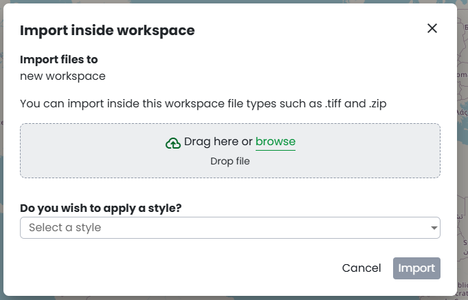

You will receive a notification once your product has been uploaded and then it will be added to the list of products in your workspace.

Open Jupyter
------------------------------------------

By clicking “Open Jupyter” WASDI begin preparing a Jupyter notebook workspace automatically. This progress on this process will show up in the Processes Progress Bar.

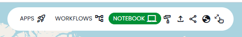

When the Jupyter Notebook workspace has been prepared, you will receive a notification.

.. note::
    Learn more in the `tutorial about working with Jupyter notebooks in WASDI<../ProgrammingTutorials/JupyterNotebookTutorial.rst>`_

Styles
------------------------------------------

The Styles Button will open a dialog displaying all the styles available to WASDI users. These styles will allow you to change the appearance of published images.

* This is an information viewing dashboard. You cannot apply styles from this dialog. For information on how to apply styles to products, see the section on editing existing products.

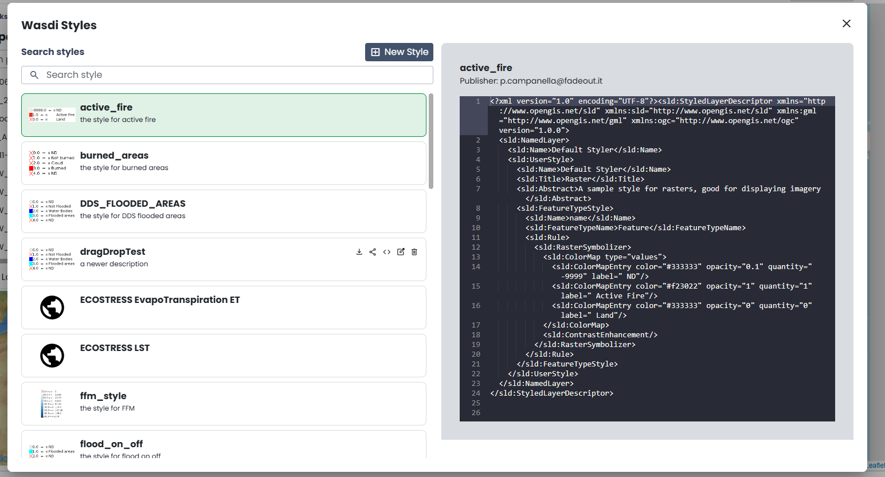

If you are the owner of an existing style or permissions to the style have been shared with you, you can make changes to a style by clicking the Edit Style button.

In the Edit Style Dialog you can edit the name, description, and XML file (by adding a new one), and set the Style to public so all WASDI users can access it.

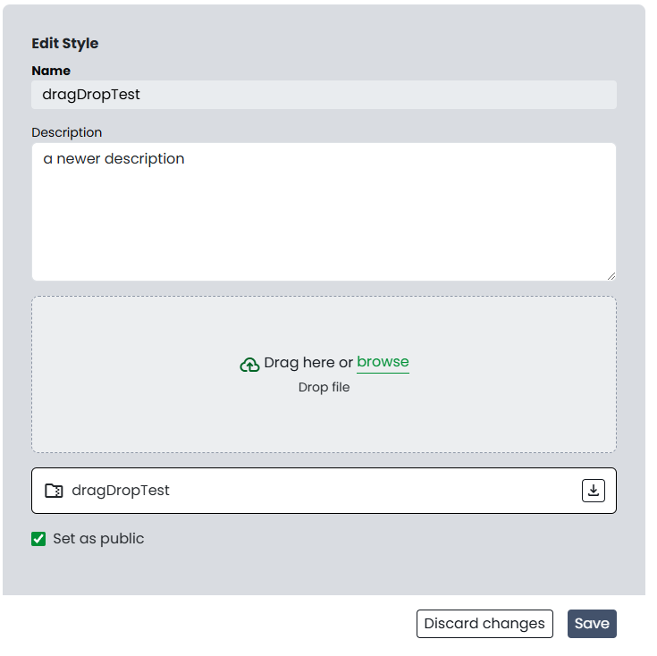

From this same dialog you can manage the users with whom the style has been shared.

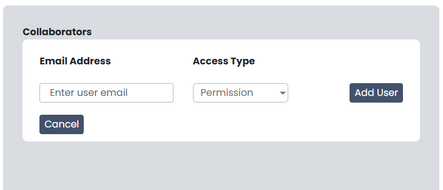

You can also edit the XML file by accessing the “Edit XML” Tab.

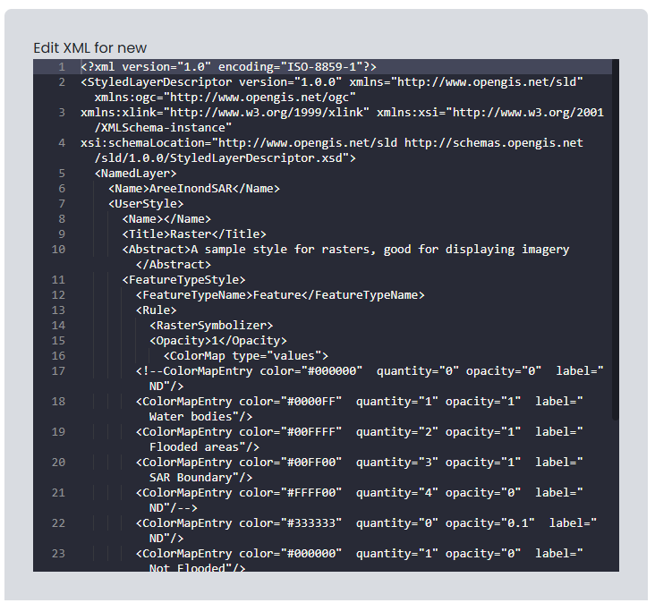

Share
------------------------------------------

The Share button will open a dialog box displaying all the users (if any) that this workspace has been shared with.

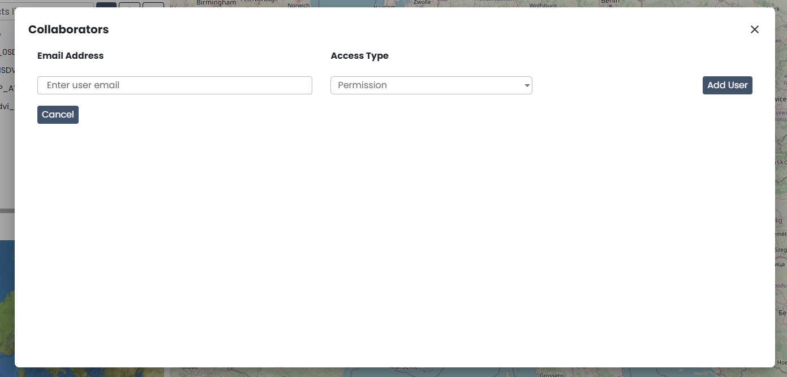

Both the owner of the workspace and all the users they’ve shared it with can manage the shared users.

To search a user to share the workspace with, search for the user’s email address associated with their WASDI account and click “Share”.

* If the email address was correct then the sharing will be executed automatically.

To remove a user from the workspace, simply click “Remove” and once you confirm that you wish to remove them, their permissions will be removed automatically. Note: you can give permissions back to a removed user at any time.

The Processes Bar
------------------------------------------

The processes bar is the most useful component in WASDI. This is where you can find information about actions executed in your workspace.

When closed, the processes bar will display the status of websocket (Green for connected, red for disconnected), the number of processes waiting, the number of processes running, a button to open your Workspaces Processes List dialog, and an arrow to open the processes bar.

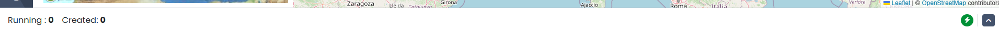

When the processes bar is open, you will be able to view all to view the most recent 5 processes that were executed in your workspace. You can see how long it took for the processor to work (or if it is ongoing).

.. image:: ../_static/user_manual_images/workspaces/processes-bar-open.png

In the right-most column, you will see either one or two icons. If you click the “Logs” icon you will open the logs for that operation.

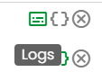

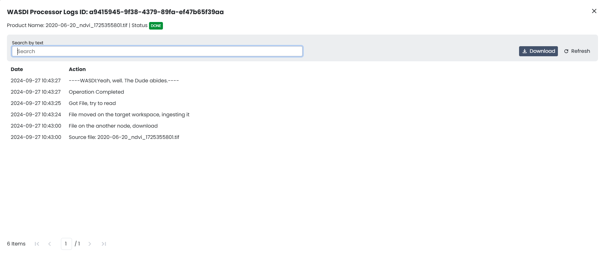

In the logs dialog, you have the option to download a record of the logs in a .txt file.

If you click the “Payload” icon, you will open a dialog where you can view the payload of that operation and copy it to your clipboard.

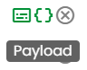

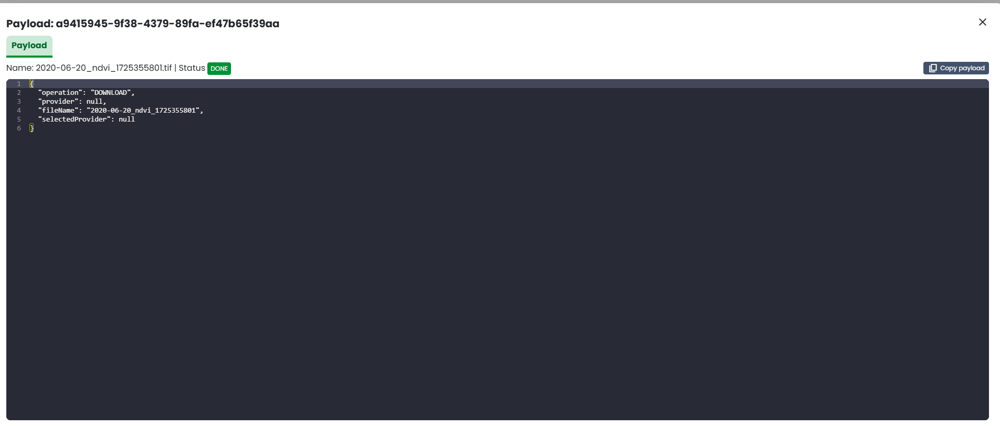

You can search for specific processes by name or filter your processes based on their status (Any, Created, Running, Waiting, Ready, Done, Error, Stopped), type (Any, Run Processor, Run IDL, Run MatLab, Ingest, Download, Publish Band, Graph, Deploy Processor, Copy to SFTP, FTP Upload, Mosaic, Multi-subset), or the date. To apply the filters, set the filters you wish to use and then click “Apply Filters”. To remove filters you applied, simply click “Reset Filters”.

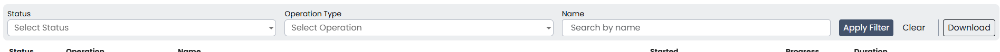

You can also download a copy of all the processes executed in this workspace by clicking “Download”. You will receive a .csv file.

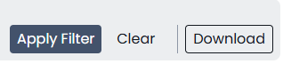
    
The Map
------------------------------------------

The Map inside your workspaces features that can be found in the top right-hand corner of the map box.

To switch between the 2D leaflet map and the 3D Cesium globe, click the 3D/2D toggler.

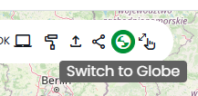

The dimension that is not currently active in the large map box will be shown in the Navigation tab of the Navigation/Layers box.

The home button is used to navigate back to the “home” bounding box for the workspace.

When the arrow button is clicked, the map in the main view will synchronise to that of the navigation tab (smaller map under your products).

Workspace Details
------------------------------------------

In the top left-hand corner beside the Products filter, you will find the button to open your Workspace Details

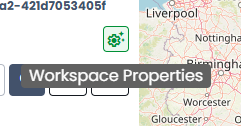

Once open, you will find information about your workspace and the Node which houses your workspace.

You are able to change the node by selecting one from the dropdown menu

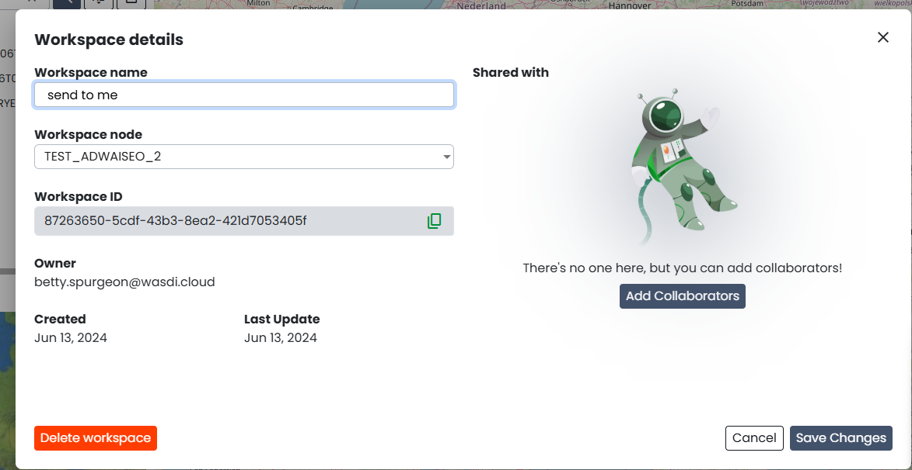

If you are using an ADWAISEO node, you will also be able to view the ADWAISEO SLA to review their terms of service.
