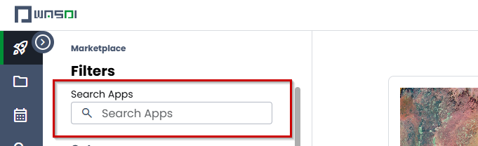
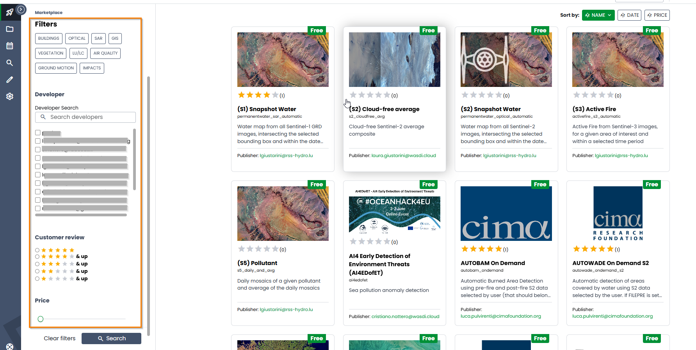

.. App store Tutorial

.. _AppStoreTutorial:

Wasdi App Store
==================

In this tutorial the WASDI app store will be introduced.
The document will cover and highlight the main feature of this WASDI sections and also, will present how a WASDI application can be launched.

The app store concept is pretty common for mobile devices and our effort
was invested to develop the same user experience for WASDI.
An user can upload, execute and share his own application directly on
a web browser, with a fast and consistent user experience.

Also, a dedicated graphical interface(UI) can be added to the application,
allowing to supply other users a well taylored experience. |:smile:|

Introduction
-------------

The main app store view consist of a list of entries reporting various WASDI applications:

It is possible to search the applications by using the following search field

Also, an user can enable some filters related to categories, developer, ratings and price

Launch an application
------------------------

Let's try an application, in particular, search for **Automatic S1-S2 Floods**.
This application can be used to identify flooded areas, using Sentinel-1 and Sentinel-2 products.

The application, at the lowest level of parameters specification, requires the date of the
flood events and the area where the study must be done.
WASDI, will then connect to dedicated servers (DIAS) to gather images and elaborates them to
obtain the final product map.

Click on the **Automatic S1-S2 Floods** icon

and then on *Open Application*

.. image:: ../_static/appstore_images/5_open_app.png

The application UI it is shown. Several tabs are available to the user, allowing to customize the elaboration:

* **Advanced** allows to select the number of days before events to be evaluated, plus the selection of the Data Provider
* **SAR** give the possibility of a fine tuning of SAR(Syntethic Aperture Radar) parameters
* **Optical** tab deals with cloud coverage, setting a maximum percentage
* **GIS** allows to set parameters for the customization of final products
* **Help** reports a handle guide to this particular application
* **History** allow user to see previous run of the application
* **JSON** Show to the user the final JSON, which is a structured text format, that contains all parameters that will be used for the current app run.

For the sake of clarity only **Basic** tab will be used in this tutorial. More info on all the other parameters and a brief
explanation of the app capabilities can be found in descriptions and in **Help tab**.
This tutorial will analyze the outcome of a flood occured on 11 May 2021 in Tajikistan and Afghanistan. In particular our
analysis will consider imagery from the Khatlon Region of Tajikistan (`References <http://floodlist.com/asia/tajikistan-afghanistan-flash-floods-may-2021>`_)

From the first available field please select the date of the event and set it to 11/05/2021 (DD/MM/YYYY format).
A text field value is used as default name fot the output images.

As reported in Help section:

*Event Code (BASENAME): Base Name of the output file. DO NOT USE "_" or " " or other special chars in the Base Name*

The ouput of the WASDI application will be several geoTiff images with the following naming convention:

* One layer for each day with a valid SAR Map, called [CODE]_[DATE]_flood
* SAR flood composite, sum of all days, called [CODE]_[DATE]_sar_flood_sum_days[TOT]
* Optical flood composite, sum of all tiles, called [CODE]_[DATE]_s2_flood
* Composite of SAR and Optical Flood, called [CODE]_[DATE]_flood_sum_days[TOT]

The single pixels in the result images uses the following value legend:

* **0** - No Data
* **1** - No Flood
* **2** - Permanent Water
* **3** - Flooded Areas

Select the area of the event and then click on "run" to start the processing.

After launching the elaboration the user will be redirected to the **edit view** of the newly generated workspace.

Here, the user can open the lower information bar, by clicking on the arrow in the lower right angle of the current perspective.

A panel with all the sub-operations is reported, showing the process status and the percentage of each single operation.
In the following image there is reported the very early phases of the elaboration.

After the initial setup WASDI starts to fetch the required images. Each image is then added to the current workspace.

Selecting a result image from the product list it is possible to view the resulting GeoTiff image, geo-localized on the
current map. In this case the image reports only permanent water belonging to the normal streams of rivers or from lake and sea.

Following the naming convention introduced beforehand, we can note that the current image is obtained from images
acquired day before the flood event reported on the website.

.. image:: ../_static/appstore_images/11.png

The geoTiff reported here above show in light blue the flooded areas and in dark blue the permanent waters(river streams).
Congratulations for concluding your remote sensing analysis with WASDI! |:bottle_with_popping_cork:|

Add a new application
-------------------------

We have seen how a deployed application can be launched and how products can be obtained.

For create a new application open a workspace and click on the icon **New App** from the
bar.

A new dialog will be opened allowing the user to insert basic values like name and description of the
new application

The user, that from now on we refer as the developer, can use several programming languages for the applications
reported in the following image.

In order to upload the effective application a *.Zip* file, containing a set of files that must be prepared beforehand.
Please refer to the particular WASDI libraries in order to acquire all the details about conventions and file format required.
Note that it is possible to make the uploaded application available to all users of WASDI, by enabling the dedicated checkbox.

A great starting point as developer on WASDI is the :doc:`python tutorial </PythonTutorial>`. Check it out !

A key factor of WASDI application is the possibility for the developer to create an user interface for the application, directly on the WASDI website.
A JSON descriptor of the required fields can be edited to allow users to interact with canonical web widget.

Clicking on the User Interface(UI) tab it is possible to add such widgets by clicking to the corresponding buttons.
The resulting JSON will be then parsed to check syntax coherence and, if the test is passed, used to generates UIs.

