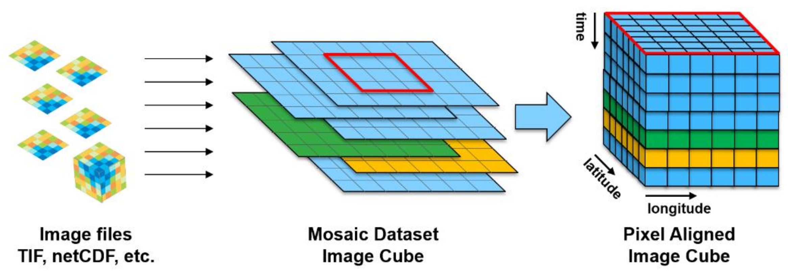
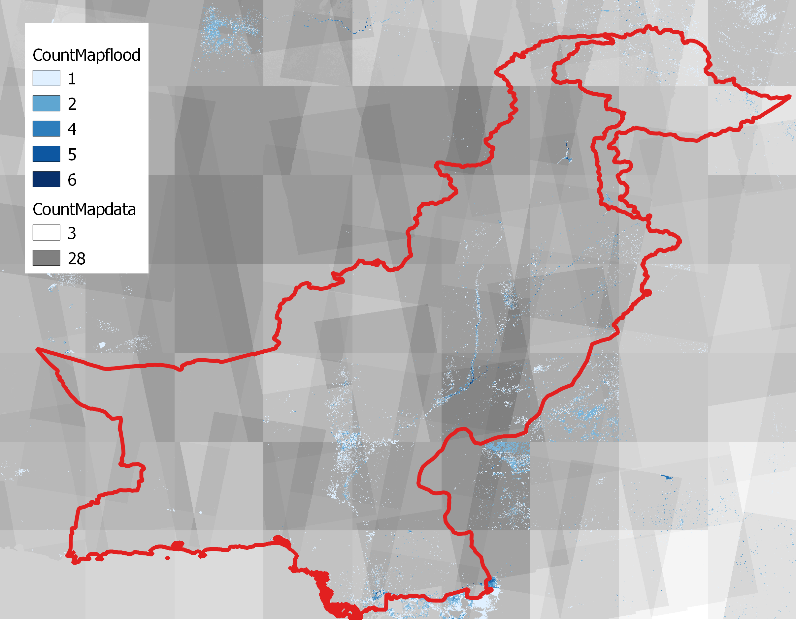
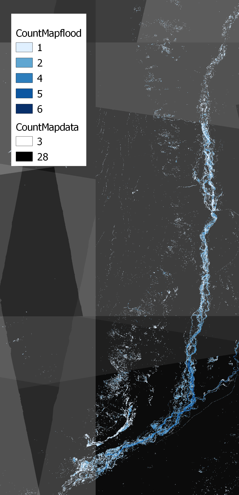
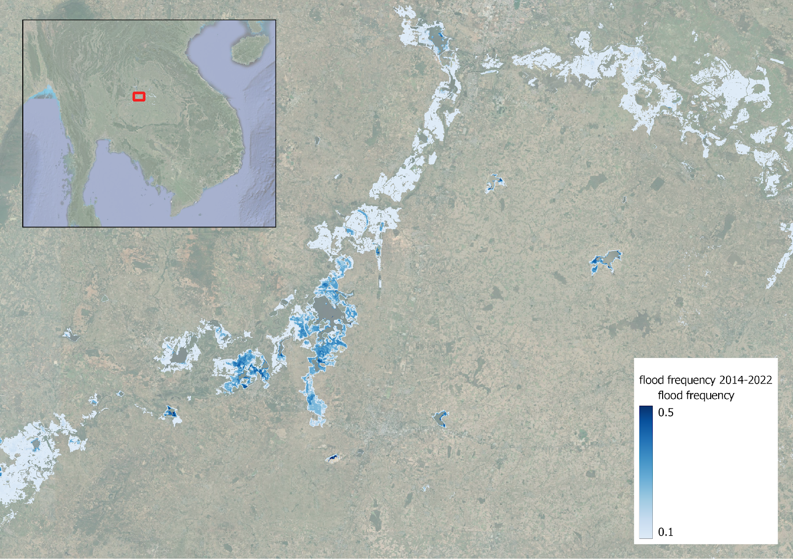
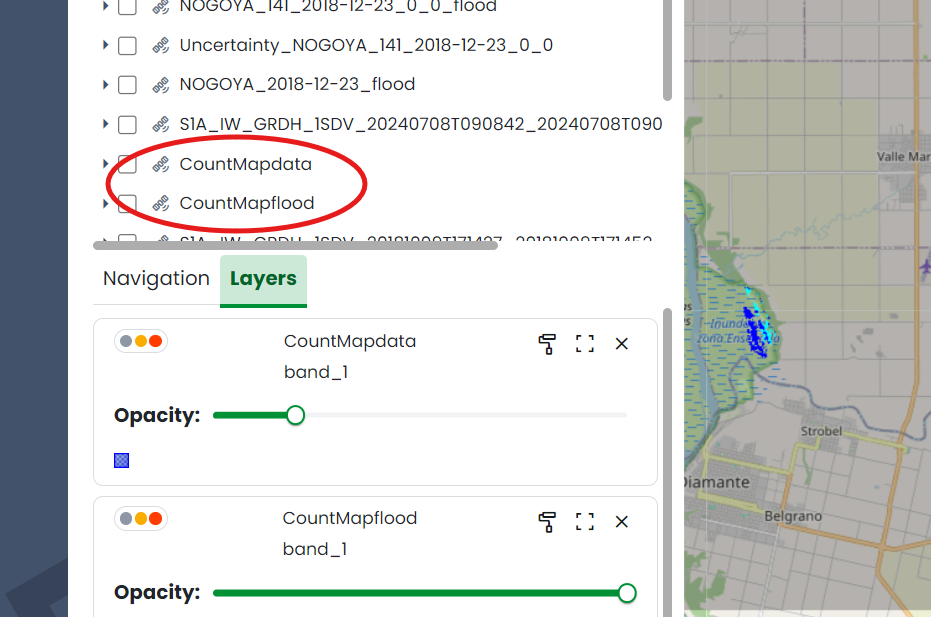

**Flood Frequency Map Generator**
=====================================================

Table of Contents
=================

1. `Description <#description>`_
2. `Process Workflow <#process-workflow>`_
3. `Output <#output>`_
4. `How to use it <#how-to-use-it>`_
   4.1 `Basic Parameters <#basic-parameters>`_
   4.2 `Advanced Parameters (WASDI Help Section) <#advanced-parameters-wasdi-help-section>`_
       4.2.1 `Flood Frequency Map Generator <#flood-frequency-map-generator>`_
       4.2.2 `Basic parameters <#basic-parameters-2>`_
       4.2.3 `Advanced parameters <#advanced-parameters>`_
       4.2.4 `GIS parameters <#gis-parameters>`_
       4.2.5 `Diagnostics <#diagnostics>`_
5. `References <#references>`_

Description
===========

The Flood Frequency Map Generator application (processor name: floodfrequencylauncher) offers detailed insights into the frequency of flooding within a specified Area of Interest (AoI) and timeframe through a visual map. Specifically, the application analyzes daily flood maps from a Flood Archive and calculates the number of times a pixel has been observed flooded (in the time period of the archive) and the number of times a pixel has been observed, whether flooded or not (in the time period of the archive). The flood frequency can then be computed by the user as the ratio between the number of times a pixel has been observed flooded and the number of times a pixel has been observed.

Counting the number of times a pixel has been observed is fundamental due to the revisit time of the satellites over different areas of the globe. In other words, the orbits of the satellites and the way they overlap may provide a much higher revisit time over a certain area and a lower revisit time over an area just next to the first one.

Process Workflow
================

1. **Flood Maps Recognition**: Once the user sets the application inputs and specifies the workspace where the Flood Archive was initially generated (a required prior step), the Flood Frequency Map Generator app will analyze the naming structure and dates of the files in the workspace to identify mosaic flood maps that fall within the user-specified date range.
2. **Map Cropping and Stacking the Maps**: The application will then crop each identified mosaic flood map to align with the boundaries of the selected Area of Interest (AoI). The cropped mosaic flood maps are subsequently stacked with pixel alignment to create a Pixel-Aligned Image Cube (refer to the workflow diagram below).
3. **Frequency Calculation and Visualization**: The application will calculate how often each pixel was marked as flooded and visually represent the frequency of flooding on a map using a color scale—such as transitioning from light blue to dark blue—to indicate different levels of flood occurrence. Additionally, the application will count how often each pixel was observed (i.e., when data was available for each pixel) whether flooded or not. This helps to accurately determine the relative flood frequency for each pixel, as some areas may not have been observed as frequently as others.

Workflow from image files to a pixel-aligned image cube. Source: Kopp et al., 2019.

Output
======

The application automatically generates two outputs, both as raster files:

- **CountMapFlood**: This file shows the number of flood events that have affected each pixel. Higher values indicate more frequent flooding. To visualize this, users can apply a color scale style in a `GIS <https://www.usgs.gov/faqs/what-geographic-information-system-gis#:~:text=A%20Geographic%20Information%20System%20(GIS)%20is%20a%20computer%20system%20that,attached%20to%20a%20unique%20location.>`_ such as `QGIS <https://www.qgis.org/>`_, transitioning for example from white to dark blue to represent increasing flood count.

- **CountMapData**: This file indicates how often each pixel was observed, which could vary from an area to another within the Area of Interest (AoI). Indeed, some areas may be observed more frequently due to overlapping satellite orbits. Each pixel value represents the number of times data was available for that specific location. Similarly to the CountMapFlood product, users can use a color scale style in a GIS to illustrate the observation frequency.

Below are shown examples of these two outputs.

CountMapData and CountMapFlood outputs over Pakistan during July/August 2024 floods.

CountMapData and CountMapFlood outputs over over the Indus River in Pakistan during July/August 2024.

**Flood Frequency Map:** Finally, users can create a Flood Frequency Map by dividing the CountMapFlood output by the CountMapData output. This map displays the relative flood frequency of each pixel by dividing the flood count by the data count. A color scale, such as light blue to dark blue, can be used to highlight areas with higher relative flooding frequency (darker blue indicates more frequent flooding). This combined map serves as the final output of the application, offering insights into how often flooding occurs relative to the observation frequency for each area.

Example of output of Flood Frequency Map.

Example of CountMapFlood and CountMapData outputs in a WASDI workspace.

How to use it
================

Basic Parameters
----------------------

Advanced Parameters (WASDI Help Section)
---------------------------------------------

**Flood Frequency Map Generator**

This processor calculates a flood frequency map, i.e., a map where each pixel value represents the count of flood events that impacted that pixel. The map is generated over an area and within a given period. In order to run this processor, a set of flood maps (in .tif format) have to be present in the input workspace: so, first, make sure you actually have them in the workspace of interest.

The output maps are:

- **flood frequency map**, named ``CountMapflood.tif``: it counts the number of times a pixel was observed flooded.
- **data frequency map**, named ``CountMapdata.tif``: it counts the number of times for which data are available.
- **no data** (optional, turned off by default): the number of times for which data were not present.

The parameters are:

.. code-block:: json

    {
        "prefix": "",
        "startDate": null,
        "endDate": null,
        "dictBBox": null,
        "floodValue": 1,
        "noDataValue": 255,
        "monthsFilter": "",
        "inWsId": "",
        "inWs": "",
        "outWsId": "",
        "outWs": "",
        "suffix": "_flood",
        "extension": ".tif",
        "outputName": "CountMap",
        "overwrite": false,
        "addFiles": true,
        "EPSG": "4326",
        "gridstep": "5",
        "vrt": false,
        "noData": false,
        "dataType": "uint16",
        "verbose": false,
        "dryRun": false,
        "coldIds": false,
        "coldSubProcIds": "[]"
    }

Basic parameters
----------------

- **prefix**: Input file prefix, e.g. ``TAN_``.
- **Area bounding box (mandatory)** representing the area of interest:
  - If you select the area using the web user interface, parameter **dictBBox** is generated in the form of a JSON dictionary. Example:

  .. code-block:: json

      "dictBBox": {
          "northEast": {
              "lat": 33.358061612778876,
              "lng": 27.773437500000004
          },
          "southWest": {
              "lat": 19.394067895396613,
              "lng": 6.328125000000001
          }
      }

  - Alternatively, you can define parameter **bbox**: JSON string in the form ``"LATN,LONW,LATS,LONE"``, e.g. ``"-5.99803, 36.99916, -10.00237, 41.00129"``. You may find this compact form more convenient when calling the processor from another wasdi app, or when compiling the parameter JSON manually. Please note that this parameter is superseded by **dictBBox**.
  - **Start date** (**startDate**): The first day to be included in the analysis. It is a JSON string representing a date in the form ``"%Y-%m-%d"``, e.g., ``"2020-02-10"``.
  - **End date** (**endDate**): The last day to be included in the analysis. It is a JSON string representing a date in the form ``"%Y-%m-%d"``, e.g., ``"2020-02-10"``.

Advanced parameters
-------------------

- **Input workspace:**
  - By name: **inWs**
  - By ID: **inWsId**. If specified, this supersedes **inWs**.
  - By default, the currently open workspace is used.

- **Output workspace:**
  - By name: **outWs**
  - By ID: **outWsId**. If specified, this supersedes **outWs**.
  - By default, the currently open workspace is used.

- **suffix**: The input files suffix. By default, it is ``"_flood"``.
- **extension**: The input files extension (with the dot ``.`` symbol). By default, it is ``".tif"``.
- **outputName**: Output file name template, ``"floodFrequencyMap"`` by default.
- **overwrite**: Flag to overwrite existing output files with the same name (``false`` by default).
- **addFiles**: Add file to WASDI, ``true`` by default.

GIS parameters
--------------

- **EPSG** code, ``4326`` by default.
- When the map is too big to fit in memory, the computation is split into square subgrids, each of size **gridstep**. The default value is ``5``, and smaller values are ignored.
- Instead of creating a GeoTIFF, a virtual mosaic can be created by setting **vrt** to ``true`` (it is ``false`` by default).
- If the output TIFF must contain the no data frequency map too, set **noData** to ``true`` (it is ``false`` by default).
- **dataType**: ``uint16`` by default, set a different one to suit your needs.

Diagnostics
-----------

- Set **verbose** to ``true`` to activate verbose logs (it is ``false`` by default).
- Set **dryRun** to ``true`` to simulate execution (it is ``false`` by default).
- Set **coldIds** to ``true`` to perform post-mortem analysis (it is ``false`` by default).
- Add subprocess IDs in the list **coldSubProcIds** for post-mortem analysis.

References
==========

More information about the technology and the scientific methodology applied can be found below:

