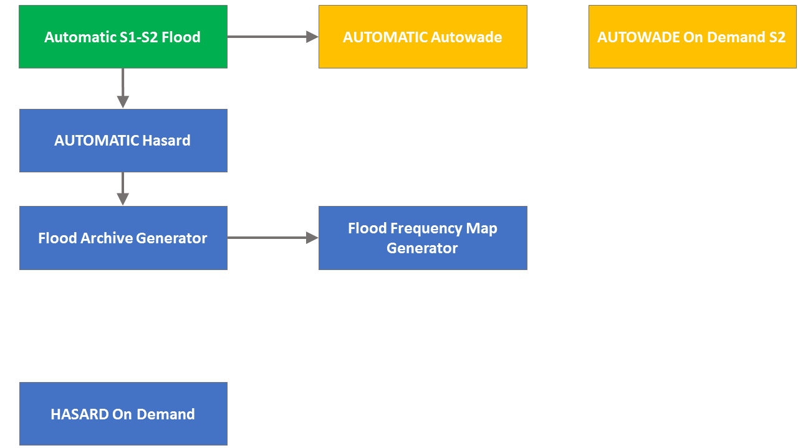
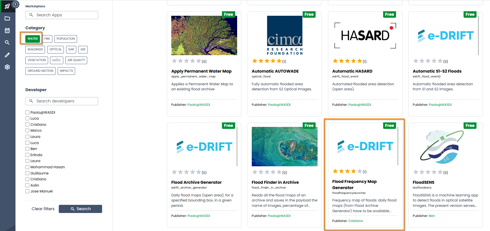
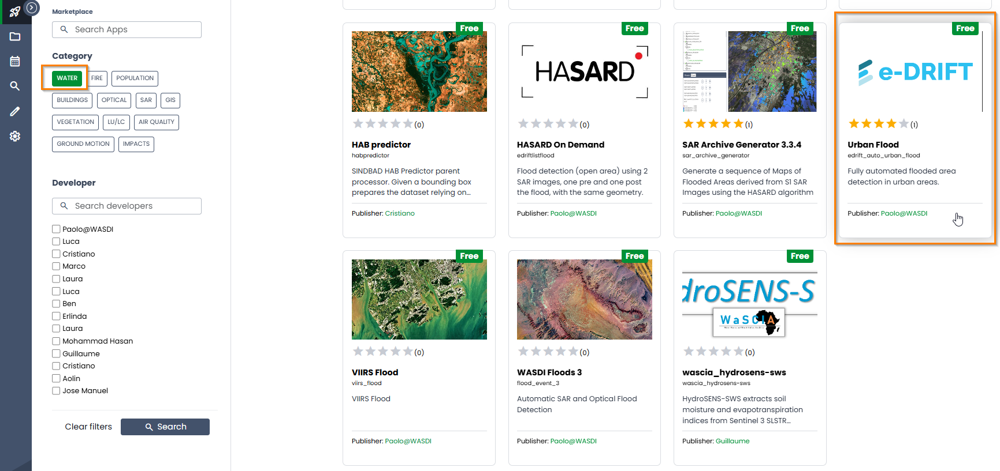

.. FloodMapping

.. _FloodMapping:

Flood Mapping
==================

The flood-related algorithms available in WASDI support automated mapping of flood in:

* Open area
* Urban area

with:

* Sentinel-1, Sentinel-2 or a combination of the 2 missions
* VIIRS

Floods in open areas
----------------------------------

In WASDI there are several applications available to map floods in open areas using either the Sentinel mission or the VIIRS sensor.

The scheme of Fig. 1 presents the algorithms for flood mapping in open area, using Sentinel-1 and/or Sentinel-2 and how they relate to each other. The algorithm to map flood from VIIRS sensor will be presented later and separately from the Sentinel missions.

When landing in the WASDI marketplace, the used can select the filter “water” to subset only application related to water in general. 

Excluding the apps designed to map a snapshot of water at a particular 
moment and permanent water (“(S1) Snapshot water” and “(S2) Snapshot water”),
 there still remain a rather large number of apps to map floods.
This guideline should help the user select the best app for the specific need.

In case of flood map of open areas, the **most general app** is Automatic S1-S2 Floods.

Automatic S1-S2 Floods generates a fully automatic flood map, in open areas, from **Sentinel-1 and Sentinel-2 images**.

In practice, Automatic S1-S2 Floods calls 2 other apps available in WASDI, namely:
* Automatic AUTOWADE 
* Automatic HASARD

Automatic AUTOWADE performs flood area detection in open areas from Sentinel-2 optical images, while Automatic HASARD executes flood area detection in open areas from Sentinel-1 SAR images. Both apps have their corresponding On Demand version. The difference between the automatic version and the On Demand version is:

* Automatic: this version automatically identifies the pairs of pre-flood and post-flood images.
* On Demand: this version uses Sentinel images selected by the user, according to criteria defined in the help section and such images have to imported manually in the workspace where the analysis is run.

We analyze here first the algorithms available to map floods in open areas with Sentinel-1 and then those to map floods in open areas with Sentinel-2.

Algorithms to map floods in open areas from Sentinel-1
------------------------------------------------------------

Automatic HASARD
^^^^^^^^^^^^^^^^^^^^^^^^^^^^^^^^^^^^
Automatic HASARD can be used to map floods, in open area, in a given region and for a certain date. 

Automatic HASARD actually calls one more app, namely Flood Archive Generator. The difference between Automatic HASARD and Flood Archive Generator is that the second one is used to generate daily flood maps in the time range specified by the user. On the other hand, Automatic HASARD calls the Flood Archive Generator to create daily flood map in the time range around the date specified by the user. By default it considers 15 days after the date specified by the user and 15 days before the date specified by the user. The reason behind this is that when using Automatic HASARD, the date of the flood might not be entirely clear. In fact, the daily maps will help narrow down the day of the largest extent, supporting also monitoring the evolution of the flood around the date selected by the user. Besides the daily maps of flood, Automatic HASARD will also produce a final composite map that represents the cumulative flood of all the daily flood maps.

.. image:: ../_static/FloodMapping/8_automatic_hasard.png

.. image:: ../_static/FloodMapping/9.png

Flood Archive Generator
^^^^^^^^^^^^^^^^^^^^^^^^^^^^^^^^^^^
As anticipated above, the Flood Archive Generator is used to generate daily flood maps in the time range specified by the user. It detects floods in open areas, using Sentinel-1 images. The time range can be as long as the entire archive of Sentinel-1 images.

Flood Frequency Map Generator
^^^^^^^^^^^^^^^^^^^^^^^^^^^^^^^^^^^
The Flood Frequency Map Generator is placed in Fig. 1 next to the Flood Archive Generator because this app, starting from an archive of flood maps (in .tif format) generated, for example, with the Flood Archive Generator, produces 2 outputs:

* a flood count map: a map where each pixel value represents the count of flood events that impacted that pixel 
* a data count map: a map where each pixel value represents the number of times for which data (images) were present

A frequency map can be then computed dividing the flood count map by the data count map.

.. image:: ../_static/FloodMapping/14.png

HASARD On Demand
^^^^^^^^^^^^^^^^^^^^^^^^^^^^^
HASARD On Demand generates a flooded area map, in open area, using 2 Sentinel-1 images, one pre and one post the flood, with the same geometry.

Use this app when fairly certain of the date of the flood and when the 2 Sentinel-1 images have already been pre-processed from S1 GRD images and saved as .tif files.

Parameters
^^^^^^^^^^^^^^^^^^^^
All these apps, working with Sentinel-1 images, share a few parameters, whose meaning and range of possible values is here discussed.

**HSBA Depth**

This is the Hierarchical Split Based Approach (HSBA) Depth parameter as defined in Chini et al. (2017). Its default value of –1 means that the algorithm starts from the entire S1 scene and then, if it did not find any bimodality in the histogram of the entire scene itself, it will split the entire S1 scene into 4 tiles and check each of them for bimodality in the histogram distribution of each of the 4 tiles. In case it finds bimodality in the histogram of one or more of the 4 tiles, it keeps, out of the 4 tiles, those that are bimodal, while it keeps splitting again in 4 tiles the tiles whose histogram is not bimodal. 

In case this value is changed to, for instance, 2, this means that the algorithm will not check if the entire S1 image has a bimodal histogram. It will also not check if the 4 tiles in which the entire S1 scene can be split are bimodal. It will go straight to check if the 16 tiles in which the entire S1 image can be split are bimodal. This shortens the processing time and should be used only when the user is fairly certain that the flood represents only a small portion of the entire S1 scene.

**Ashman Coefficient (no units)**

The default value of 2.4 is general, while a higher value (e.g. 2.7) can be selected to better separate the 2 distributions

**Minimum value (pixels) for bimodal identification**

This parameter represents the minimum number (in pixels) that a sub-tile should have to stop further splitting. A smaller value, like 1,000 pixels, is suggested for small floods, like those that typically happen in Europe, while a larger flood, like 10,000 pixels, is more appropriate for vast events that can be observed in Asia or in North America.

**Minimum blob size (pixels) **

This parameter is used in post-processing to remove small clusters of pixels that were identified as flood but that most likely are going to be noise and/or misclassification. A smaller value, like 10 pixels, is suggested for small floods, like those that typically happen in Europe, while a larger flood, like 150 pixels, is more appropriate for vast events that can be observed in Asia or in North America.

**REFERENCES**

M. Chini, R. Hostache, L. Giustarini and P. Matgen, "A Hierarchical Split-Based Approach for Parametric Thresholding of SAR Images: Flood Inundation as a Test Case," in IEEE Transactions on Geoscience and Remote Sensing, vol. 55, no. 12, pp. 6975-6988, Dec. 2017, doi: 10.1109/TGRS.2017.2737664.

Chini, Marco, Ramona Pelich, Luca Pulvirenti, Nazzareno Pierdicca, Renaud Hostache, and Patrick Matgen. 2019. "Sentinel-1 InSAR Coherence to Detect Floodwater in Urban Areas: Houston and Hurricane Harvey as A Test Case" Remote Sensing 11, no. 2: 107. https://doi.org/10.3390/rs11020107

Algorithms to map floods in open areas from Sentinel-2
------------------------------------------------------------

Automatic AUTOWADE
^^^^^^^^^^^^^^^^^^^^^^^^^^^^^^^^
Automatic AUTOWADE can be used to map floods, in open area, in a given region and for a certain date. It will search for Sentinel-2 images pre and post flood, try to detect the flooded areas for each pair of images and then it will mosaic the final result. All the single output maps and the final mosaic will be added to the workspace.

AUTOWADE On Demand S2
^^^^^^^^^^^^^^^^^^^^^^^^^^^^^^^
AUTOWADE On Demand S2 generates a flooded area map, in open area, using 2 Sentinel-2 images, one pre and one post the flood, belonging to the same Sentinel-2 tile.

Use this app when fairly certain of the date of the flood and when the 2 Sentinel-2 images have already been imported into the workspace. It can also work with only 1 Sentinel-2 image, which needs to be the one post the flood.

    
**REFERENCES**
Pulvirenti, Luca, Giuseppe Squicciarino, and Elisabetta Fiori. 2020. "A Method to Automatically Detect Changes in Multitemporal Spectral Indices: Application to Natural Disaster Damage Assessment" Remote Sensing 12, no. 17: 2681. https://doi.org/10.3390/rs12172681

Algorithms to map floods in open areas from VIIRS
--------------------------------------------------------
VIIRS Flood
^^^^^^^^^^^^^^^^^

VIIRS Flood produces VIIRS flood map for a specific event and a given areas: it searches the nearest VIIRS images with respect to the date  of the event date and it makes a mosaic in the area of interest. If more than one image is available, the closest to the event date is taken in order of priority. The ones of the following days are used to try and fill the cloud gaps. The user can control the number of such days.

.. image:: ../_static/FloodMapping/23.png

Floods in urban areas
------------------------------

Algorithms to map floods in urban areas from Sentinel-1 
------------------------------------------------------------------------

Urban Flood
^^^^^^^^^^^^^^^^^^^^^

Urban Flood can be used to map floods in urban on a specific date. It is based on a multi-pass approach exploiting a stack of interferometric acquisitions. The coherence map between each consecutive pair of images is extracted using a square moving window. Given t0, i.e., the date of the image acquired during the flood event, we denote with ρco the coherence of the image pair acquired on t0 and t−1, and ρpre the one with images acquired on t−1 and t−2. 

* Step (1) allows the double-bounce map to be extracted, i.e., the building footprints.
* Step (2) combines the double-bounce map and the change of ρpre–ρco. The underlying assumption is that urban areas affected by a flood have ρco < ρpre.

.. image:: ../_static/FloodMapping/26.png