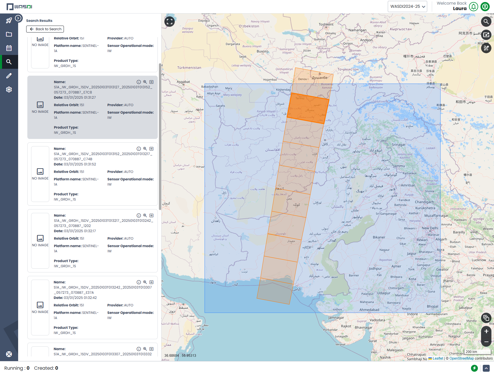
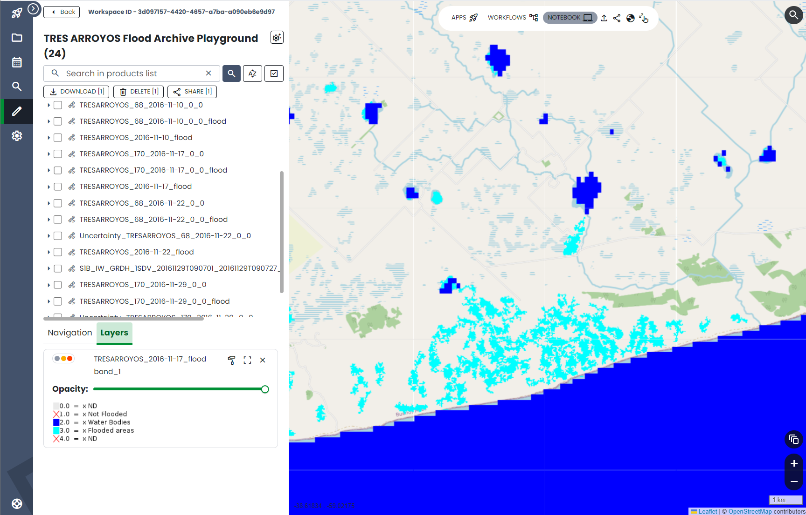
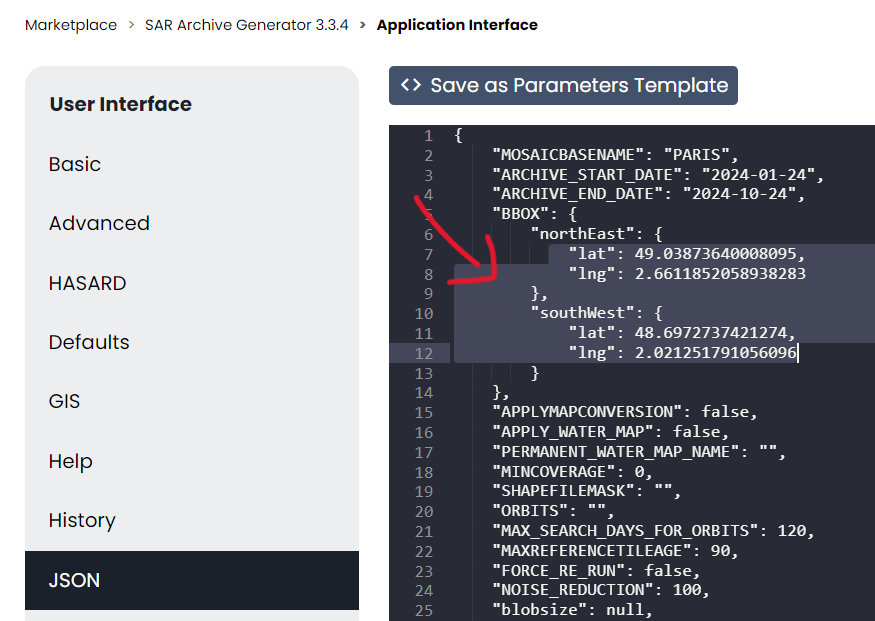
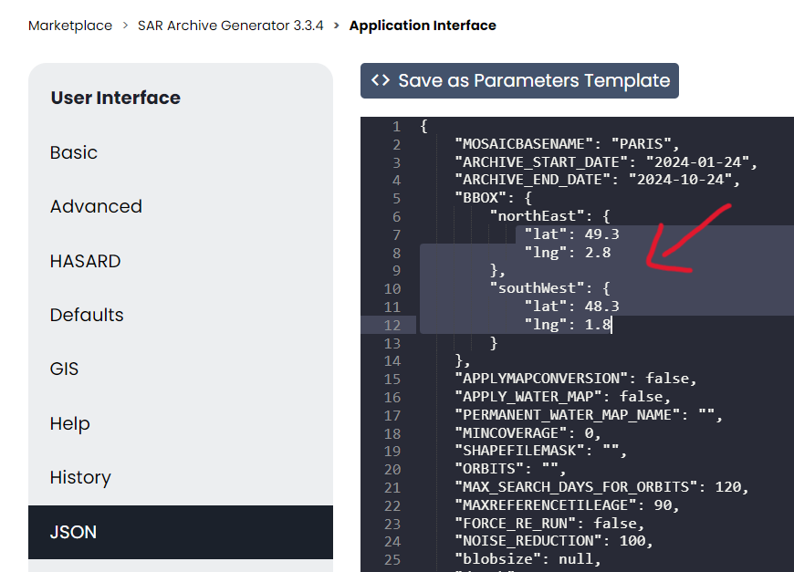
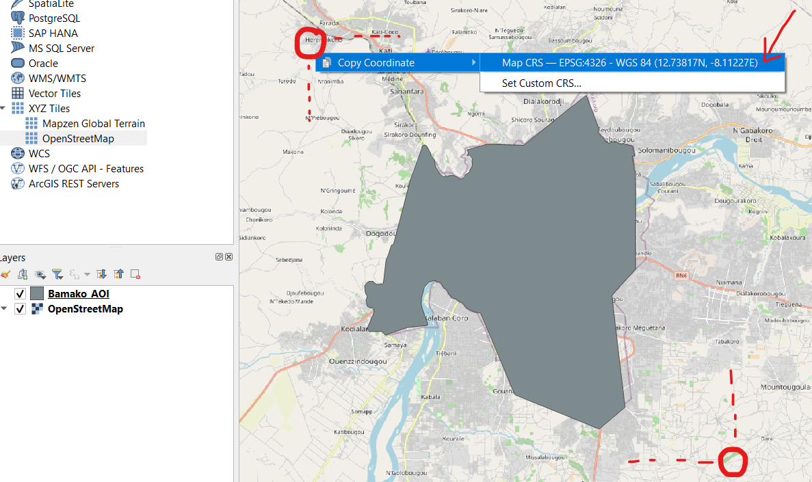
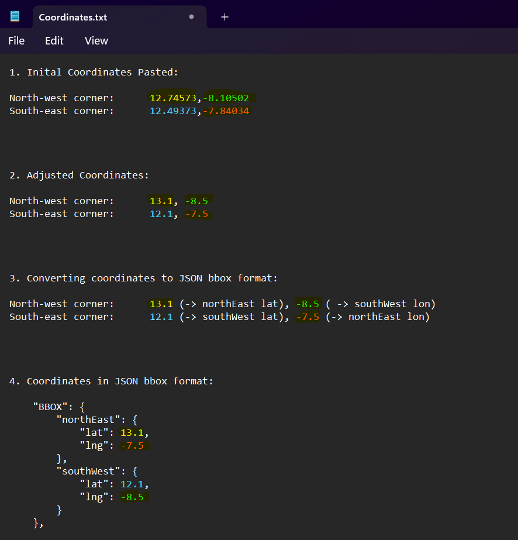

**SAR Flood Archive Generator 3.3.7**
===================================================

.. contents:: Table of Contents
   :depth: 3

1 Description
-----------------------------------------

SAR Flood Archive Generator 3.3.7 (processor name: sar_archive_generator) is an automated application designed to process the Sentinel-1 archive for a specified Area of Interest (AoI), generating daily flood maps in **open areas** (a synonym often used for open areas is "bare soil"). The application generates maps for every day for which a Sentinel-1 GRD image is available over the AoI. Flood detection is performed by analyzing intensity values. The output is an archive of maps that, according to the input parameters, can be either in binary format (flooded or not-flooded) or as a 3-state classification (flooded, not-flooded, permanent water). As **best practice**, we recommend making binary (2-state) flood maps and, in a post-processing step, superimpose over them permanent water to make 3-state flood maps.

The Flood Archive leverages the patented HASARD technology, developed by LIST, with WASDI SARL holding a royalty license and exclusive commercial rights.
 Link to the app `“here” <https://www.wasdi.net/#/sar_archive_generator/appui/>`_

Important: Flood Archive Generator is the older version of SAR Flood Archive Generator 3.3.7.

2 Application Parameters
-----------------------------------------

2.1 Basic Parameters
-----------------------------

- **Prefix (i.e. Basename) (JSON: "BASENAME")**: The user can add a string as a prefix to the output file name (e.g., the name of the region analyzed). The prefix must not contain spaces or underscores; if either is found, the system will automatically remove them.
- **Suffix (JSON: "SUFFIX")**: The user can add a string as a suffix to the output file name. The suffix must end in ".tif" and not contain spaces or underscores. The default suffix is "flood.tif".
- **Archive Start Date and End Date (JSON: "ARCHIVE_START_DATE" and "ARCHIVE_END_DATE")**: Enter the start and end dates for the period you want the archive to process.
- **Area of interest (JSON: "BBOX")**: Draw or add manually a bounding box to define the desired AoI.

2.2 Advanced Parameters
-----------------------------

The user has a certain degree of control over the creation of the archive.

**Apply Map Conversion (JSON: "APPLY_WATER_MAP")** and **Apply Permanent Water Map (JSON: "PERMANENT_WATER_MAP_NAME")**: Enabling the ‘Apply Map Conversion’ parameter (by ticking the checkbox or setting it to “true” in the JSON) allows the system to overlay a permanent water layer onto the outputs. To use a permanent water layer, you also need to enable the ‘Apply Permanent Water Map’ parameter (checkbox or JSON).

If you wish to use a custom Permanent Water Map, follow these steps:

1. Upload your Permanent Water Map to the workspace where you plan to run the archive.

2. In the SAR Archive Generator’s Application Interface, navigate to the left panel under ‘Run App In’, deselect the ‘New Workspace’ checkbox, and search for and select the workspace containing the Permanent Water Map.

3. In the advanced parameter section, under ‘Permanent Water Map’, select the Permanent Water Map file you uploaded to the workspace. Alternatively, in the JSON parameters next to "PERMANENT_WATER_MAP_NAME", enter the full name of the Permanent Water Map file, including its extension.

However, if both ‘Apply Map Conversion’ and ‘Apply Permanent Water Map’ are enabled (checkboxes ticked or JSON set to “true”) but no Permanent Water Map is selected, the application will automatically use the **ESACCI-Ocean-Land-Map-150m** as the default Permanent Water Map.

**BEST PRACTICE**: make 2-state flood maps, setting ``"APPLY_WATER_MAP": false`` in the parameters. Then, after all the 2-state flood maps have been generated for the time period of interest, apply permanent water on them with the app **Apply Permanent Water Map** (“apply_permanent_water_map“).

**Min Coverage Area (JSON: “MINCOVERAGE”)**: This parameter defines the minimum percentage of coverage required for a Sentinel-1 image over the AoI to be included in the computation. By default, it is set to zero, meaning that even an image covering as little as 1% of the AoI will be included. It is recommended to **increase this value** to about 10%, to exclude images that do not provide significant added value and to optimize processing efficiency.

**Shape File Mask (JSON: “SHAPEFILEMASK”)**: This parameter allows you to upload a shapefile (containing only 1 polygon), so that all Sentinel-1 images within the AoI (which must be a **rectangular** area) but outside of the borders of the shapefile are not included in the computation. In other words, it helps exclude Sentinel-1 images that do not intersect with the shapefile but would otherwise be included when using only the AoI, as defined by a rectangular bbox, thereby reducing unnecessary image processing.

Example of image (in dark orange) within a rectangular AoI (blue shade) but outside the borders of the country of interest (Pakistan in this specific example).

The shapefile will only be used to exclude images. It will not be used to crop the daily flood maps to the border of the shapefile. If you want to crop the daily flood maps to that border of the shapefile, please post-process the maps with the app **cutonshape**.

You can use QGIS for instance to prepare your (polygon) shapefile. If you need guidance, refer to the tutorial `here <https://www.youtube.com/watch?v=knD2S89FV04>`_.

**Shape File Mask product format**:

With your shapefile ready and saved on your local device, ensure that it is in .zip format before uploading it to your workspace on WASDI. This single .zip file must contain at least the following four files:

- ``NameOfTheShapefile.shp`` (feature geometry)
- ``NameOfTheShapefile.shx`` (index of feature geometry)
- ``NameOfTheShapefile.dbf`` (attribute information)
- ``NameOfTheShapefile.prj`` (coordinate system and projection information in well-known text, or WKT, format).
- ``NameOfTheShapefile.cpg`` (Optional) 

To create the .zip file on Windows, select the files listed above, right-click, and choose "Send to" > "Compressed (zipped) folder."

Ensure the .zip file is named to match the names of the files it contains (e.g. NameOfTheShapefile.zip). For example, if your files are named *Valencia_AOI*.shp, *Valencia_AOI*.shx, *Valencia_AOI*.dbf, and *Valencia_AOI*.prj, the .zip file must be named *Valencia_AOI*.zip.

**Note**: DO NOT compress a folder containing the files; the individual files should be placed directly in the .zip file.

**Upload a Shape File Mask in your Workspace**:

1. Upload the shapefile .zip file to the workspace where you plan to run the archive.

2. In the SAR Archive Generator’s Application Interface, in the left panel under ‘Run App In', deselect the 'New Workspace’ checkbox, then search for and select the workspace you uploaded the shapefile to.

3. Finally, under the ‘Shape File Mask’ parameter, select the shapefile product you uploaded in the workspace. Alternatively, in the JSON parameters under SHAPEFILEMASK, write the name of the shapefile with the .shp extension (e.g., *Valencia_AOI*.shp, **not** .zip).

**S1 Orbits (JSON: “ORBITS”)**: This parameter allows the selection of specific Sentinel-1 images from chosen orbits passing over the AoI. To specify the desired orbits, provide their numbers as a comma-separated list without spaces (e.g. 23,44,55). This manual orbits selection can avoid processing unnecessary images and achieve faster results, when feasible.

If the parameter is left blank, the processor will automatically search and select the orbits to use. In this case, the system will identify all orbits intersecting the AoI, starting from the end date and working backward to the start date. This automatic search is constrained by the value entered in the ‘Max Days to search to find Automatic Orbits’ parameter (see below).

**Max Days to search to find Automatic Orbits (JSON: “MAX_SEARCH_DAYS_FOR_ORBITS”)**: Specifies the maximum time period for the search of orbits passing over the selected AoI. The default value is 120.

**Max Reference Tile Age (JSON: “MAXREFERENCETILEAGE“)**: Max difference in days between pre-image and post-image. The default value is 90.

**Force re-run (JSON: “FORCE_RE_RUN“)**: If true, it will delete existing products, without reusing any available products already processed and available in the workspace. By default, it is set as false.

2.3 HASARD Parameters
-----------------------------

The following parameters are specific to the HASARD Processor (autofloodchain2).

- **Blob Size / Noise Reduction (JSON: "blobsize", "NOISE_REDUCTION")**: Blob size removal values are in the range between 20 and 150 pixels. All clusters of pixels with a number of pixels lower than this value will be considered noise and removed. If blobsize is set, the value is used and noise reduction is not considered. As an alternative, the user can set the Noise Reduction between 0-100%. Noise Reduction is a proxy of the Blob Size Removal: the system will convert it in the appropriate blobsize pixel value.
- **Ashman Coefficient (JSON: "ad")**: The default value of 2.6 is general, while a higher value (e.g., 2.7) can be selected to better separate the 2 distributions (water and non-water).
- **HSBA Depth (JSON: "depth")**: This is the Hierarchical Split Based Approach (HSBA) Depth parameter, as defined in Chini et al. (2017).

2.4 Defaults Parameters
-----------------------------

- **S1 GRD Preprocessing Workflow (JSON: "PREPROCWORKFLOW")**: Set the name of the workflow to use to pre-process S1 images. By default, it is set as "LISTSinglePreproc2".
- **Delete (JSON: "DELETE")**: If true, it will delete all the intermediate files. By default, it is set as true.
- **Simulate Flood Detection (JSON: "SIMULATE")**: It is a flag used ONLY for debug purposes. When it is set as true, it will simulate flood detection. The default value is false.
- **Move to sftp (JSON: "MOVETOSFTP")**: It is a flag, which when set as true will move the generated maps to the local node sftp server. By default, it is set as false.
- **Relative day offset (JSON: "LASTDAYS")**: It is the number to be used for relative day offset. Setting a value of 0 means that it will process day by day. The default value is also 0.
- **Data Provider (JSON: "PROVIDER")**: It is used to specify the provider to use to search and import S1 images. By default, it will be the automatic data provider ("AUTO"), and the same will be used even if it is left to null ("").

2.5 GIS Parameters
-----------------------------

- **Grid Dimension (JSON: "GRIDSTEP")**: It is used to specify the dimension of the tiles in the following format - "Lat,Lon" (in degrees). The bbox will be split into tiles of this grid dimension. Please see the section `Overview of the Tiling Process <https://wasdi.readthedocs.io/en/latest/WasdiApplications/SARArchiveGenerator.html#overview-of-the-tiling-process-in-wasdi>`_ for more details.
- **No Data Value (JSON: "NODATAVALUE")**: The default value is -9999.
- **Input Ignore Value (JSON: "INPUTIGNOREVALUE")**: The default value is 0.
- **Mosaic No Data Value (JSON: "MOSAICNODATAVALUE")**: The default value is 255.
- **Mosaic Input Ignore Value (JSON: "MOSAICINPUTIGNOREVALUE")**: The default value is 255.

3 Process Workflow
-----------------------------------------

1. **Initial Orbit Search**: Upon launching the SAR Archive Generator 3.3.7 app, WASDI first identifies the Sentinel-1 satellite orbits that pass over the selected AoI. For example, the following orbit values cover the region of Luxembourg: 161, 15, 37, 88, and 139.
2. **Data Import**: For each day within the specified time frame, orbit by orbit, WASDI will search for and import any `Sentinel-1 Ground Range Detected (GRD) <https://sentiwiki.copernicus.eu/web/s1-processing#S1-Processing-Ground-Range-Detected/>`_ images that intersect the AoI. This ensures comprehensive coverage of the area within the designated period.
3. **Tile Delimitation**: WASDI then defines its own tiling scheme over the AoI. This process subdivides the AoI into smaller sections, referred to as tiles, each overlaid with the relevant satellite imagery. This tiling process is important for organizing, storing, and analyzing large volumes of geospatial data efficiently.
4. **Flood Detection**: Once the Sentinel-1 images have been imported, the app subsequently calls the Automatic HASARD application (specifically, an application named autofloodchain2) to compute the flood map in each tile. This application compares satellite tiles from the same location and orbit, captured on different dates, by analyzing each pixel to detect signs of flooding. If the two tiles show discrepancies, a flood tile is generated.
5. **Permanent Water (Optional)**: WASDI will import and overlay a permanent water layer indicating the permanent water bodies on the flood maps if the user selects the 'Apply Map Conversion' and 'Apply Permanent Water Map' options in the Advanced settings of the App Interface. (see the `Advanced Parameters <https://wasdi.readthedocs.io/en/latest/WasdiApplications/SARArchiveGenerator.html#advanced-parameters>`_ section for more details). As best practice, we recommend making binary (2-state) flood maps and, in a post-processing step, superimpose over them permanent water to make 3-state flood maps.
6. **Flood Map Creation**: The flood tiles from various orbits are stitched (mosaicked) together into a comprehensive mosaic flood map, to cover the entire AoI.
7. **Workspace Cleanup**: Concurrently to the steps above, WASDI will clean the workspace by removing the flood tiles that are no longer needed, to ensure that only the essential products are retained.

4 Application's Products
-----------------------------------------

- **Satellite image**: Sentinel-1 GRD image imported by WASDI.

  - `Name format <https://sentinels.copernicus.eu/web/sentinel/search?p_p_id=com_liferay_portal_search_web_search_results_portlet_SearchResultsPortlet_INSTANCE_XIxtnlMxlnwC&p_p_lifecycle=0&p_p_state=maximized&p_p_mode=view&_com_liferay_portal_search_web_search_results_portlet_SearchResultsPortlet_INSTANCE_XIxtnlMxlnwC_mvcPath=%2Fview_content.jsp&_com_liferay_portal_search_web_search_results_portlet_SearchResultsPortlet_INSTANCE_XIxtnlMxlnwC_redirect=%2Fweb%2Fsentinel%2Fsearch%3Fq%3Dlogging%2520into%2520someone%2527s%2520snapchat%2520without%2520them%2520knowing%252C%25E3%2580%25902024%2520TelegramChannel%253AKunghac%25E3%2580%2591%2520%2520snapchat%2520hack%2520deleted%2520messages%252Csnapon%2520tools%2520hacked%252Cmy%2520snap%2520got%2520hacked%252Csnapchat%2520hack%2520token%2520id%252Creddit%2520snapchat%2520hack%252Choop%2520snapchat%2520hack%252Csnaphack%25203%252E01%252Csnapchat%2520score%2520hack%2520no%2520human%2520verification%252Csomeone%2520hacked%2520my%2520snapchat%2520account%252Cwww%2520snapchatdb%252C....eeb8%26category%3D4208307%26tag%3Dyear-2020%26delta%3D4%26start%3D114&_com_liferay_portal_search_web_search_results_portlet_SearchResultsPortlet_INSTANCE_XIxtnlMxlnwC_assetEntryId=2013756&_com_liferay_portal_search_web_search_results_portlet_SearchResultsPortlet_INSTANCE_XIxtnlMxlnwC_type=content&p_l_back_url=%2Fweb%2Fsentinel%2Fsearch%3Fq%3Dlogging%2520into%2520someone%2527s%2520snapchat%2520without%2520them%2520knowing%252C%25E3%2580%25902024%2520TelegramChannel%253AKunghac%25E3%2580%2591%2520%2520snapchat%2520hack%2520deleted%2520messages%252Csnapon%2520tools%2520hacked%252Cmy%2520snap%2520got%2520hacked%252Csnapchat%2520hack%2520token%2520id%252Creddit%2520snapchat%2520hack%252Choop%2520snapchat%2520hack%252Csnaphack%25203%252E01%252Csnapchat%2520score%2520hack%2520no%2520human%2520verification%252Csomeone%2520hacked%2520my%2520snapchat%2520account%252Cwww%2520snapchatdb%252C....eeb8%26category%3D4208307%26tag%3Dyear-2020%26delta%3D4%26start%3D114/>`__: e.g. ``S1B_IW_GRDH_1SDV_20161129T090701_20161129T090727_003171_005658_7EB6_preproc``

- **Tile**: Subset of the AoI + One satellite image.

  - **Name format**: ``CODE_ORBIT_DATE_TILE`` (e.g. ``SINDH_71_2010-04-22_1_0``)

- **Flood tile**: Subset of the AoI + Detected flood.

  - **Name format**: ``CODE_ORBIT_DATE_TILE_SUFFIX`` (e.g. ``SINDH_71_2010-04-22_1_0_flood``)

- **Mosaic flood map**: Multiple flood tiles merged into one flood map.

  - **Name format**: ``CODE_ORBIT_DATE_SUFFIX`` (e.g. ``SINDH_2010-04-22_flood``)

- **Composite flood map (over the entire time period of the archive)**: Differently from a Mosaic flood map which shows the flooding on a single day over the entire AoI, a composite flood map shows as flooded, over the entire AoI, all pixels that have been detected flooded at least once over the entire time period of the archive. In other words, if a pixel has been detected flooded once over the entire archive, that pixel will be shown as flooded in the composite flood map. If a pixel has been detected flooded every single day over the entire archive, that pixel will be shown as flooded in the composite flood map.

  - **Name format**: ``CODE_ORBIT_LAST-DATE_COUNT-NO.-DAYS_SUFFIX``

- **Permanent water map**: The user can add a personal Permanent Water Map to the workspace. If the user doesn’t upload any water map, but the user wishes to apply one, the application will automatically extract the Permanent Water Map from the **ESACCI-Ocean-Land-Map-150m**. As **best practice**, we recommend making binary (2-state) flood maps and, in a post-processing step, superimpose over them permanent water to make 3-state flood maps.

  - **ESA CCI Water map name format**: e.g. ``WASDI_STATIC_ESACCI-OCEAN-LAND-MAP-150M-P13Y-2000_Bdej``

- **DEM maps**: Digital Elevation Model (DEM) represents the Earth's bare ground (bare earth) topographic surface excluding trees, buildings, and any other surface objects. This product is often essential to remove areas producing false positives (areas that are detected as flooded but that in reality are not flooded) such as rugged **relief**, i.e. areas with **steep** slopes, extreme elevation changes, and complex land-forms, such as high mountains or deep canyons (see additional details about DEM maps `here <https://www.usgs.gov/faqs/what-a-digital-elevation-model-dem>`_, and about Copernicus DEM specifically `here <https://spacedata.copernicus.eu/collections/copernicus-digital-elevation-model>`_).

  - **Name format**: e.g. ``WASDI_STATIC_COPDEM30M_WBM_GLOBAL_MOSAIC_fjNW``

5 Application Output: Mosaic Flood Maps
-----------------------------------------

The application generates a daily map of flooded area for each day for which a Sentinel-1 GRD Image is found over the area of interest, starting from the start date until the end date. The output flood maps will have names like:

.. code-block:: java

   CODE_YYYY-MM-DD_SUFFIX.tif

If the flag APPLYMAPCONVERSION is set to **false**, the output maps are binary:

.. code-block:: java

   0 = Not Flooded
   1 = Flooded
   (255 = No Data)

If the flag APPLYMAPCONVERSION is set to **true**, the output maps are:

.. code-block:: java

   (0 = No Data)
   1 = Not Flooded
   2 = Permanent Water
   3 = Flooded

5.1 Output Example
-----------------------------

Below is an example of a mosaic flood map where permanent water bodies, such as the ocean in the south and lakes within the country, are clearly distinguished in dark blue, while the flooded areas are shown in light blue.

Flood Map west of the city of Necochea, Argentina - 17/11/2016

**Other complementary outputs** connected to the Flood Archive app include:

- **Flood Frequency Map**: See the Flood Frequency Map Generator tutorial for more details (coming soon!).

- **Urban Flood Maps**: Produced by the **Urban Flood** application.

6 Optimizing Resource Usage
-----------------------------------------

This section covers how to optimize computational resource usage when running a flood archive by adjusting the bounding box (bbox) size and Tile/Grid Dimension settings. The following instructions are conducted prior to running the application.

6.1 Overview of the Tiling Process in WASDI
-----------------------------

The processing of a flood archive in WASDI uses significant computational resources and processing time, particularly for large AoIs and long timeframes (e.g., a flood archive spanning from June 2015 to the present for entire Vietnam).

When defining a bounding box (bbox) for an archive, WASDI will divide the bbox into tiles (areas analyzed separately) of sizes based on the "Grid Dimension" (or "Grid Step"). By default, the tile (or grid) dimension is set to 2x2 degrees in both latitude and longitude.

For bboxes larger than the grid dimension, WASDI will multiply the number of tiles to cover the entire bbox. However, the output is always cropped to the dimensions of the bbox only at the very end, which can result in wasted computational resources. For example, if the bbox’s size is around 2.5x2.5 degrees (in latitude and longitude) and the Grid Dimension is 2x2 degrees, WASDI will process an area of 4x4 degrees, then crop and keep only the output over the bbox (2.5x2.5 degrees). This means resources were used to process an additional area which will not contribute to the final output.

Similarly, if the bbox is smaller than the tile size, WASDI will still process the full tile, then crop the results to the bbox, also leading to resource inefficiency. For example, if the bbox is only about 0.5x0.5 degrees but the Grid Dimension was set to 1x1 degrees, WASDI will analyze an area of 1x1 degrees, then crop the results to 0.5x0.5 degrees, wasting computational resources to analyse an area that will not be included in the final output.

6.2 Guidelines for Adjusting Bounding Box and Grid Dimension
-----------------------------

To optimize resource usage, it is recommended to set the Grid Dimension to match or be (as much as possible) an exact multiple of the selected bbox size. Note that the Grid Dimension only accepts integer latitude and longitude values, and typically do not exceed 2x2 degrees. So:

6.2.1 Starting with a Bounding Box
-----------------------------

1. If no shapefile of the AoI is available, define a bbox directly in the "Basic Parameters" with the AoI centered around it.

2. Go to the JSON Parameters, review the bbox coordinates in lines 7 to 12 (in the following figure), and take note of the latitude and longitude differences between the northeast and southwest corners.

3. Go to GIS Parameters, and adjust Grid Dimension (Lat,Lon):

   - If both the latitude and longitude differences between the northeast and southwest corners of the bbox are less than 1 degree, set the Grid Dimension to “1,1” degrees.

   - If the bbox is larger than 2x2 degrees, set the Grid Dimension to “2,2” for sizes close to even numbers (e.g., 6x6) and “1,1” for odd sizes (e.g., 5x5).

4. After inputting/adjusting all the other parameters (Basic, Advanced, Hazard, etc.), return to JSON Parameters and adjust the bbox latitude and longitude coordinates to ensure they align precisely with either 1x1 or 2x2 degrees. Use one decimal place for precision to simplify adjustments, and aim to keep the AoI centered within the bbox by increasing each coordinate evenly. See below for an example of a 1x1 degree adjustment of a bbox:

JSON Parameters - Non-adjusted bbox coordinates

JSON Parameters - Adjusted bbox coordinates

**Be sure to save this setup immediately after finishing**, by selecting "Save as Parameters Template" or by copying it to a text editor. This is important because if you leave the JSON Parameters tab, the bbox coordinates will revert to those of the manually drawn bbox in the Basic Parameters, and the adjustment will need to be repeated.

Once all the steps are complete, you can click on **Run App** to initiate the flood archive.

6.2.2 Getting the bbox coordinates from a Shapefile of the AoI
-----------------------------

When starting with a shapefile of the AoI, you can use QGIS to get the coordinates of a bbox around the AoI.

1. Drag and drop this shapefile in a new project in QGIS (or `import it in QGIS <https://www.spotzi.com/en/about/help-center/how-to-import-a-shapefile-into-qgis/>`_).

2. `Add a map layer <https://docs.qgis.org/3.34/en/docs/training_manual/basic_map/preparation.html>`_ (e.g. OpenStreetMap).

3. Position your mouse on the map at the north-west corner of the Area of Interest (AoI) (as indicated by the red circles in the image below), right-click to copy the coordinates, and paste them into a text editor. Then, repeat this process for the south-east corner.

   - Be sure to include some additional margin around the AoI when retrieving these coordinates. This extra space ensures that the AoI is fully contained within the bounding box (bbox) that will be formed using these coordinates, preventing any part of the AoI from being cut off at the edges (see red dotted lines).

   - If the coordinates appear as very large numbers (e.g., 155838567, -4513529) instead of the standard latitude and longitude decimal format, please refer to `this post <https://groups.google.com/g/australian-qgis-user-group/c/6xrPCvuHlVk?pli=1>`_ for instructions on how to change their format first.

QGIS map with AoI and bbox coordinates

4. After pasting the corners coordinates into a text editor (see point #1 in the image below), adjust them to expand the coverage by rounding to 1x1 degrees (or 2x2 for larger areas) while keeping the AoI roughly centered (point #2).

5. Go to the section `Starting with a Bounding Box <https://wasdi.readthedocs.io/en/latest/WasdiApplications/SARArchiveGenerator.html#advanced-parameters>`_ of this documentation. Follow Step 3 to adjust Grid Dimension (Lat,Lon) in the GIS Parameters, and input/adjust all the other parameters (Basic, Advanced, Hazard, etc.) as needed.

   - We also recommend manually drawing a random bbox to generate its JSON format, which will be reflected in the JSON Parameters.

6. Finally, when the coordinates are the only parameters left to update, return to the text editor, copy the adjusted coordinates, and paste them into the bbox coordinates in the JSON Parameters in WASDI (lines 7 to 12). Refer to points #3 and #4, as well as the colored coordinates in the image, for assistance with the conversion.

7. Once all the steps are complete, you can click on **Run App** to initiate the flood archive.

Adjusted bbox coordinates in JSON Parameters

7 References
-----------------------------------------

More information about the technology and the scientific methodology applied can be found below:

- Chini, M., Hostache, R., Giustarini, L., Matgen, P., 2017. A hierarchical split-based approach for parametric thresholding of SAR images: flood inundation as a test case. *IEEE Transactions on Geoscience and Remote Sensing*, 55(12). `[Link] <https://ieeexplore.ieee.org/document/8017436>`_

- Chini, M., Giustarini, L., Matgen, P., Hostache, R., Pappenberger, F. and Bally, P., 2014, July. Flood hazard mapping combining high resolution multi-temporal SAR data and coarse resolution global hydrodynamic modelling. In *2014 IEEE Geoscience and Remote Sensing Symposium* (pp. 2394-2396). IEEE. `[Link] <https://ieeexplore.ieee.org/abstract/document/6946953>`_

- Schumann, G.J., Campanella, P., Tasso, A., Giustarini, L., Matgen, P., Chini, M. and Hoffmann, L., 2021, July. An online platform for fully-automated EO processing workflows for developers and end-users alike. In *2021 IEEE International Geoscience and Remote Sensing Symposium IGARSS* (pp. 8656-8659). IEEE. `[Link] <https://ieeexplore.ieee.org/abstract/document/9554498>`_

- Chini, M., Pelich, R., Pulvirenti, L., Pierdicca, N., Hostache, R. and Matgen, P., 2019. Sentinel-1 InSAR coherence to detect floodwater in urban areas: Houston and Hurricane Harvey as a test case. *Remote Sensing*, 11(2), p.107. `[Link] <https://www.mdpi.com/2072-4292/11/2/107>`_
