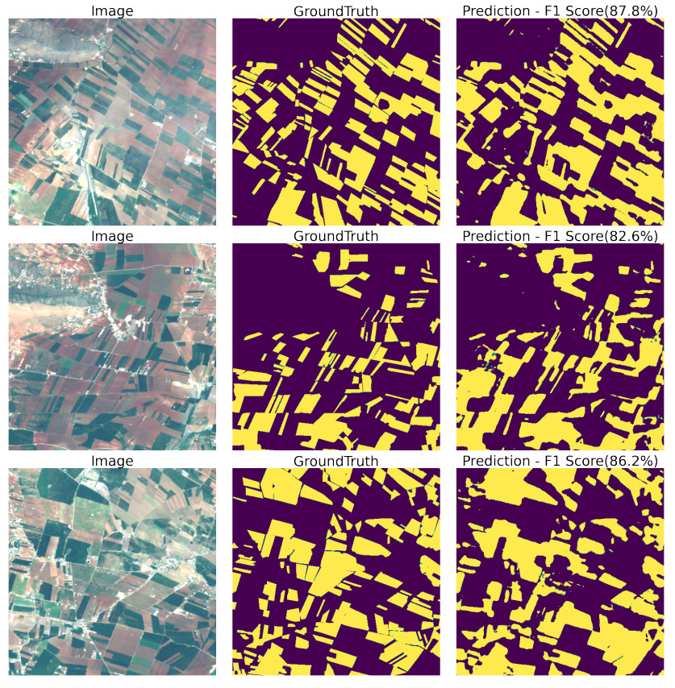
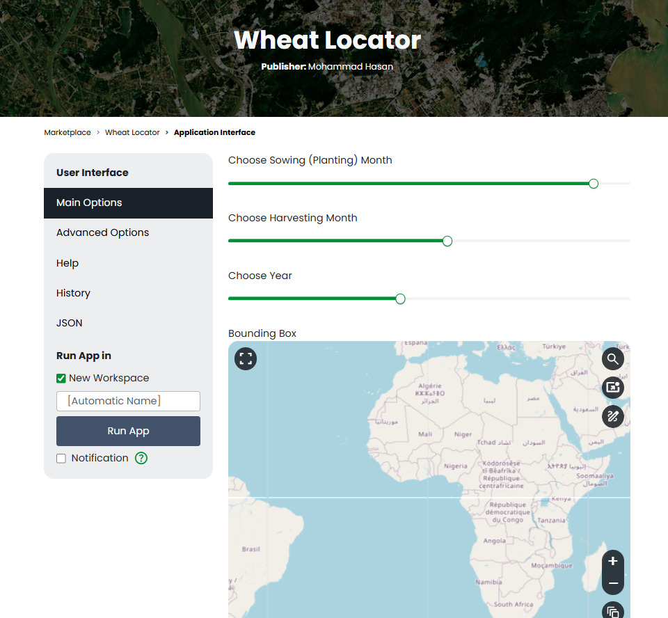

.. WheatLocator

.. _WheatLocator:

Wheat Locator
=============

About?
------

Developed by the `GEOAI <https://geogroup.ai/>`__ research group, the
`“Wheat Locator” <https://www.wasdi.net/#!/wheat_locator/>`__ App uses a
deep learning transformer-based model to extract wheat fields from
Sentinel-2 images as detailed in this
`manuscript <https://geogroup.ai/publication/2023ecrs_peftwheat/>`__.
This work explores the feasibility of cross-area and cross-year
out-of-distribution generalization of crop segmentation models. We
adopted the
`TSViT <https://openaccess.thecvf.com/content/CVPR2023/papers/Tarasiou_ViTs_for_SITS_Vision_Transformers_for_Satellite_Image_Time_Series_CVPR_2023_paper.pdf>`__
model to address wheat field segmentation in Lebanon using PEFT
techniques. We relied on an in-house labeled dataset, called the
Lebanese Wheat dataset, that comprises high-quality annotated polygons
for wheat and non-wheat classes for the study area in the Beqaa area,
Lebanon, with a total surface of 170 km², over five consecutive years
from 2016 to 2020. Using a time series of multispectral Sentinel-2
images, our model achieved an 84% F1-score. Our code is publicly
available at this
`Repo <https://github.com/geoaigroup/GEOAI-ECRS2023>`__.

The App will automatically download the required Region of Interest
(RoI) images or use available workspace images. Since we trained the
transformer model on a Satellite Images Time Series (SITS) of Lebanon,
the model’s out-of-distribution (OOD) performance will be hindered when
testing using new regions. This work is in the beta phase, and your
feedback is highly appreciated via this
`LINK <https://geogroup.ai/#contact>`__ or through info@geogroup.ai.

Input Parameters:
-----------------

1. Sowing (Planting) Month: wheat planting month in the selected RoI
2. Harvesting Month: wheat harvesting month in the selected RoI
3. Year: wheat harvest year
4. Bounding Box: to reduce time and computational complexity into an
   acceptable size, the area of the bonding box should be less than
   30km2 (3000ha)

Credits:
--------

Models training and WASDI deployment by Eng. `Mohamad Hasan
Zahweh <https://geogroup.ai/author/mohammad-hasan-zahweh/>`__ under Dr
Ali J. Ghandour supervisor.

THE SOFTWARE IS PROVIDED “AS IS”, WITHOUT WARRANTY OF ANY KIND, EXPRESS
OR IMPLIED, INCLUDING BUT NOT LIMITED TO THE WARRANTIES OF
MERCHANTABILITY, FITNESS FOR A PARTICULAR PURPOSE AND NONINFRINGEMENT.
IN NO EVENT SHALL THE AUTHORS OR COPYRIGHT HOLDERS BE LIABLE FOR ANY
CLAIM, DAMAGES OR OTHER LIABILITY, WHETHER IN AN ACTION OF CONTRACT,
TORT OR OTHERWISE, ARISING FROM, OUT OF OR IN CONNECTION WITH THE
SOFTWARE OR THE USE OR OTHER DEALINGS IN THE SOFTWARE.
