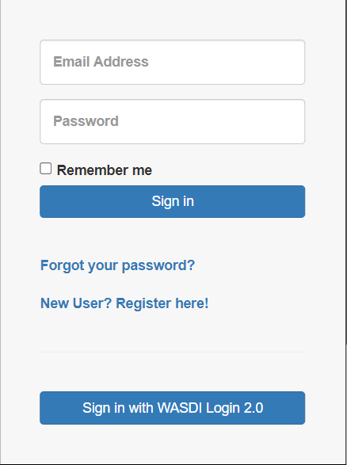
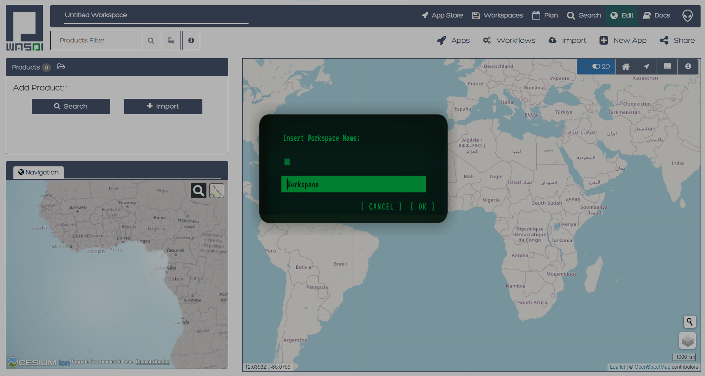
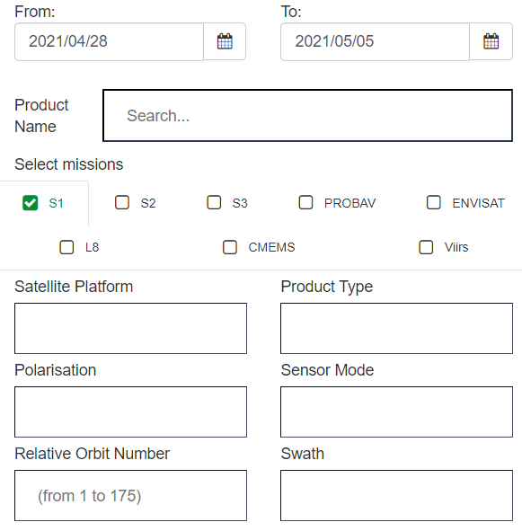
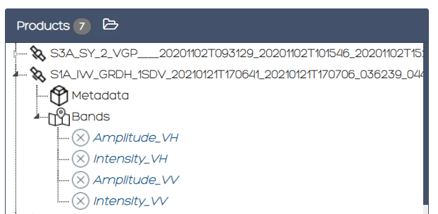
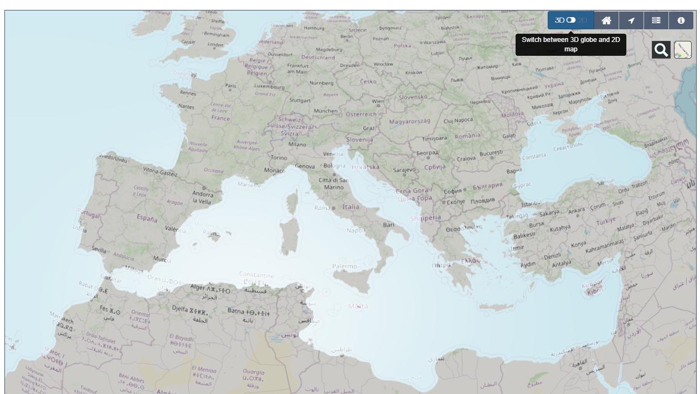

.. TestReadTheDocs documentation master file, created by
   sphinx-quickstart on Mon Apr 19 16:00:28 2021.
   You can adapt this file completely to your liking, but it should at least
   contain the root `toctree` directive.
.. _WasdiTutorial

Wasdi Web Platform access and basic usage
=========================================
The home page of WASDI is reachable at the address:

http://www.wasdi.net/

.. image:: _static/wasdi_tutorial_images/Devmanimage11.png

WASDI Login
------------------------------------------

The user can access using his own google account without the need of any registration, just clicking on Login and then selecting Sign In with Google

This kind of access **CANNOT BE USED BY DEVELOPERS**. While a google user can access all the web platform features, he cannot use the WASDI Libraries features.

To use this functionality the user has to register within the WASDI Platform, clicking Register from the home page.

.. image:: _static/wasdi_tutorial_images/Devmanimage5.png

To register the user has to input:

* A valid eMail Address (that will be used as UserId)

* A password

* A Name and Surname

The user will receive a confirmation e-mail and then will be enabled to use WASDI.

Workspace Management
--------------------
Each user in WASDI can work in one or more Workspace. A Workspace is a set of EO Images (original or elaborated by some processor) that are grouped in the same “project”.

The workspace concept is the same of many other development tools or languages: can be called workspace or project and is just a name given to a specific set of files.

Once logged for the first time, the user is asked to create a new workspace.

To work with the Editor a Workspace is needed: just click on the text suggestion or on the New Workspace Button on the top right of the screen.

Wasdi Sections
--------------
The WASDI Sections are listed in the top blue bar:

.. image:: _static/wasdi_tutorial_images/Devmanimage1.png

* **Home**: workspace management, to create open or delete user workspaces;

* **Plan**: explore new acquisition plan;

* **Search**: search for an EO Image;

* **Edit**: edit data in a workspace;

* **User**: user info

Plan, and User are out of the scope of this Tutorial.

Search
^^^^^^
The search section has many features; in this guide we will make a basic introduction just to let the user start working with EO Images.

.. image:: _static/wasdi_tutorial_images/Devmanimage24.png

The user can set the filters:

To enable one mission specific filter, first select the tab and the Checkbox of the mission. If no checkbox is selected, the system will search all the available missions, otherwise, selected it will search only for the selected ones.

WASDI has a Multi Provider search system: this means that the same query is sent to many data providers. The user can switch providers on/off:

.. image:: _static/wasdi_tutorial_images/Devmanimage2.png

The SERCO ONDA DIAS is the **priority one** Provider because data is stored in the Cloud where WASDI is installed so this is, usually, the fastest provider available.

To start a query click on the SEARCH button on the top right of the screen:

.. image:: _static/wasdi_tutorial_images/Devmanimage9.png

The results are shown in different tabs for different providers:

.. image:: _static/wasdi_tutorial_images/Devmanimage25.png

To add a image to WASDI, click on the “+” icon near to the name of the image. The system will ask for the workspace to use and then will start the import of the image.

Devmanimage23.png

Editor
^^^^^^
Editor is where the user can interact with the EO Images.

.. image:: _static/wasdi_tutorial_images/Devmanimage16.png

On the left the tree of the products in the workspace is shown. Each product has its own metadata and band subfolder.

The user can browse the bands of the image. Just click on a band to see the band image.

Data can be shown in Image Editor (default) or Geographic view.

To switch just click con the button in the top right corner of the band image space:

When in geographic mode, WASDI will publish on the fly in WMS the selected bands.

Once published the band will be shown on the map:

.. image:: _static/wasdi_tutorial_images/Devmanimage14.png

Click again the Editor Mode button to return in Image Editing Mode.

From the editor is possible to run some SNAP Processor, upload and run a full SNAP workflow, run user-supplied processors.

.. image:: _static/wasdi_tutorial_images/Devmanimage14.png

