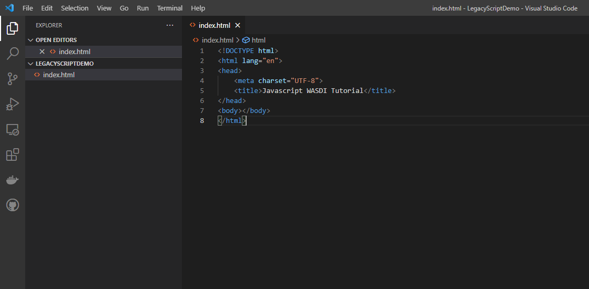

.. TestReadTheDocs documentation master file, created by
   sphinx-quickstart on Mon Apr 19 16:00:28 2021.
   You can adapt this file completely to your liking, but it should at least
   contain the root `toctree` directive.
.. _PythonTutorial:

Javascript Web Tutorial
===========================

In this tutorial we will show you how you can start using to use the Javascript library
for WASDI. In this tutorial we will create a web page that show data gathered through
the library just by using one 

    </head>
    <body></body>
    </html>

Now,to start using the functionalities exposed by the library, create a new file next to index.html
and name it **main.js**.

Include the file index.html :

.. code-block:: html

    <!DOCTYPE html>
    <html lang="en">
    <head>
        <meta charset="UTF-8">
        <title>Js Wasdi Tutorial</title>
    <!-- This script loads the library -->
    
    <!-- This script contains your custom code -->
    

    </head>
    <body></body>
    </html>

Login
---------------------------

WASDI is a web application that allows users to download, process and obtains result from satellite imagery.

To continue with this tutorial you will need a valid account on the platform: 
please, proceed to register to WASDI services and keep note of your credential.

The first step to start interacting with `WASDI <https://www.wasdi.net>`_ services is to login by using the library facilities.

To achieve this you must add 2 files next the index.html file :
- config.json
- parameters.json

The second will be introduced later on the tutorial, when we will start using processors.
Create file config.json next to index.html file.

Add the following content, changing **[YOUR_USERNAME]** and **[YOUR_PASSWORD]** with your WASDI credentials

.. code-block:: json

    {
      "USER": "[YOUR_USERNAME]",
      "PASSWORD": "[YOUR_PASSWORD]",
      "WORKSPACE": "",
      "PARAMETERSFILEPATH": "./parameters.json",
      "WORKSPACEID": "test",
      "BASEPATH":"test",
      "DOWNLOADACTIVE":"test",
      "UPLOADACTIVE": "test",
      "VERBOSE":"test",
      "BASEURL" : "https://www.wasdi.net/wasdiwebserver/rest",
      "REQUESTTIMEOUT":120
    }

Notte that this file name is a **conventional one**. Please check library documentation for more details about the 
**loadconfig()** function.

Please open main.js and start editing the file.
Wasdi librariy is exposed as a global singleton, a common practise for Javascript library. 

The variable to be used to access library methods is "**wasdi**"
Add the following lines:

.. code-block:: javascript
    // load the configuration from config.json file  
    wasdi.loadConfig();
    // login to Wasdi
    wasdi.login();

After the successful login call, the wasdi global object will keep its state, 
allowing to make further request to the system.

Create Workspaces
-----------------------

A **Workspaces** is a basic concept of WASDI: one of the main objective of the platform is to connect 
to various satellite imagery portals and download files from such services. 
The workspace is composed by a collection of images downloaded, called **products**. 

The download doesn't require local storage because it "happens" in dedicated cluod instances.
Also, a workspace, holds the informations about the elaborations on such data, done by the **processors**.
Each users can create his own workspace, but he can also share them with other users.

In the following steps we will add some controls to HTML and some code to our main.js
file to create a Workspace on WASDI.

First edit the index.html file by adding the following lines, inside the body tags :

.. code-block:: html

        

        Insert workspace name <input type="text" id="wsname">
        <input type="button" onclick="createWorkspace()" value="Create Workspace">
        

Then open our javascript file *main.js* and define the function createWorkspace() :

.. code-block:: javascript

    // Function to create a workspace
    createWorkspace = function() {
    let wsName = document.getElementById("wsname").value;
    wasdi.createWorkspace(wsName);
    }

The function defined will be invoked when the user clicks on the "Create workspace" button.
Open the index.html page on you browser and you will have a simple form like this: 

.. image:: img/2.png

When you click the system will create a new workspace on WASDI.
You can check it in the wasdi web application:

.. image:: img/3.png

There it is !

For the following part of the tutorial we will use this workspace as default one.
This way, for the following features, it will not be necessary to create each time a 
new workspace.

To open it every time we reload the page add this statement after the login call, a the beginning of the file 
*main.js*: 

.. code-block:: javascript

    wasdi.loadConfig();
    wasdi.login();
    // From now on this tutorial uses JavascriptWebTutorial workspace as default
    wasdi.openWorkspace("JavascriptWebTutorial");

List the available Processors
---------------------------------

Another key concept of the WASDI web application is the **Processor**: it represents
a tool to gather and elaborate satellite imagery. Processors can be either public or private in WASDI, depending on your subscription.
Any user can upload his own code in several languages to create a new Processor.
Each processor has a defined set of parameters encoded in a specific JSON and, when we load a processor, a default
template is served.

In this step of the tutorial we will list the available processors, show them on a selection list
and load the parameters of the selected one.

First, add the following line to the index.hml file, containing

- the button to load the deployed processor.
- a selection list that will be populated with the available ones.
- a button to load the parameters of the selected ones.
- a textarea to show the JSON of the parameters.

.. code-block:: html

    

        <input type="button" onclick="getDeployed()" value="Get processor list">
        

    

    

        <select id="ProcessorSelect" size="8"></select>
        <input type="button" onclick="loadProcessorParameters()" value="Load processor parameters">
    

    
    

        Edit parameters  
        <textarea rows="10" cols="100" id="parameters">  </textarea>
    

Then, open the main.js file and add the definition to actual load the data for the controller defined:

.. code-block:: javascript

    getDeployed = function() {
    var deployed = wasdi.getDeployed();
    let selectionList = document.getElementById("ProcessorSelect");

    deployed.forEach(element => {        
        let option = document.createElement("option");
        option.text=element.processorName;
        selectionList.add(option);
    });

    }

    loadProcessorParameters = function(){
    let list = document.getElementById("ProcessorSelect");
    let selectedProcessor = list.options[list.selectedIndex].text;

    wasdi.getDeployed().forEach(element => {        
        if (element.processorName == selectedProcessor){
            
            document.getElementById("parameters").value =decodeURI(element.paramsSample);
        }    
    });
    }

Opening again the index.html and clicking on the first button the list will be populated:

.. image:: img/4.png

And, after selecting a processor, clicking on the second button the parameters are then showed:

.. image:: img/5.png

Execute a processor
------------------------

In this step we will use the data gathered on the prevoius task of the tutorial to launch an actual application on WASDI.
The first approach will be by using a simple test application, which implements a pretty common feature for programming newbie.
After that we will introduce the request to obtain the status of the launched processors.
This data will be showed by adding a string to the html DOM.

First open index.html and add the following components inside the *<body>* tags:

.. code-block:: html
    

        <input type="button" onclick="executeProcessor()" value="Execute processor">
    

    

        <input type="button" onclick="getStatus()" value="Get status of processor launched">
    
 

    

First, in order to have a support variable keeping the launched process from this webpage, add this line at the top of the *main.js* file

.. code-block:: javascript 
    var launchedProcessorID=[];

Then add the following methods to *main.js*:

.. code-block:: javascript 
    executeProcessor = function() {
    let list = document.getElementById("ProcessorSelect");
    let selectedProcessor = list.options[list.selectedIndex].text;
    let parameters = document.getElementById("parameters").value;
    let response = wasdi.executeProcessor(selectedProcessor,encodeURI(parameters));
    console.log(response.processingIdentifier);
    launchedProcessorID.push(response.processingIdentifier);

    }

    // Util function to render a formatteed string from the process status reponse 
    getProcessorString = function(status) {
    let response = "";
    response = response.concat("Processor name " + status.productName + " | " + "status " + status.status + " | % " + status.progressPerc +  " | Payload " + status.payload  );
    return response;
    }

    getStatus = function() {  
    document.getElementById("processorStatus").innerHTML = "";
    launchedProcessorID.forEach(element => {
        let status = wasdi.getProcessStatus(element);
        document.getElementById("processorStatus").innerHTML = document.getElementById("processorStatus").innerHTML.concat(
            getProcessorString(status) + " "
        );
    }); 
    }

The first function *executeProcessor* invoke the wasdi library method to run a processor (remember, on the workspace "JavascriptWebTutorial" ).

The second function *getProcessorString* it's an util method to shown the process status of the processes started from the current page.

The last function use the wasdi library to gather the data of the launched processors and push the formatted result on a dedicated div.

We can then test the page by launching the application **hellowasdiworld**: after clicking on both buttons, *excecute processor* and 
*Get status of processor launched* a string with the status will showed :

.. image:: img/6.png

If you open WASDI on wasdi.net, login and open the workspace, you will see that the processor were executed:

.. image:: img/7.png
    :scale: 50
